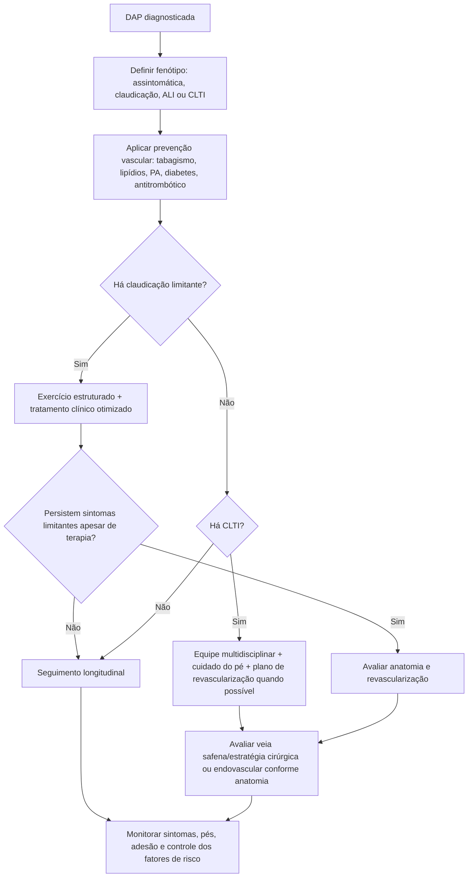

# ACC/AHA 2026 — qualidade do cuidado em DAP

O documento ACC/AHA 2026 transforma recomendações da diretriz de DAP de 2024 em medidas objetivas de qualidade. Foram definidos **15 indicadores: 7 medidas de performance e 8 de qualidade**. Quatro das sete medidas de performance e cinco das oito medidas de qualidade são novas.

O valor clínico do documento é funcionar como um **checklist do que não pode faltar** no cuidado longitudinal da doença arterial periférica (DAP).

## Novas medidas de performance destacadas

As novas medidas de performance concentram-se em otimização do tratamento clínico:

- manejo adequado da pressão arterial;
- uso apropriado de IECA em pacientes elegíveis;
- manejo do diabetes;
- terapia antitrombótica baseada em evidência.

Medidas de performance derivam, em geral, das recomendações mais fortes da diretriz e são consideradas maduras para avaliação pública/qualidade assistencial.

## Novas medidas de qualidade

Entre os novos indicadores de qualidade estão:

- cuidados preventivos com os pés;
- intensificação do tratamento lipídico com agentes adicionais quando necessário;
- avaliação de disparidades em saúde;
- avaliação da veia safena antes de determinadas estratégias de revascularização;
- abordagem multidisciplinar da **isquemia crônica ameaçadora do membro (CLTI)**.

## Um checklist clínico para DAP

Ao identificar DAP sintomática ou assintomática clinicamente relevante, revisar:

1. **Confirmação e gravidade** — sintomas, ABI e imagem quando indicada.
2. **Tabagismo** — status documentado e intervenção de cessação.
3. **Lipídios** — tratamento intensivo e resposta.
4. **Pressão arterial** — diagnóstico e controle estruturado.
5. **Diabetes** — tratamento e risco vascular integrado.
6. **Antitrombótico** — indicação correta conforme fenótipo e risco de sangramento.
7. **Exercício** — terapia de exercício estruturado para claudicação quando apropriada.
8. **Pés** — inspeção, prevenção de úlcera e orientação.
9. **Revascularização** — indicada por sintomas/CLTI, não apenas pela imagem.
10. **CLTI** — avaliação multidisciplinar e preservação do membro sempre que factível.
11. **Equidade** — identificar barreiras de acesso, seguimento e tratamento.

## Árvore de qualidade — paciente com DAP

## Por que pé e equidade entraram em destaque

DAP não é apenas um problema de fluxo arterial. Úlcera, infecção, neuropatia diabética e atraso no acesso à revascularização podem determinar amputação mesmo quando o tratamento farmacológico está correto.

A inclusão explícita de disparidades como medida de qualidade reconhece que diferenças socioeconômicas, raciais/geográficas e de acesso podem produzir resultados diferentes para a mesma gravidade de doença.

## Armadilhas

- Tratar DAP apenas quando existe indicação de stent ou bypass.
- Omitir terapia de exercício estruturado na claudicação.
- Não examinar os pés porque o paciente não tem diabetes.
- Revascularizar claudicação antes de oferecer tratamento clínico e exercício adequados, quando o caso permite.
- Avaliar CLTI isoladamente por uma única especialidade quando há infecção, ferida complexa ou grande risco de amputação.
- Considerar sucesso técnico da intervenção como único desfecho; capacidade funcional, ferida, membro e qualidade de vida importam.

## Regra prática

**DAP de alta qualidade é cuidado longitudinal, não apenas revascularização.** O paciente precisa receber prevenção cardiovascular, exercício, cuidado dos pés, manejo de comorbidades e acesso oportuno a uma equipe de preservação de membro quando houver CLTI.