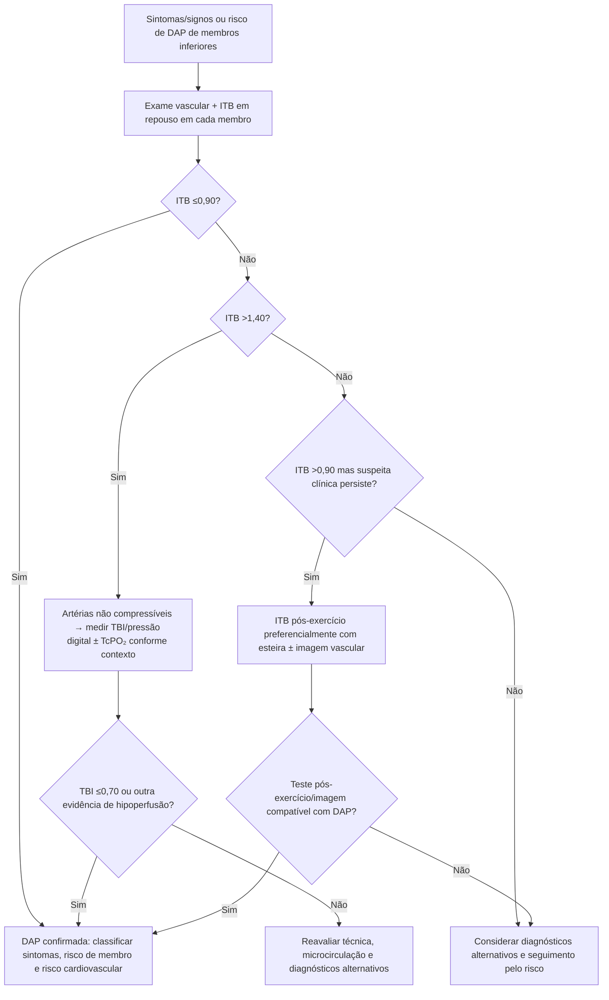
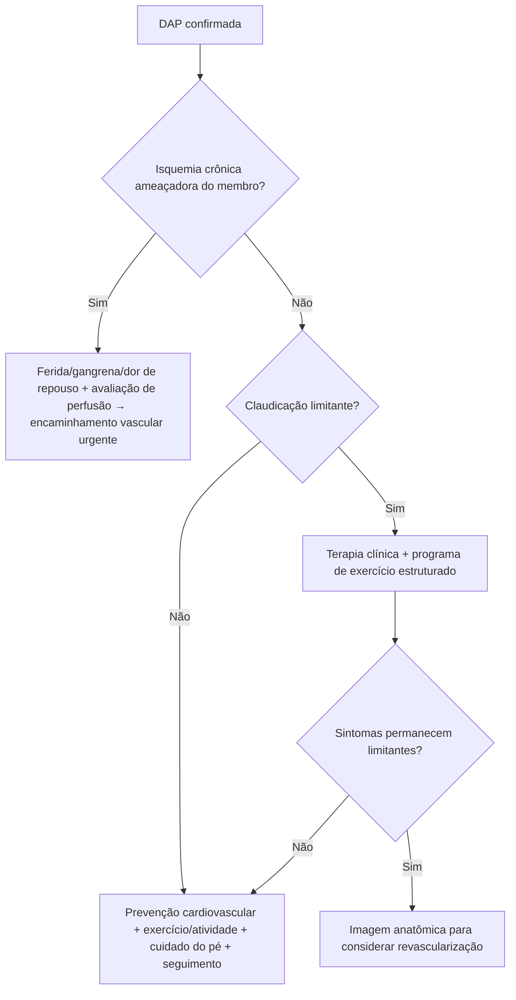

# DAP de membros inferiores — diagnóstico hemodinâmico pela ESC 2024

## Por que começar pelo ITB

A diretriz ESC 2024 para doenças arteriais periféricas e da aorta mantém o **índice tornozelo-braquial (ITB/ABI)** como exame não invasivo inicial de baixo custo para confirmar redução da perfusão dos membros inferiores e acompanhar DAP.

O ITB de repouso apresenta, nas séries citadas pela diretriz, sensibilidade de aproximadamente **68%–84%** e especificidade de **84%–99%** para diagnóstico de DAP.

### Interpretação central

- **ITB ≤0,90:** confirma DAP no contexto apropriado.
- **ITB >1,40:** artérias devem ser consideradas **não compressíveis**; esse padrão é particularmente relevante em diabetes, DRC grave e idade avançada.
- **TBI ≤0,70:** é o limiar patológico usual citado pela ESC para índice hálux-braquial.

## Árvore diagnóstica

## Quando o ITB normal não encerra a investigação

Paciente com **dor de membro desencadeada por esforço e aliviada com repouso** pode ter ITB de repouso >0,90. Nesse cenário, a ESC considera **ITB pós-exercício** e/ou estudo por imagem, preferencialmente após teste em esteira, quando a suspeita permanece.

Isso reduz o erro de classificar como “sem DAP” um paciente com doença hemodinamicamente relevante apenas durante exercício.

## Quando o ITB muito alto também é anormal

ITB >1,40 não significa “circulação excelente”. Ele sugere calcificação/rigidez e vasos não compressíveis. Além de dificultar diagnóstico de DAP, associa-se a maior risco cardiovascular.

Nesse cenário, o **TBI** é útil porque artérias digitais tendem a ser menos afetadas pela rigidez de artérias maiores.

## Do diagnóstico à decisão de imagem

Após demonstrar DAP, imagem anatômica deve responder uma pergunta clínica, especialmente quando:

- há sintomas limitantes apesar de tratamento clínico/exercício;
- existe isquemia crônica ameaçadora do membro;
- considera-se revascularização;
- a anatomia é necessária para planejamento de procedimento.

Ultrassom duplex costuma ser primeira opção anatômico-hemodinâmica; CTA/MRA e angiografia invasiva são escolhidas conforme território, função renal, calcificação, necessidade de intervenção e disponibilidade.

## Árvore: claudicação vs ameaça ao membro

## DAP é marcador sistêmico

Confirmar DAP não termina no membro. O paciente tem risco aumentado de:

- IAM;
- AVC;
- morte cardiovascular;
- eventos adversos maiores do membro (MALE).

O risco aumenta quando mais de um território arterial está acometido. Portanto, o tratamento deve integrar prevenção cardiovascular intensiva, tabagismo, lipídios, pressão, diabetes e estratégia antitrombótica conforme o fenótipo.

## Armadilhas

1. Não excluir DAP apenas porque ITB de repouso é >0,90 em paciente com claudicação típica.
2. Não interpretar ITB >1,40 como resultado normal.
3. Não solicitar angiografia apenas para “confirmar” DAP simples quando ITB/TBI e clínica já respondem a pergunta.
4. Não revascularizar claudicação sem otimizar tratamento clínico e exercício, salvo contexto especial.
5. Não tratar apenas o membro e esquecer o risco cardiovascular sistêmico.

## Fonte verificada

Mazzolai L, Teixido-Tura G, Lanzi S, et al. 2024 ESC Guidelines for the management of peripheral arterial and aortic diseases. *Eur Heart J.* 2024;45(36):3538-3700. PMID **39210722**. DOI **10.1093/eurheartj/ehae179**.

## Status de revisão

`VERIFICAÇÃO HUMANA NECESSÁRIA`: conferir classe/nível formal de cada recomendação antes de converter a árvore em protocolo institucional normativo.
