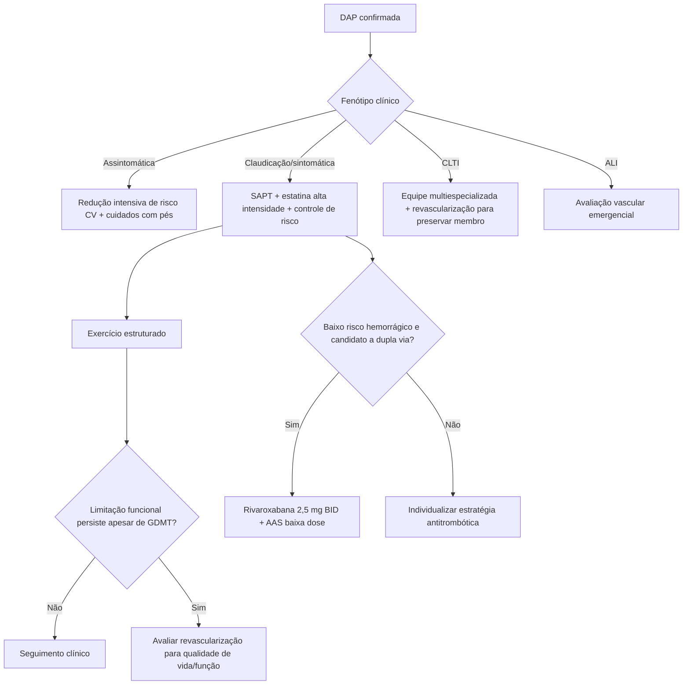

# DAP de membros inferiores — tratamento antitrombótico, exercício e revascularização ACC/AHA 2024

A diretriz ACC/AHA multissocietária de 2024 organiza a doença arterial periférica (DAP) dos membros inferiores em quatro apresentações: **DAP assintomática**, **DAP crônica sintomática** — incluindo claudicação —, **isquemia crônica ameaçadora do membro (CLTI)** e **isquemia aguda do membro (ALI)**. Essa classificação é útil porque o tratamento muda conforme o objetivo dominante: reduzir risco cardiovascular, melhorar capacidade de marcha ou preservar o membro.

## 1. O tratamento começa antes de pensar em procedimento

DAP é manifestação de aterosclerose sistêmica. Portanto, a terapia deve reduzir simultaneamente **MACE** — morte cardiovascular, infarto e AVC — e **MALE** — eventos adversos maiores do membro.

Os pilares incluem:

- cessação do tabagismo;
- **estatina de alta intensidade**, com objetivo de redução de LDL-C ≥50%;
- controle da pressão arterial;
- tratamento do diabetes;
- terapia antitrombótica apropriada;
- exercício estruturado na DAP crônica sintomática;
- cuidados preventivos com os pés.

## 2. DAP sintomática: antiagregação simples é recomendada

Em pacientes com **DAP sintomática**, terapia antiagregante simples é recomendada para reduzir MACE (**Classe I, nível A**). A diretriz aceita como estratégias:

- **clopidogrel 75 mg uma vez ao dia**;
- **AAS 75–325 mg ao dia**.

A escolha deve considerar contexto clínico, tolerabilidade, sangramento, indicação concomitante de anticoagulação e histórico de revascularização.

## 3. Inibição de dupla via: rivaroxabana vascular + AAS

Em DAP sintomática, **rivaroxabana 2,5 mg duas vezes ao dia associada a AAS em baixa dose** é recomendada/efetiva para reduzir MACE e MALE (**Classe I, nível A**) em pacientes apropriados.

Após **revascularização endovascular ou cirúrgica**, a mesma combinação também é recomendada para reduzir eventos cardiovasculares e do membro.

Esse regime usa **dose vascular**, não dose plena de anticoagulação para FA ou TEV. A indicação exige avaliação de risco hemorrágico e não deve ser aplicada automaticamente a quem apresenta alto risco de sangramento.

### O que não fazer

Na DAP **sem outra indicação de anticoagulação** — por exemplo, sem FA ou TEV — **anticoagulação oral em intensidade plena não deve ser utilizada apenas para reduzir MACE/MALE** (**Classe III — dano/sem benefício conforme contexto da recomendação; nível A**).

## 4. Depois de revascularização endovascular

Após revascularização endovascular, a diretriz considera **razoável** DAPT com AAS em baixa dose + inibidor P2Y12 por **pelo menos 1 a 6 meses** (**Classe IIa, C-LD** no slide set oficial). A duração deve ser individualizada conforme procedimento, dispositivos empregados e risco hemorrágico.

Não se deve prolongar DAPT indefinidamente por inércia clínica quando não existe outra indicação.

## 5. Exercício estruturado é tratamento de primeira linha

Em DAP crônica sintomática, **terapia de exercício supervisionado** ou programa comunitário/ domiciliar **estruturado**, com técnicas de mudança comportamental, é recomendada para melhorar:

- desempenho de marcha;
- estado funcional;
- qualidade de vida.

A recomendação é **Classe I, nível A**. Exercício não estruturado do tipo “ande mais” sem programa definido não tem a mesma base de evidência.

## 6. Quando revascularizar a claudicação

Em claudicação com limitação funcional, revascularização é uma opção **quando a resposta à terapia médica guiada por diretriz, incluindo exercício estruturado, é inadequada**. O objetivo é melhorar função de marcha e qualidade de vida — não prevenir a progressão natural em todo paciente com estenose anatômica.

Se o paciente já apresenta resposta clínica adequada ao tratamento médico e ao exercício, **revascularização não é recomendada apenas porque existe lesão arterial importante na imagem**.

## 7. CLTI muda a prioridade: preservar o membro

Na **isquemia crônica ameaçadora do membro**, revascularização é recomendada para:

- minimizar perda tecidual;
- favorecer cicatrização de feridas;
- aliviar dor isquêmica;
- preservar um membro funcional.

O cuidado deve ser multiespecializado, integrando avaliação vascular, tratamento de infecção, descarregamento de pressão, cuidado de feridas, perfusão e controle metabólico.

## Árvore prática

## Armadilhas

- Tratar DAP apenas como doença da perna e esquecer o risco sistêmico de IAM/AVC.
- Usar rivaroxabana em dose plena sem FA, TEV ou outra indicação formal apenas para DAP.
- Prescrever DAPT prolongada sem revisar indicação e risco hemorrágico.
- Encaminhar diretamente para angioplastia por claudicação antes de exercício estruturado e terapia médica adequada.
- Adiar revascularização na CLTI com ferida, gangrena ou dor isquêmica persistente quando o membro é potencialmente salvável.
- Usar “andar mais” como substituto de programa estruturado de exercício.

## Referência principal

Gornik HL, Aronow HD, Goodney PP, et al. *2024 ACC/AHA/AACVPR/APMA/ABC/SCAI/SVM/SVN/SVS/SIR/VESS Guideline for the Management of Lower Extremity Peripheral Artery Disease.* J Am Coll Cardiol. 2024;83(24):2497-2604. DOI **10.1016/j.jacc.2024.02.013**. PMID **38752899**. PMCID **PMC12728805**.
