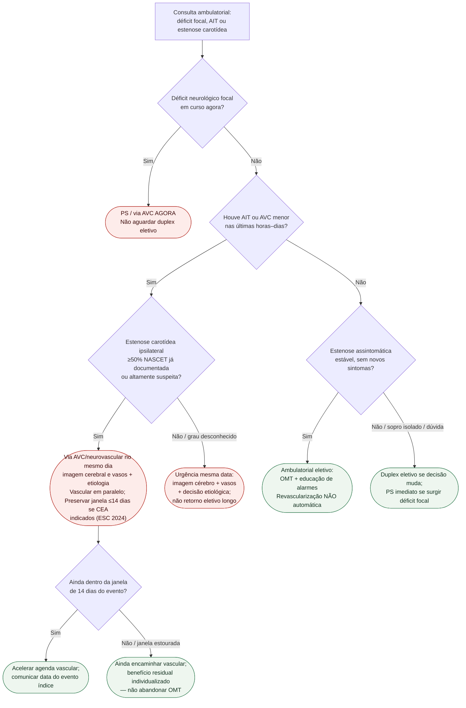

# Fluxograma ambulatorial: carótida — PS vs vascular/neurovascular vs retorno

Prosa: [[sinalizadores-ambulatoriais-ait-deficit-focal-estenose-carotidea-quando-encaminhar](/biblioteca/sinalizadores-ambulatoriais-ait-deficit-focal-estenose-carotidea-quando-encaminhar)](/biblioteca/sinalizadores-ambulatoriais-ait-deficit-focal-estenose-carotidea-quando-encaminhar). Janela 14 dias: [[estenose-carotidea-sintomatica-janela-de-14-dias-destino-ambulatorial](/biblioteca/estenose-carotidea-sintomatica-janela-de-14-dias-destino-ambulatorial)](/biblioteca/estenose-carotidea-sintomatica-janela-de-14-dias-destino-ambulatorial). Hub: [[estenose-de-carotida-diagnostico-e-indicacao-de-revascularizacao-esc-2024](/biblioteca/estenose-de-carotida-diagnostico-e-indicacao-de-revascularizacao-esc-2024)](/biblioteca/estenose-de-carotida-diagnostico-e-indicacao-de-revascularizacao-esc-2024).

## Árvore de decisão

## Resumo de destinos

| Achado | Destino |
|---|---|
| Déficit focal em curso | PS / via AVC agora |
| AIT/AVC menor recente + estenose ipsilateral ≥50% | Via AVC/neurovascular no mesmo dia; vascular em paralelo e CEA precoce se indicada |
| AIT recente sem grau conhecido | Urgência mesma data (imagem + etiologia) |
| Estenose assintomática estável | Ambulatorial + OMT + alarmes |
| Sintomas de CLTI ou AAA | Pacote #833 (não esta árvore) |

## Notas

- **D1** = gate de segurança neurológica.
- **D3/D5** = janela ESC 2024 para revascularização sintomática quando indicada.
- Não decide CEA vs CAS vs TCAR; não lista doses.
