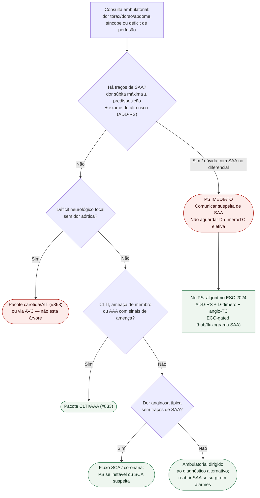

# Fluxograma ambulatorial: suspeita de SAA — consultório → PS

Prosa: [`sinalizadores-ambulatoriais-suspeita-sindrome-aortica-aguda-ps-imediato`](sinalizadores-ambulatoriais-suspeita-sindrome-aortica-aguda-ps-imediato.md). Checklist: [`checklist-ambulatorial-suspeita-de-sindrome-aortica-aguda-antes-do-ps`](checklist-ambulatorial-suspeita-de-sindrome-aortica-aguda-antes-do-ps.md). Hub hospitalar: [`sindrome-aortica-aguda-dissecacao-diagnostico-e-manejo`](sindrome-aortica-aguda-dissecacao-diagnostico-e-manejo.md).

## Árvore de decisão

## Resumo de destinos

| Achado | Destino |
|---|---|
| Suspeita de SAA (dor súbita ± predisposição ± exame) | **PS imediato** |
| Déficit focal isolado | #868 / via AVC |
| CLTI ou AAA com ameaça | #833 |
| Angina típica sem SAA | Fluxo SCA |
| Sem alarmes aórticos | Ambulatorial etiológico |

## Notas

- **D1** = gate de segurança aórtica: na dúvida, PS.
- ADD-RS + D-dímero (ADvISED) pertence ao **PS**, não ao consultório.
- Não lista doses; não decide tipo A/B nem TEVAR.
- `review_status: pendente_revisao`.
