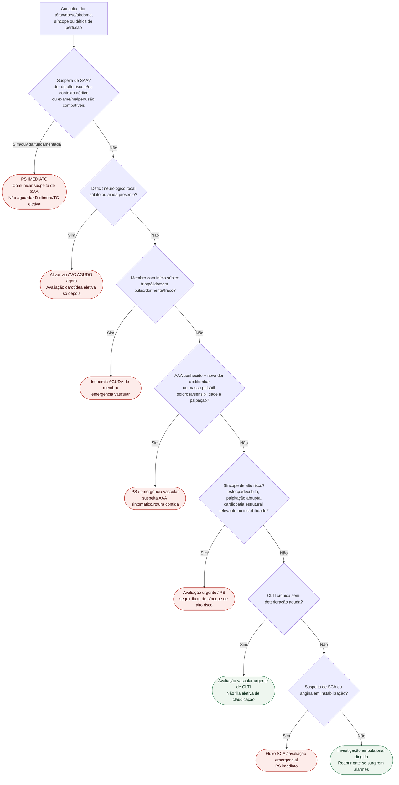

# Fluxograma ambulatorial: suspeita de SAA — consultório → PS

## Links canônicos

- [fluxograma-sindrome-aortica-aguda-esc-2024](/biblioteca/fluxograma-sindrome-aortica-aguda-esc-2024)
- [fluxograma-dor-membro-claudicacao-clti-isquemia-aguda](/biblioteca/fluxograma-dor-membro-claudicacao-clti-isquemia-aguda)
- [fluxograma-aneurisma-de-aorta-abdominal-seguimento-e-indicacao-de-reparo](/biblioteca/fluxograma-aneurisma-de-aorta-abdominal-seguimento-e-indicacao-de-reparo)

ADD-RS + D-dímero pertence ao ambiente de emergência; este fluxo só decide **destino**.

SAA pode ocorrer sem predisposição conhecida e, raramente, sem dor: o conjunto clínico prevalece sobre a pontuação. Na suspeita concomitante de dissecção e AVC, comunicar ambos imediatamente à equipe de emergência para avaliação coordenada antes de terapias que possam agravar a dissecção. CLTI requer avaliação vascular urgente mesmo quando crônica; deterioração aguda muda o destino para emergência.

- [AVC agudo](/biblioteca/fluxograma-suspeita-de-avc-agudo-primeira-hora).
