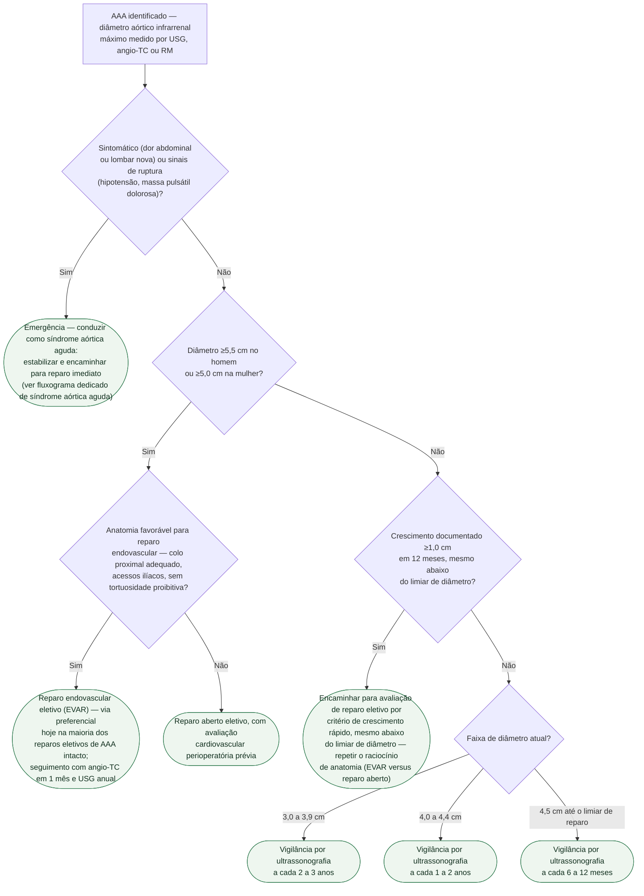

# Fluxograma: Aneurisma de Aorta Abdominal — seguimento por tamanho e indicação de reparo (ESC 2024)

Os quatro fluxogramas já publicados neste tema cobrem emergência aórtica (síndrome
aórtica aguda), isquemia aguda de membro, a distinção entre claudicação/CLTI/isquemia
aguda e o diagnóstico de doença arterial periférica pelo ITB — todos cenários agudos ou
de investigação inicial. Faltava a árvore de decisão do cenário **eletivo e crônico**
mais comum na prática do aneurisma de aorta abdominal (AAA): uma vez identificado o
aneurisma, com que frequência reavaliar por tamanho, e em que ponto a vigilância cede
lugar à indicação de reparo. Esta árvore fecha essa lacuna, complementando o documento
já publicado no tema sobre rastreamento, seguimento e indicação de reparo.

A ESC 2024 fundiu, pela primeira vez, doença arterial periférica e doença aórtica num
único documento (substituindo as diretrizes de 2014 e 2017), fixando classe e nível de
evidência para os limiares que já eram praticados: reparo eletivo recomendado a partir
de **5,5 cm no homem** e **5,0 cm na mulher** — a mulher opera mais cedo por maior risco
de ruptura relativo ao diâmetro —, e crescimento acelerado (**≥1,0 cm em 12 meses**)
como indicação cirúrgica independente do diâmetro absoluto.

## Árvore de decisão

## Por que o limiar difere entre homem e mulher

O risco de ruptura de um AAA não é função só do diâmetro absoluto — é maior, para o
mesmo diâmetro, na mulher. É por isso que o limiar de reparo eletivo recomendado é mais
baixo nela (5,0 cm) do que no homem (5,5 cm), e não uma diferença arbitrária de
protocolo. Abaixo do limiar de diâmetro, a razão de chances de ruptura por aumento de
1 cm no diâmetro é próxima nos dois sexos (cerca de 5,0-5,3), mas a mulher parte de um
risco basal mais alto na mesma faixa de tamanho.

## Por que o critério de crescimento existe além do diâmetro

Um aneurisma que cresce rápido — ≥1,0 cm em 12 meses — sinaliza instabilidade da parede
que o diâmetro absoluto isolado não captura. É por isso que a indicação cirúrgica não
espera o AAA atingir o limiar de tamanho quando esse ritmo de crescimento já foi
documentado: o risco de ruptura no intervalo até a próxima vigilância programada deixa
de ser aceitável.

## EVAR versus reparo aberto

A decisão entre via endovascular e cirurgia aberta depende primariamente da anatomia —
comprimento e angulação do colo proximal, calibre e tortuosidade dos acessos ilíacos —,
não de preferência isolada. Na prática atual dos EUA, o reparo endovascular já responde
por cerca de 80% dos reparos eletivos de AAA intacto, refletindo tanto a evolução das
endopróteses quanto o perfil de risco cirúrgico mais favorável do EVAR no perioperatório
imediato; o reparo aberto continua sendo a alternativa quando a anatomia não é favorável
ou quando a durabilidade de longo prazo pesa mais na decisão compartilhada com o
paciente.

## Racional da vigilância por faixa de tamanho

Abaixo do limiar de reparo, o risco anual de ruptura cresce de forma não linear com o
diâmetro — próximo de 0% na faixa de 3,0-3,9 cm, em torno de 1% na faixa de 4,0-4,9 cm —,
e é esse gradiente de risco que justifica encurtar o intervalo de reavaliação à medida
que o aneurisma se aproxima do limiar cirúrgico, em vez de manter uma frequência fixa de
exame desde o diagnóstico.
