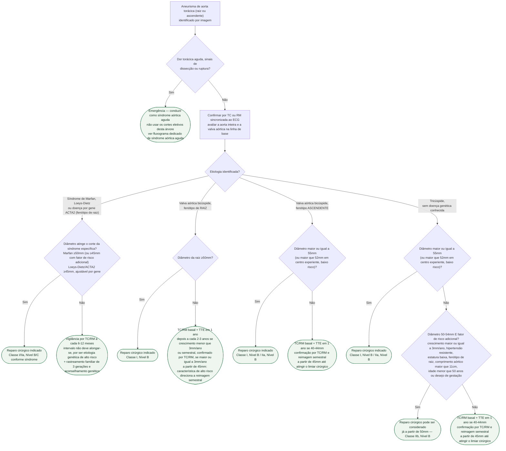

# Fluxograma: Aneurisma de Aorta Torácica — Corte de Reparo por Etiologia e Vigilância (ESC 2024)

Os seis fluxogramas já publicados no tema cobrem o aneurisma de aorta **abdominal**, a
doença arterial periférica de membro e a síndrome aórtica **aguda** — dissecção, hematoma
intramural e úlcera aterosclerótica penetrante, sempre em cenário de emergência. Faltava a
árvore de decisão do cenário **eletivo e crônico** do aneurisma de aorta **torácica**
(raiz/ascendente): uma vez identificado, sem sinais de síndrome aórtica aguda, em que ponto
a vigilância por imagem cede lugar à indicação de reparo. A ESC 2024 respondeu a essa
pergunta de forma **não uniforme** — o corte de diâmetro muda conforme a etiologia, não só
conforme o tamanho —, e é exatamente essa dependência de etiologia que esta árvore organiza.

## Árvore de decisão

## Por que a etiologia decide o corte, não só o diâmetro

O erro mais comum na leitura rápida da diretriz é tratar "55 mm" como um número único e
universal. Ele é, na verdade, o corte-padrão de **um** cenário — aorta ascendente tubular,
valva tricúspide, sem doença genética. Nos demais cenários o corte é mais baixo, porque o
risco de dissecção em diâmetros menores é maior:

- na síndrome de Marfan e no fenótipo de raiz da valva bicúspide, o corte cai para **50 mm**;
- na síndrome de Loeys-Dietz e na doença por gene ACTA2, cai para **45 mm**, com a ressalva
  de que dissecção pode ocorrer com diâmetros ainda menores nessas duas condições.

## O corte de 50 mm por fator de risco, sem síndrome genética nem valva bicúspide

Mesmo no cenário mais "benigno" — tricúspide, sem doença genética —, a substituição da
aorta ascendente **pode ser considerada já a partir de 50 mm** (Classe IIb, Nível B) quando o
paciente reúne fatores de risco adicionais: crescimento ≥3 mm/ano, hipertensão resistente,
estatura baixa, fenótipo de raiz, comprimento aórtico >11 cm, idade <50 anos ou desejo de
gestação. A justificativa numérica está na própria diretriz: **mais de 60% das dissecções
agudas tipo A** em pacientes sem síndrome genética e sem valva bicúspide ocorrem com aorta
que ainda não atingiu o corte clássico de 55 mm, e o risco de evento já ultrapassa 1% ao ano
na faixa de 50-54 mm. Esta árvore mantém essa recomendação restrita ao ramo tricúspide sem
doença genética — a diretriz não estende esse mesmo corte de 50 mm ao fenótipo ascendente da
valva bicúspide, que segue pelo corte-padrão de 55 mm (ou 52 mm em centro experiente).

## Por que TTE não substitui TC/RM no seguimento

A ecocardiografia transtorácica é o método inicial válido para **raiz e ascendente**, mas é
**formalmente contraindicada (Classe III, Nível C)** para vigilância de aorta ascendente
distal, arco e descendente — segmentos onde o método obrigatório é TC ou RM. Essa regra vale
para todos os ramos desta árvore e por isso não está desenhada como decisão: aplica-se
igualmente à confirmação inicial e a cada reavaliação de vigilância, qualquer que seja a
etiologia.

## Antes de entrar nesta árvore

Identificado um aneurisma torácico em qualquer segmento, a avaliação da **aorta inteira** é
recomendada, na linha de base e no seguimento (Classe I, Nível C), assim como a avaliação da
**valva aórtica** — sobretudo para bicúspide (Classe I, Nível C), porque 20-30% dos
aneurismas de raiz surgem em portador de valva bicúspide. É essa avaliação inicial que define
em qual dos quatro ramos etiológicos desta árvore o paciente se encaixa.

## Limites

- esta árvore cobre reparo eletivo da raiz e da aorta ascendente; a aorta descendente e
  toracoabdominal têm cortes próprios e mais altos (DTA sem doença hereditária ≥55 mm, TAAA
  degenerativo ≥60 mm), não representados aqui por serem um recorte anatômico distinto;
- não substitui a avaliação de risco cirúrgico formal nem a decisão compartilhada com o
  paciente sobre durabilidade e via de reparo (aberta versus endovascular);
- rastreamento familiar (história de três gerações, teste em cascata, aconselhamento
  genético) é recomendado nos ramos de doença hereditária mas não está desdobrado nesta
  árvore, que é sobre limiar de reparo — ver o documento-base para o detalhe do rastreamento;
- este fluxograma não cobre síndrome aórtica aguda (ver `fluxograma-sindrome-aortica-aguda-esc-2024`)
  nem aneurisma de aorta abdominal (ver `fluxograma-aneurisma-de-aorta-abdominal-seguimento-e-indicacao-de-reparo`).

## Conexões no CorVIA

- documento-base, com o detalhe completo de tabelas e rastreamento familiar:
  `aneurisma-de-aorta-toracica-cortes-por-etiologia-e-seguimento-esc-2024`;
- fluxogramas relacionados do mesmo tema: `fluxograma-sindrome-aortica-aguda-esc-2024`,
  `fluxograma-aneurisma-de-aorta-abdominal-seguimento-e-indicacao-de-reparo`;
- diretriz combinada: 2024 ESC Guidelines for the management of peripheral arterial and
  aortic diseases (PMID 39210722).
