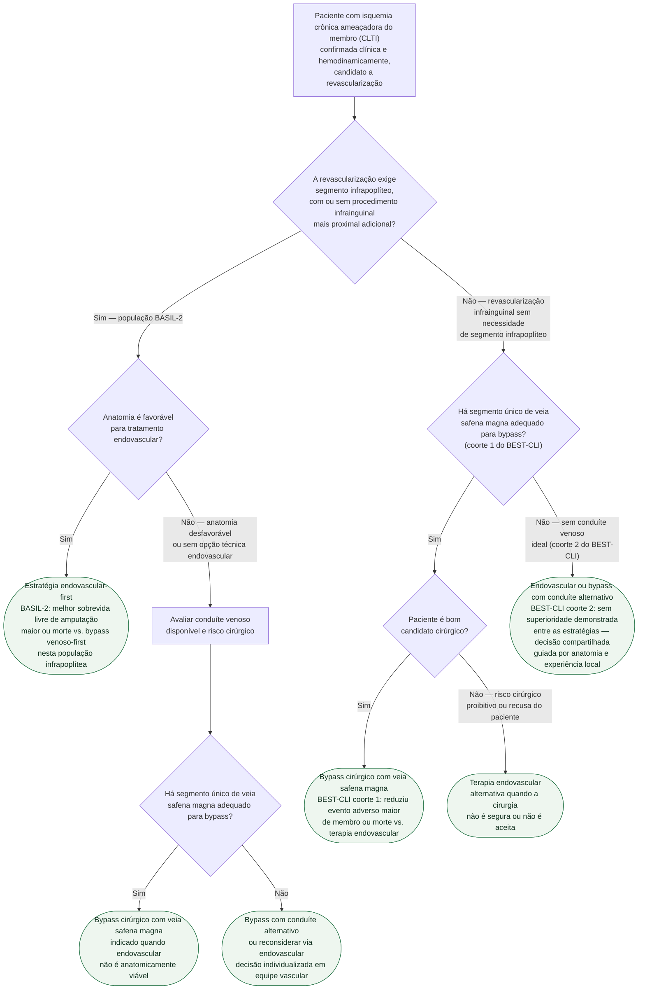

# Fluxograma: Isquemia Crônica Ameaçadora do Membro — Estratégia de Revascularização por Padrão Anatômico (BASIL-2 e BEST-CLI)

A escolha entre bypass cirúrgico e terapia endovascular na isquemia crônica
ameaçadora do membro (CLTI, do inglês *chronic limb-threatening ischaemia*)
deixou de ser uma pergunta única com resposta única. Dois ensaios
randomizados de grande porte, publicados em anos consecutivos, responderam
a perguntas **diferentes**, em populações **diferentes**, com resultados que
parecem opostos à primeira leitura — e não são, quando se olha para o
critério de inclusão de cada um.

- **BEST-CLI** (N Engl J Med 2022) incluiu pacientes candidatos tanto à
  cirurgia quanto à terapia endovascular, com revascularização **infrainguinal
  em geral**, e estratificou a análise por disponibilidade de **veia safena
  magna** em segmento único adequado para bypass.
- **BASIL-2** (Lancet 2023) selecionou especificamente pacientes que
  **precisavam de revascularização infrapoplítea**, com ou sem procedimento
  infrainguinal mais proximal associado.

Este fluxograma organiza a decisão pela pergunta que separa as duas
populações — **a revascularização exige segmento infrapoplíteo?** — antes de
aplicar o critério que decide dentro de cada uma.

## Árvore de decisão

## Antes de entrar nesta árvore

Este fluxograma pressupõe que o diagnóstico de CLTI já está estabelecido —
dor isquêmica em repouso, ferida que não cicatriza ou gangrena, com
confirmação hemodinâmica (ITB, TBI/pressão do hálux, TcPO₂ ou pressão de
perfusão cutânea conforme o caso) — e que a anatomia arterial já foi definida
por imagem (duplex, angio-TC, angio-RM ou angiografia). Essa etapa está
detalhada em `fluxograma-dor-membro-claudicacao-clti-isquemia-aguda`, que
também usa o **WIfI** para estadiar a gravidade da ferida, isquemia e infecção
— o WIfI organiza risco de amputação e urgência, mas **não escolhe sozinho**
a técnica de revascularização, que é o que esta árvore endereça.

## Por que a pergunta inicial é o padrão anatômico, não o ensaio

Separar por "BASIL-2 ou BEST-CLI" seria começar pela citação, não pela
anatomia do paciente. A pergunta clínica que replica o critério de inclusão
de cada ensaio é: **esta revascularização precisa alcançar o território
infrapoplíteo?**

- Se **sim**, o paciente se assemelha à população do **BASIL-2** — 345
  pacientes que necessitavam revascularização infrapoplítea, com ou sem
  procedimento infrainguinal mais proximal adicional.
- Se **não** — a revascularização é infrainguinal em geral, sem exigir
  descida ao segmento infrapoplíteo —, o paciente se assemelha à população do
  **BEST-CLI**, e o critério decisivo passa a ser a disponibilidade de veia
  safena magna em segmento único.

## O resultado do BASIL-2, e o que ele não prova

No BASIL-2, amputação maior ou morte ocorreu em **63%** (108/172) do grupo
bypass-primeiro contra **53%** (92/173) do grupo endovascular-primeiro (HR
ajustado 1,35; IC95% 1,02–1,80; p=0,037), favorecendo a estratégia
endovascular-first nessa população. **Isso não significa que o bypass esteja
contraindicado no território infrapoplíteo**: a diferença foi impulsionada
predominantemente por maior mortalidade no grupo bypass, não por uma
diferença isolada e dominante em amputações, e a amostra não atingiu o número
de eventos planejado. Por isso a árvore mantém o bypass como conduta válida
quando a anatomia não é favorável ao endovascular — a evidência orienta a
**estratégia inicial preferencial**, não uma proibição.

## O resultado do BEST-CLI, e por que ele decide pela veia

No BEST-CLI, a resposta muda com o conduíte disponível:

- **Coorte 1 (safena magna adequada):** MALE ou morte em **42,6%** com
  cirurgia vs. **57,4%** com endovascular (HR 0,68; IC95% 0,59–0,79;
  p<0,001) — vantagem clara do bypass com veia.
- **Coorte 2 (sem conduíte venoso ideal):** **42,8%** vs. **47,7%** (HR 0,79;
  IC95% 0,58–1,06; p=0,12) — sem diferença estatisticamente significativa.

É essa divisão por coorte, e não uma preferência geral por cirurgia, que a
árvore reproduz nos nós D4/D5/C4/C5/C6.

## Limites

- Esta árvore não substitui a avaliação de risco cirúrgico formal (ver
  Avaliação Cardiológica Pré-Operatória de Risco Cirúrgico) nem a decisão
  compartilhada com o paciente sobre durabilidade, número de reintervenções
  esperadas e tempo de recuperação.
- BASIL-2 e BEST-CLI têm desenhos, territórios e endpoints distintos — não
  devem ser lidos como resultados contraditórios de uma mesma pergunta.
- Anatomia, qualidade do conduíte, possibilidade técnica e experiência do
  centro continuam sendo determinantes práticos que nenhum dos dois ensaios,
  isoladamente, substitui.
- Este fluxograma não cobre isquemia aguda de membro (ver
  `fluxograma-isquemia-aguda-de-membro-rutherford-2024`) nem o diagnóstico
  inicial de DAP (ver `fluxograma-doenca-arterial-periferica-diagnostico-esc-2024`).

## Conexões no CorVIA

- estudos já publicados: `basil-2-bypass-endovascular-infrapopliteo-clti`,
  `best-cli-bypass-endovascular-isquemia-cronica-ameacadora-membro`;
- documento-base de diagnóstico: `doenca-arterial-periferica-de-membros-diagnostico-por-itb-e-isquemia-critica`;
- fluxogramas relacionados do mesmo tema: `fluxograma-dor-membro-claudicacao-clti-isquemia-aguda`,
  `fluxograma-isquemia-aguda-de-membro-rutherford-2024`;
- diretriz combinada: 2024 ESC Guidelines for the management of peripheral
  arterial and aortic diseases (PMID 39210722).
