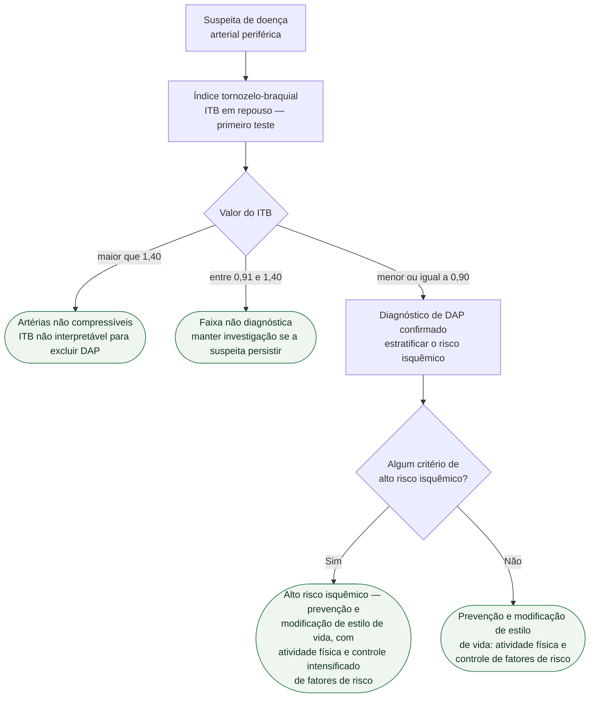

# Fluxograma: Doença Arterial Periférica — diagnóstico (ESC 2024)

A diretriz ESC 2024 uniu, pela primeira vez, doença arterial periférica e doenças
da aorta em um único documento — a justificativa declarada é a
**interconectividade do sistema arterial como um todo**. Ela funde e atualiza as
diretrizes de DAP de 2017 e de aorta de 2014.

## Árvore de decisão

## O ITB como primeiro teste

A abordagem inicial recomendada é não invasiva, com o **índice tornozelo-braquial
como primeiro exame**. Desempenho do ITB em repouso para o diagnóstico de DAP:

| Métrica | Faixa |
|---|---|
| Sensibilidade | 68% – 84% |
| Especificidade | 84% – 99% |

**ITB ≤ 0,90 confirma o diagnóstico de DAP.** Para valores **> 1,40**, o termo
correto é *artérias não compressíveis* — nesse cenário o índice não serve para
excluir doença, porque a calcificação da parede arterial eleva artificialmente a
pressão no tornozelo.

## Critérios de alto risco isquêmico da ESC

- amputação prévia
- isquemia crônica ameaçadora do membro
- revascularização prévia
- comorbidades de alto risco — insuficiência cardíaca, diabetes, doença
  poliarterial
- taxa de filtração glomerular estimada abaixo de 60 mL/min/1,73 m²

## Ênfase da diretriz

O documento cobre toda a trajetória do paciente, do diagnóstico e da
estratificação de risco na apresentação inicial até o manejo de longo prazo após
a hospitalização, e enfatiza cuidado centrado no paciente, estratégias
preventivas, modificação de estilo de vida e atividade física para evitar
progressão da doença e complicações.
