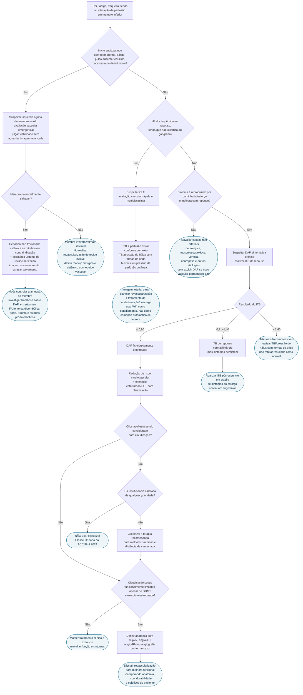

# Fluxograma: Dor em Membro Inferior — Claudicação, CLTI ou Isquemia Aguda?

Este fluxograma deriva do documento `doenca-arterial-periferica-de-membros-diagnostico-por-itb-e-isquemia-critica` e responde primeiro à pergunta que muda prognóstico: **há ameaça imediata à viabilidade do membro?** Somente depois organiza a investigação fisiológica da DAP crônica.

## Árvore de decisão

## Como usar o ramo de isquemia aguda

Na ALI, o objetivo inicial é classificar **viabilidade do membro**, não obter o exame anatômico mais sofisticado. A ACC/AHA 2024 recomenda avaliação emergencial por profissional capaz de julgar viabilidade e implementar tratamento — **Classe I, C-EO** — e permite que essa avaliação inicial seja feita sem duplex, angio-TC ou angio-RM — **Classe I, C-LD**.

Déficit sensitivo e, sobretudo, **fraqueza/paralisia** elevam a suspeita de ameaça imediata. A classificação Rutherford ajuda a organizar o risco:

- **I:** viável;
- **IIa:** marginalmente ameaçado;
- **IIb:** imediatamente ameaçado;
- **III:** irreversível.

Em membro salvável, revascularização endovascular ou cirúrgica é indicada — **Classe I, A**. Heparina não fracionada sistêmica deve ser administrada no diagnóstico salvo contraindicação — **Classe I, C-EO**. A própria diretriz reconhece que esta anticoagulação é sustentada por prática consolidada/consenso e não por ensaio randomizado de heparina versus nenhuma anticoagulação.

## Como usar o ramo de DAP crônica

### ITB de repouso

Com história/exame sugestivos de DAP, ITB de repouso é recomendado — **Classe I, B-NR**. As categorias são:

- ≤0,90: anormal;
- 0,91–0,99: limítrofe;
- 1,00–1,40: normal;
- >1,40: não compressível.

### Sintoma típico, ITB normal/limítrofe

Se sintomas ao esforço continuam sugestivos com ITB >0,90 e ≤1,40, realizar **ITB pós-exercício — Classe I, B-NR**. Esse ramo existe para impedir o erro “ITB normal em repouso = DAP excluída”.

### ITB >1,40

Usar **TBI/pressão do hálux com formas de onda — Classe I, B-NR**. A ACC/AHA 2024 considera TBI ≤0,70 anormal. Diabetes e DRC aumentam a chance de artérias não compressíveis.

## Interação clínica que deve aparecer no grafo: cilostazol × insuficiência cardíaca

Na claudicação, cilostazol é recomendado para melhorar sintomas e distância de caminhada — **Classe I, A**. Porém, se o paciente tem **insuficiência cardíaca de qualquer gravidade**, cilostazol **não deve ser administrado — Classe III: dano, C-LD**.

Isso deve conectar três superfícies do CorVIA:

**DAP/claudicação → cilostazol → insuficiência cardíaca/contraindicação**.

O objetivo não é produzir alerta indiscriminado para todo uso do fármaco, mas evitar que uma recomendação legítima para claudicação seja exibida sem a principal condição cardiovascular que a invalida.

## Quando a imagem anatômica muda conduta

Imagem arterial não deve ser automaticamente pedida para toda claudicação. Ela ganha valor quando:

- claudicação permanece funcionalmente limitante apesar de tratamento orientado por guideline e exercício estruturado e revascularização está sendo considerada — **Classe I, B-NR**;
- há CLTI e a anatomia é necessária para planejar revascularização — **Classe I, B-NR**;
- a fisiologia permanece inconclusiva apesar de suspeita clínica — imagem não invasiva pode ser considerada — **Classe IIb, C-EO**.

## Conexões no CorVIA

- documento-base: `doenca-arterial-periferica-de-membros-diagnostico-por-itb-e-isquemia-critica`;
- fluxograma geral já existente: `fluxograma-dap-doenca-arterial-periferica`;
- fármaco: `cilostazol`;
- IC: módulos de insuficiência cardíaca para contraindicação do cilostazol;
- diabetes: rastreio de DAP silenciosa e ITB potencialmente enganoso;
- fibrilação atrial: fonte cardioembólica em ALI;
- aorta/aneurisma: fonte arterial de embolização;
- cardio-oncologia: `isquemia-aguda-de-membro-e-doenca-arterial-por-nilotinibe-ou-ponatinibe`;
- exames: ITB, ITB pós-exercício, TBI, duplex, angio-TC/angio-RM e medidas de perfusão distal;
- emergência: ALI ameaçando membro e necessidade de transferência quando não há capacidade de revascularização local.

## Limites

- claudicação é síndrome clínica; não deve ser diagnosticada por um único sintoma sem avaliação vascular;
- WIfI e Rutherford organizam risco, mas não escolhem isoladamente a técnica de revascularização;
- heparina na ALI tem recomendação forte de guideline, porém nível de evidência C-EO;
- a estratégia endovascular versus cirúrgica depende de anatomia, risco, conduit, durabilidade e experiência local;
- este fluxograma não contém esquema posológico e não substitui protocolo vascular local para anticoagulação e revascularização.
