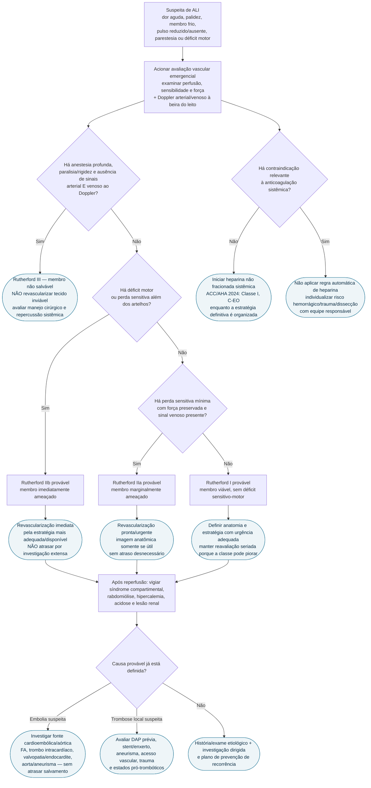

# Fluxograma: Isquemia Aguda de Membro — Viabilidade, Rutherford e Reperfusão

Este é o fluxograma específico do módulo `isquemia-aguda-de-membro-classificacao-de-rutherford-e-conduta`. A prioridade é **viabilidade do membro e tempo para reperfusão**, não confirmação anatômica antes de acionar a equipe vascular.

## Árvore de decisão

## Pontos que o fluxograma protege

### 1. Não esperar imagem avançada para reconhecer ameaça imediata

A ACC/AHA 2024 recomenda avaliação emergencial de viabilidade — **Classe I, C-EO** — e afirma que a avaliação inicial pode ser realizada **sem duplex, angio-TC ou angio-RM — Classe I, C-LD**.

A imagem anatômica é útil quando modifica a estratégia e existe tempo. Ela não deve atrasar revascularização de Rutherford IIb.

### 2. Heparina é recomendada, mas não possui evidência randomizada direta

Na ALI, heparina não fracionada sistêmica é recomendada salvo contraindicação — **Classe I, C-EO**. A diretriz explicita que esse uso se baseia em prática aceita e prevenção de propagação/embolização adicional, não em ensaio randomizado contra nenhuma anticoagulação.

O CorVIA deve apresentar simultaneamente **a força da recomendação e a limitação da evidência**.

### 3. Rutherford III não significa “amputar automaticamente pela tabela”

O princípio de guideline é: **não revascularizar membro não salvável — Classe III: dano, C-EO**. Manejo cirúrgico definitivo depende de avaliação vascular, extensão de tecido inviável, repercussão sistêmica, dor/infecção e objetivos de cuidado.

### 4. Reperfusão não encerra o episódio

Após restauração de fluxo, vigiar síndrome compartimental e repercussão metabólica. Depois, investigar a causa para prevenir recorrência. A investigação cardiovascular de fonte embólica pode ser útil — **Classe IIa, C-LD** — mas jamais deve atrasar salvamento do membro.

## Conexões no CorVIA

- documento especializado: `isquemia-aguda-de-membro-classificacao-de-rutherford-e-conduta`;
- porta sindrômica: `fluxograma-dor-membro-claudicacao-clti-isquemia-aguda`;
- DAP crônica: `doenca-arterial-periferica-de-membros-diagnostico-por-itb-e-isquemia-critica`;
- fibrilação atrial e fontes cardioembólicas;
- endocardite e doença valvar;
- aortopatias e aneurisma poplíteo;
- cardio-oncologia: `isquemia-aguda-de-membro-e-doenca-arterial-por-nilotinibe-ou-ponatinibe`;
- futura entrada `isquemia-aguda-de-membro` no modo Emergência.

## Limites

- Rutherford deve ser reavaliado seriamente se a intervenção não for imediata;
- a classificação não escolhe sozinha a técnica de revascularização;
- este fluxograma não contém posologia de anticoagulante ou trombolítico;
- protocolos locais de cirurgia vascular/intervenção e capacidade de transferência continuam determinantes.
