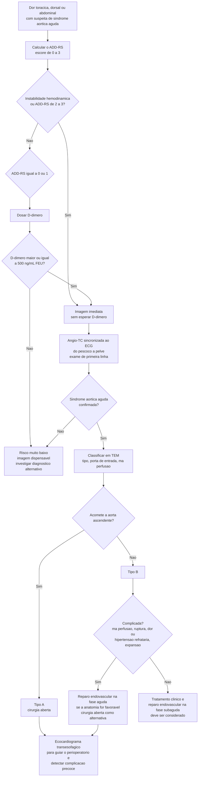

# Fluxograma: Síndrome aórtica aguda (ESC 2024)

A ESC 2024 fundiu, pela primeira vez, as recomendações de doença arterial
periférica e de doença aórtica em um documento único, substituindo as
diretrizes de 2017 e de 2014. Para a síndrome aórtica aguda, duas mudanças
organizam o raciocínio: um **algoritmo diagnóstico multiparamétrico
ancorado no escore ADD-RS** (Classe I, nível B) e uma **nova classificação
TEM**, que descreve o caso por tipo de síndrome, localização da porta de
entrada e presença de má perfusão.

## Caminho decisório

## O escore ADD-RS

O *Aortic Dissection Detection Risk Score* não conta fatores isolados: conta
**quantas das três categorias abaixo têm ao menos um item presente**. O
escore vai, portanto, de 0 a 3.

**1. Condições predisponentes de alto risco**

- síndrome de Marfan ou outra doença do tecido conjuntivo
- história familiar de doença aórtica
- doença valvar aórtica conhecida
- manipulação aórtica recente
- aneurisma de aorta torácica conhecido

**2. Características de dor de alto risco**

Dor torácica, dorsal ou abdominal que seja de início abrupto e/ou de
intensidade grave **e** de qualidade dilacerante, rasgante ou em pontada.

**3. Achados de exame físico de alto risco**

- déficit de perfusão — déficit de pulso, diferencial de pressão arterial
  entre membros ou déficit neurológico focal
- sopro novo de insuficiência aórtica acompanhando a dor
- hipotensão ou estado de choque

## Por que combinar ADD-RS com D-dímero

Nenhum dos dois é exame diagnóstico — os dois servem para decidir **quem
precisa de imagem**. A metanálise que sustenta a estratégia mediu as
combinações possíveis:

| Estratégia | Sensibilidade | Especificidade |
|---|---:|---:|
| ADD-RS > 0 | 94,6% | 34,7% |
| ADD-RS > 1 | 43,4% | 89,3% |
| ADD-RS > 0 ou D-dímero > 500 ng/L | 99,8% | 21,8% |
| ADD-RS > 1 ou D-dímero > 500 ng/L | 98,3% | 51,4% |
| ADD-RS > 1, ou ADD-RS = 1 com D-dímero > 500 ng/L | 93,1% | 67,1% |

A leitura prática é direta: o ADD-RS sozinho, com corte em > 0, já é
sensível, mas manda quase todo mundo para a tomografia. Acrescentar o
D-dímero permite escolher onde ficar na troca entre sensibilidade e
especificidade. A combinação de ADD-RS ≤ 1 com D-dímero < 500 ng/mL em
unidades equivalentes de fibrinogênio identifica o grupo de risco muito
baixo, que pode dispensar a imagem.

Probabilidade de dissecção por faixa de escore, na descrição original:
ADD-RS 0 corresponde a risco baixo, ADD-RS 1 a risco moderado e ADD-RS 2–3 a
risco alto.

## A classificação TEM

Substitui a leitura puramente anatômica de Stanford por três eixos com
consequência terapêutica:

- **T** — tipo de síndrome aórtica: dissecção, hematoma intramural ou úlcera
  aterosclerótica penetrante;
- **E** — localização da porta de entrada (*entry tear*);
- **M** — presença de má perfusão.

A má perfusão é o eixo que mais desloca a conduta: é o que transforma um tipo
B em tipo B complicado, com indicação de reparo endovascular na fase aguda.

## Hematoma intramural e úlcera penetrante

As duas entidades seguem a mesma lógica territorial da dissecção:

- **hematoma intramural tipo B complicado** — o reparo endovascular torácico
  passou a recomendação Classe I nesta diretriz;
- **úlcera aterosclerótica penetrante tipo A** — cirurgia;
- **úlcera aterosclerótica penetrante tipo B** — tratamento endovascular.

## Limiares de intervenção no aneurisma, para contexto

O mesmo documento fixa os limiares eletivos que definem quem opera antes de
chegar à síndrome aguda:

- aorta ascendente: cirurgia recomendada com diâmetro máximo ≥ 55 mm
  (Classe I, nível B);
- valva aórtica bicúspide com aneurisma de aorta ascendente: cirurgia deve
  ser considerada a partir de ≥ 45 mm (Classe IIa, nível C);
- a substituição da raiz aórtica com preservação valvar é recomendada em
  centros experientes (Classe I, nível B).
