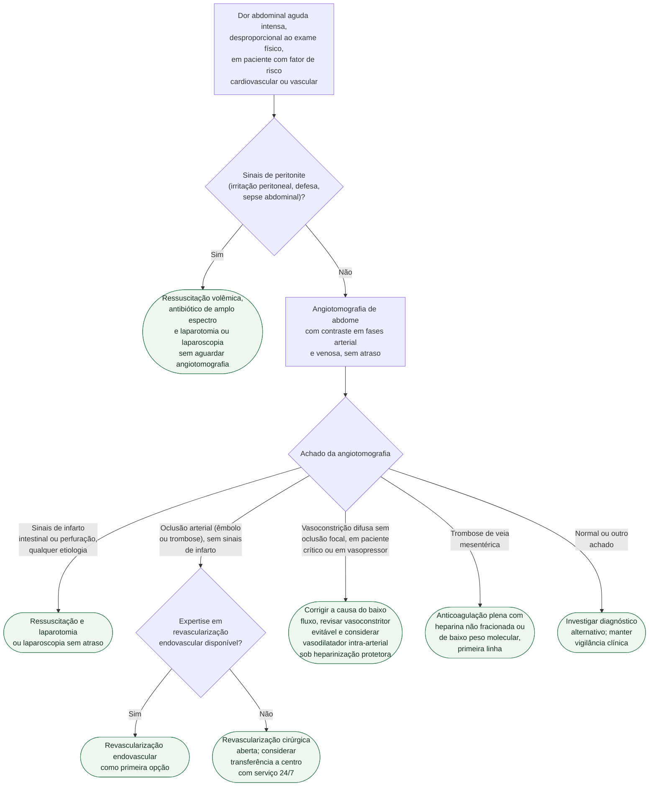

# Fluxograma: Suspeita de isquemia mesentérica aguda — primeira hora

Árvore de reconhecimento, exame e primeira decisão terapêutica. Não substitui
a decisão da equipe cirúrgica/intervencionista nem o protocolo institucional.

## Árvore de decisão

## Notas de leitura da árvore

- O ramo de peritonite segue diretamente para cirurgia porque a WSES 2022
  recomenda laparotomia/laparoscopia pronta diante de peritonite franca
  (recomendação forte), sem esperar a angiotomografia.
- A angiotomografia é o próximo passo em qualquer suspeita mantida, sem
  distinção prévia por fator de risco: a ESVS 2025 recomenda o exame
  independentemente da função renal e recomenda que a suspeita clínica seja
  informada na requisição (Classe I).
- A escolha entre revascularização endovascular e cirurgia aberta segue a
  ESVS 2025 (Classe IIa/B para endovascular como primeira linha quando há
  expertise) e a recomendação de centro com serviço 24/7 multidisciplinar
  (Classe I/C) — daí o encaminhamento a transferência quando não há
  expertise local, em vez de uma conduta cirúrgica isolada como alternativa
  neutra.
- Fator de risco cardioembólico (fibrilação atrial, infarto recente,
  valvopatia, endocardite, embolia prévia) informa a probabilidade
  pré-teste e a comunicação com a cardiologia, mas não muda a ação
  imediata (angiotomografia sem atraso) — por isso não é um ramo da árvore;
  está descrito em prosa no documento de origem.

## Tudo com Tudo — vínculos clínicos diretos

- [Isquemia mesentérica aguda de origem cardioembólica: reconhecimento e a primeira hora](isquemia-mesenterica-aguda-origem-cardioembolica-reconhecimento-e-primeira-hora.md)
