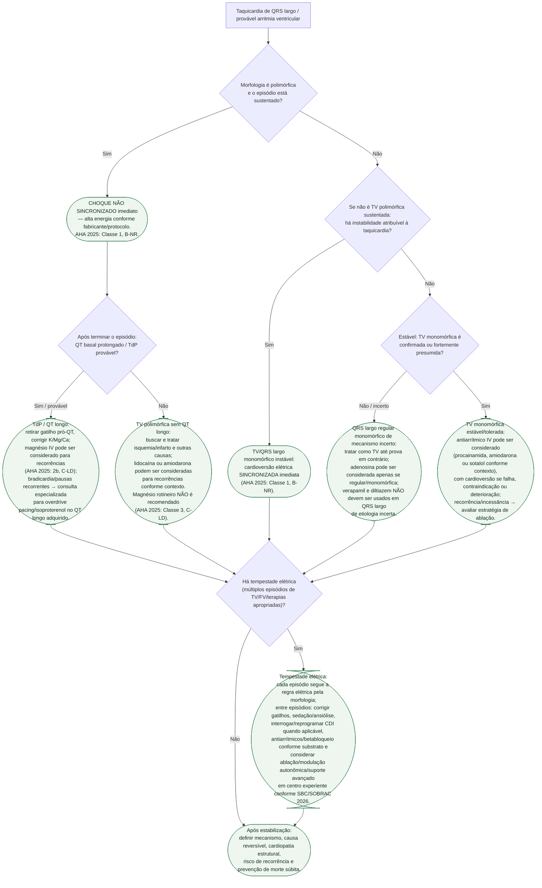

# Arritmia ventricular e risco de morte súbita

> **STATUS DE CURADORIA:** `pendente_revisao`. Atualizado para separar corretamente **TV monomórfica** de **TV polimórfica** antes de escolher terapia elétrica. **VERIFICAÇÃO HUMANA NECESSÁRIA** antes de converter o fluxo em protocolo institucional, especialmente para energia, doses e sequências farmacológicas.

## Regra de segurança que vem antes de todo o resto

Nem toda taquicardia de QRS largo instável recebe a mesma terapia elétrica:

- **TV polimórfica sustentada:** **choque não sincronizado imediato**. AHA 2025: **Classe 1, B-NR**. A sincronização não é confiável porque a morfologia do QRS muda batimento a batimento.
- **TV monomórfica sustentada hemodinamicamente instável:** **cardioversão sincronizada**. AHA 2025: **Classe 1, B-NR**.
- Se o ritmo polimórfico estiver sustentado, não atrasar o choque para determinar o QT, dosar eletrólitos ou administrar magnésio.

A versão anterior colocava “instável → cardioversão sincronizada” antes de diferenciar morfologia; essa arquitetura foi removida.

## Árvore de decisão

## TV polimórfica: QT longo versus QT normal

AHA 2025 enfatiza que o **QT basal** muda o tratamento de recorrência:

### QT longo / torsades de pointes

- Choque não sincronizado se o episódio estiver sustentado.
- Retirar fármacos pró-QT quando possível e corrigir hipocalemia, hipomagnesemia e hipocalcemia.
- Magnésio IV **pode ser considerado** para recorrências (**2b, C-LD**), mesmo sem hipomagnesemia documentada.
- Em TdP adquirida recorrente, pausa/bradicardia-dependente, considerar com especialista overdrive pacing ou isoproterenol.

### QT não prolongado

- Choque não sincronizado se sustentada.
- Isquemia/infarto são causas frequentes e devem ser tratados ativamente.
- Lidocaína ou amiodarona podem ser consideradas para recorrências (**2b, C-LD**), junto ao manejo etiológico.
- **Não usar magnésio rotineiramente apenas porque a TV é polimórfica** — AHA 2025: **Classe 3, sem benefício, C-LD**.

## Taquicardia de QRS largo monomórfica

Na TV monomórfica/QRS largo regular, a estabilidade ainda é decisiva:

- **instável:** cardioversão sincronizada imediata;
- **estável:** há tempo para ECG de 12 derivações, acesso IV e terapia farmacológica selecionada;
- AHA 2025 permite considerar amiodarona, procainamida ou sotalol IV (**2b, B-R**);
- adenosina pode ser considerada quando a taquicardia é **regular e monomórfica** e o diagnóstico ainda é incerto (**2b, B-NR**);
- verapamil/diltiazem não devem ser administrados em taquicardia de QRS largo de etiologia incerta, pelo risco de deterioração quando o ritmo é ventricular.

O PROCAMIO informa a escolha farmacológica em taquicardia de QRS largo **tolerada**; não deve ser extrapolado para TV polimórfica sustentada ou paciente instável.

## Tempestade elétrica: o tratamento entre episódios não substitui a terapia do episódio

O Posicionamento SBC/SOBRAC 2026 organiza a tempestade elétrica como síndrome de recorrência arrítmica que requer busca de gatilhos, controle autonômico/sedação, otimização de antiarrítmicos, programação do CDI e acesso precoce a ablação e suporte avançado conforme gravidade.

A regra transversal é:

- episódio **polimórfico sustentado** → choque não sincronizado;
- episódio **monomórfico instável** → cardioversão sincronizada;
- depois do término, tratar mecanismo/substrato e prevenir recorrência.

Isso evita que o rótulo “tempestade elétrica” apague a diferença crítica entre as duas morfologias.

## Causas reversíveis correm em paralelo

Investigar e tratar, conforme o cenário:

- isquemia/infarto agudo;
- hipocalemia, hipomagnesemia e outras alterações eletrolíticas;
- fármacos pró-arrítmicos/toxicidade/interações;
- insuficiência cardíaca descompensada;
- hipóxia, acidose e distúrbios sistêmicos;
- canalopatias e cardiomiopatias quando o contexto sugere.

“Causa reversível” não significa automaticamente risco futuro zero; a ESC 2022 ressalta que sobreviventes de parada atribuída a causa aparentemente corrigível ainda podem manter risco relevante conforme a cardiopatia de base.

## Conexões canônicas

- `fluxograma-torsades-de-pointes-e-qt-longo-adquirido`
- `torsades-de-pointes-e-qt-longo-adquirido-escore-de-tisdale-e-manejo-agudo`
- tempestade elétrica / posição SBC-SOBRAC 2026
- síndrome coronariana aguda/isquemia quando TV polimórfica ocorre sem QT longo
- fármacos pró-QT, hipocalemia, hipomagnesemia e hipocalcemia
- ablação de TV, CDI e prevenção secundária de morte súbita

## Pendências deliberadas

1. Auditar `fluxograma-taquicardia-de-qrs-largo-esc-2019.md` para garantir que a distinção monomórfica/polimórfica esteja explícita à luz da AHA 2025.
2. Auditar o serviço/calculadora ACLS 2025 e o documento farmacológico correspondente para consistência com o fluxo canônico, sem duplicar algoritmo.
3. Revisar o módulo de sulfato de magnésio para evitar que “primeira linha farmacológica” seja interpretada como anterior ao choque da TV polimórfica sustentada.
4. Conectar formalmente hipomagnesemia/hipocalemia e exames canônicos de K/Mg em lotes separados.
