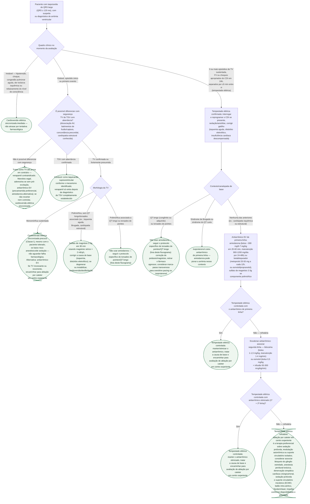

# Arritmia ventricular e risco de morte súbita

Toda taquicardia de QRS largo é **taquicardia ventricular até prova em
contrário**. A árvore abaixo cobre o atendimento imediato a partir desse
princípio: a instabilidade hemodinâmica decide antes de qualquer diagnóstico
diferencial; estável, o próximo passo é separar TV de TSV com aberrância
quando isso for seguro; TV monomórfica sustentada e TV polimórfica seguem
condutas diferentes; e a tempestade elétrica — três ou mais episódios de TV
sustentada, FV ou choques apropriados do CDI em 24h, com pelo menos 5 minutos
entre eles — é reconhecida como um quadro à parte, com escalada terapêutica
própria.

## Árvore de decisão

## Por que a tempestade elétrica é um ramo à parte

Tempestade elétrica não é "muita TV" — é um quadro com risco próprio: mortalidade
de até 14% nas primeiras 48 horas, com risco de morte 2,4 vezes maior durante a
internação e até 5,4 vezes maior nos 3 meses seguintes, frente a episódios
isolados de TV/FV. Por isso ela muda a lógica de manejo: em vez de decidir sobre
um episódio, decide-se sobre um padrão recorrente, com escalada terapêutica que
vai de antiarrítmico endovenoso a ablação por cateter e suporte avançado.

**Cada episódio agudo dentro da tempestade elétrica continua seguindo a regra de
estabilidade hemodinâmica do início desta árvore** — se um dos episódios cursa
com instabilidade, a conduta daquele episódio é cardioversão elétrica
sincronizada imediata, como em qualquer outro. O ramo de tempestade elétrica
descrito aqui é o que organiza o tratamento **entre** os episódios e depois
deles, não substitui o atendimento de cada evento agudo isolado.

## Verapamil é contraindicação formal

Verapamil não é recomendado na taquicardia de QRS largo de etiologia
desconhecida: em paciente com TV até então estável, ele pode provocar
deterioração hemodinâmica grave. Só tem lugar quando o diagnóstico de
taquicardia supraventricular está completa e seguramente estabelecido — é o
erro mais comum desse cenário, tratar como supraventricular a taquicardia
"regular, bem tolerada, em paciente jovem" que na verdade é TV.

## Por que a cardioversão entra mais cedo quando a TV já está confirmada

Quando o diagnóstico de TV monomórfica sustentada está estabelecido, a
diretriz desloca a cardioversão elétrica para o início do atendimento — mesmo
com o paciente hemodinamicamente tolerado, desde que o risco anestésico/de
sedação seja baixo — em vez de esperar a falha da sequência farmacológica. Isso
é diferente da lógica da taquicardia de QRS largo **sem diagnóstico
estabelecido**, em que a incerteza justifica tentar manobra vagal, adenosina
(se sem pré-excitação) e antiarrítmico antes de escalar.

## O que a árvore não mostra

**Critérios eletrocardiográficos de TV** — dissociação atrioventricular,
batimentos de captura e de fusão, concordância precordial, morfologia do QRS —
resumidos na aresta do nó de diferenciação, não são detalhados em ramos
próprios porque não mudam a conduta imediata: na dúvida, trata-se como TV.

**Torsades de pointes e TV polimórfica por QT longo** têm protocolo próprio
(`fluxograma-torsades-de-pointes-e-qt-longo-adquirido.md`, nesta mesma pasta) e
não entram nesta árvore além do ponto em que é preciso reconhecer o quadro e
desviar para lá — inclusive dentro da tempestade elétrica.

**Causa reversível é investigação paralela**: isquemia aguda, distúrbio
eletrolítico, intoxicação por fármaco e descompensação de insuficiência
cardíaca mudam o tratamento de fundo, não o passo imediato, e correm em
paralelo em qualquer ramo desta árvore.

**Se o paciente evolui para parada cardiorrespiratória**, o atendimento passa a
ser o de `fluxograma-parada-cardiorrespiratoria-ritmo-inicial.md`
(Terapia_intensiva), não mais o desta árvore.
