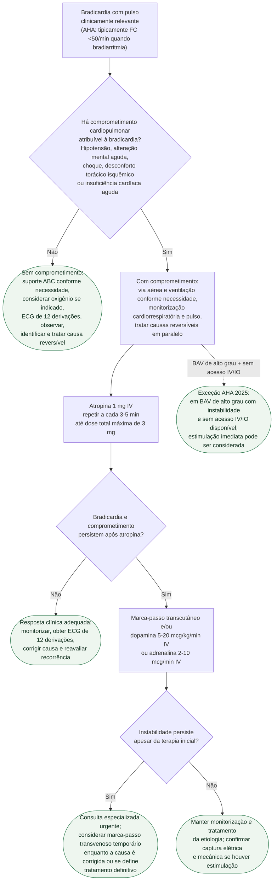

# Fluxograma: Bradicardia sintomática — manejo agudo da instabilidade

Este fluxograma cobre a **avaliação e estabilização imediata do adulto com bradicardia e pulso**. O algoritmo AHA 2025 orienta interpretar a frequência no contexto clínico — bradicardia pode ser fisiológica em pessoas saudáveis, atletas ou durante o sono — e priorizar a presença de **comprometimento cardiopulmonar atribuível à bradicardia**, não um número isolado de frequência cardíaca.

A indicação de marca-passo **definitivo** exige investigação própria da doença do nó sinusal ou do sistema de condução e não deve ser inferida deste fluxo agudo.

## Árvore de decisão

## O que muda na versão AHA 2025

### 1. A atropina passa a ser apresentada como 1 mg IV por dose

O algoritmo adulto de 2025 especifica **1 mg IV**, repetível a cada **3–5 minutos**, até **3 mg** de dose total. A formulação antiga “0,5–1 mg” não deve permanecer no fluxo atual.

### 2. A primeira decisão é clínica, não eletrocardiográfica

A sequência AHA 2025 pergunta primeiro se existe comprometimento cardiopulmonar: hipotensão, alteração aguda do estado mental, sinais de choque, desconforto torácico isquêmico ou insuficiência cardíaca aguda. O ECG é essencial para definir mecanismo e causa, mas o algoritmo de suporte avançado **não exige um ramo prévio obrigatório de localização nodal versus infra-His antes de tentar atropina**.

Bloqueio AV de alto grau, QRS largo e outras evidências de doença de condução continuam importantes porque aumentam a preocupação com progressão e com necessidade de estimulação. Em paciente instável com bloqueio AV de alto grau e sem acesso IV/IO disponível, a AHA 2025 considera que estimulação imediata pode ser realizada enquanto o acesso é obtido (**Classe 2b, nível C-EO**).

### 3. Persistência da instabilidade define a escalada

Na bradicardia aguda com comprometimento hemodinâmico, atropina é considerada razoável (**Classe 2a, nível B-NR**). Se a resposta for inadequada, estimulação transcutânea e/ou agonista adrenérgico com efeito cronotrópico podem ser usados como ponte (**Classe 2b, nível C-LD**). Quando a bradicardia permanece hemodinamicamente instável apesar do tratamento medicamentoso, marca-passo transvenoso temporário é considerado razoável (**Classe 2a, nível C-LD**).

A própria AHA ressalta que a evidência comparando fármacos e estimulação transcutânea é limitada e que os dados sobre marca-passo transvenoso temporário são predominantemente observacionais. Portanto, o fluxograma não apresenta uma modalidade de ponte como universalmente superior à outra.

## Procurar e tratar a causa em paralelo

A estabilização da frequência não substitui a investigação etiológica. Entre causas reversíveis ou tratáveis destacadas pela AHA estão:

- isquemia ou infarto do miocárdio;
- hipóxia/hipoxemia;
- distúrbios eletrolíticos, especialmente hipercalemia;
- alterações metabólicas, hipotermia e hipotireoidismo conforme contexto;
- medicamentos e toxicidade, incluindo betabloqueadores, bloqueadores de canais de cálcio e digoxina;
- doença estrutural, infecção e aumento do tônus vagal em cenários apropriados.

Se houver suspeita de intoxicação, hipercalemia, síndrome BRASH ou outra etiologia específica, o tratamento causal deve ocorrer simultaneamente ao suporte da bradicardia.

## Pontos operacionais da estimulação

**Marca-passo transcutâneo** é rápido e não invasivo, mas pode ser doloroso no paciente consciente; analgesia/sedação pode ser necessária quando clinicamente possível. Não basta observar espículas no monitor: deve-se confirmar **captura elétrica e repercussão mecânica/hemodinâmica**.

**Marca-passo transvenoso temporário** é uma ponte, não um procedimento isento de risco. A literatura citada pela AHA inclui principalmente estudos observacionais e reconhece complicações relacionadas ao acesso e ao dispositivo. Sua necessidade deve ser reavaliada quando a causa reversível é corrigida e quando se define a indicação ou não de estimulação permanente.

## O que este fluxograma não cobre

**Indicação de marca-passo definitivo** — utilizar o fluxo específico de bradiarritmias/doença de condução e as recomendações de estimulação permanente.

**Bradicardia pediátrica** — possui algoritmo próprio AHA/AAP 2025 e não deve ser tratada pela sequência adulta.

**Parada cardíaca** — ausência de pulso muda completamente o algoritmo; este documento pressupõe pulso presente.

**Intoxicações específicas** — digoxina, betabloqueadores, bloqueadores de canal de cálcio e síndrome BRASH têm terapias causais próprias e devem ser conectadas ao fluxo de toxicologia/emergência correspondente.