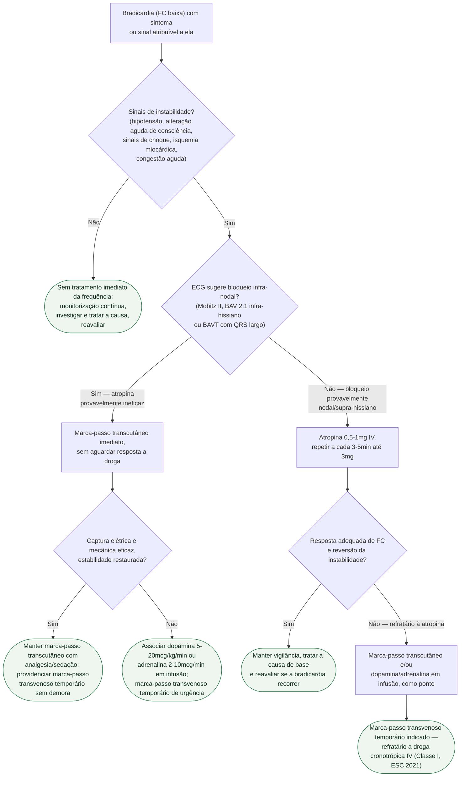

# Fluxograma: Bradicardia sintomática — manejo agudo da instabilidade

Este fluxograma cobre a **conduta imediata** diante de bradicardia com sintoma ou
sinal atribuível a ela — do reconhecimento da instabilidade até a estabilização
com marca-passo transcutâneo, droga cronotrópica ou marca-passo transvenoso
temporário. Não é o fluxograma de indicação de marca-passo **definitivo** (esse
já existe, em Dispositivos) nem cobre a tempestade elétrica de TV/FV do
documento-fonte, que é um mecanismo diferente (taquiarritmia ventricular
recorrente, não bradicardia).

## Árvore de decisão

## Por que o ECG decide antes da atropina

A atropina bloqueia o tônus vagal sobre o nó sinusal e o nó atrioventricular —
mecanismo que não alcança um bloqueio **infra-nodal**. No BAV de segundo grau
Mobitz II e no BAV total com QRS largo, o bloqueio costuma estar abaixo do nó
AV, fora do alcance desse mecanismo; insistir em atropina nesses casos só atrasa
o marca-passo transcutâneo, que não deve esperar a resposta à droga.

## O que se repete em todo ramo, fora da árvore

**Buscar e tratar a causa reversível em paralelo à estabilização** — fármaco
(betabloqueador, bloqueador de canal de cálcio, digoxina), distúrbio
eletrolítico, isquemia miocárdica ativa e hipóxia são as causas mais comuns, e
corrigi-las muda a conduta mesmo depois de escolhido um ramo da árvore.

**Monitorização contínua** (ECG, oximetria, pressão arterial não invasiva ou
invasiva conforme gravidade) e **ECG de 12 derivações** assim que possível, sem
atrasar o tratamento da instabilidade.

**Cautela com atropina em isquemia coronariana ativa**: o aumento de frequência
cardíaca eleva o consumo miocárdico de oxigênio e pode piorar a isquemia — nesse
contexto, limitar a dose total a 2-3 mg.

**Reavaliação frequente da resposta**, em qualquer ramo — a árvore representa um
único ciclo de decisão, mas a bradicardia pode recorrer ou o bloqueio pode
progredir depois de estabilizado.

## O que este fluxograma não cobre

**Indicação de marca-passo definitivo** — quando o bloqueio documentado justifica
implante permanente (independente da fase aguda), ver o fluxograma dedicado em
Dispositivos: *Bradiarritmia — indicação de marcapasso definitivo (ESC 2021)*.

**Tempestade elétrica** — no documento-fonte, tempestade elétrica é definida
como três ou mais episódios de TV sustentada, FV ou choques apropriados de CDI
em 24 horas: um mecanismo de taquiarritmia ventricular recorrente, não de
bradicardia, e por isso não tem ramo neste fluxograma.

**Bradicardia por intoxicação digitálica** tem manejo próprio (anticorpo
antidigoxina Fab), já coberto em documento dedicado no tema Arritmias.
