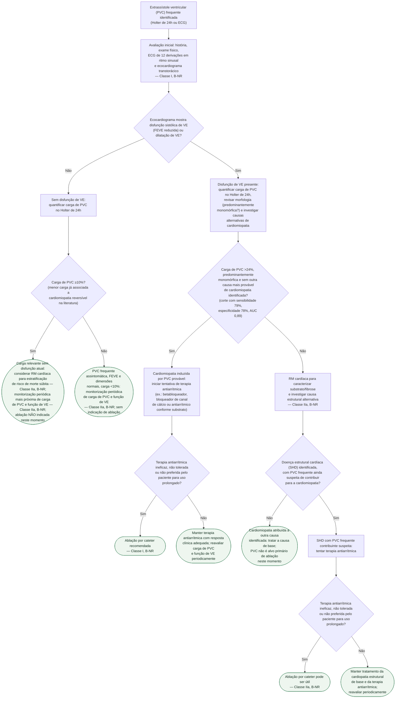

# Fluxograma: Extrassístole Ventricular Frequente — Quando Investigar Cardiomiopatia Induzida e Quando Indicar Ablação

Extrassístole ventricular (PVC) frequente é achado comum, e na maioria das
vezes benigno. A decisão que este fluxograma organiza não é "tratar ou não
tratar" — é **quando a carga de PVC deve ser investigada como causa de
cardiomiopatia** e, dentro desse subgrupo, **quando a ablação por cateter passa
de opção para indicação formal**, segundo o consenso HRS/EHRA/APHRS/LAHRS 2019
e o corte numérico de Baman et al. (2010) que a literatura de referência usa
para separar disfunção de VE preservada de comprometida.

## Árvore de decisão

## Por que o corte de 24% orienta, mas não decide sozinho

O corte de carga de PVC >24% vem de uma coorte de 174 pacientes consecutivos
encaminhados para ablação (Baman et al., Heart Rhythm 2010): foi o valor que
melhor separou função de VE preservada de comprometida (sensibilidade 79%,
especificidade 78%, AUC 0,89). Mas a **menor carga já associada a
cardiomiopatia reversível observada nessa coorte foi 10%** — por isso a árvore
não descarta o paciente com carga entre 10% e 24% e sem disfunção atual: ele
entra em vigilância mais próxima e estratificação de risco por RM, não em
"sem problema". Um segundo fator, do mesmo grupo (Olgun et al., 2011): **PVC
interpolada** (a extrassístole que se insere entre dois batimentos sinusais
sem pausa compensatória) é fator de risco adicional para cardiomiopatia,
independente da carga isolada — dois pacientes com a mesma carga percentual
não têm necessariamente o mesmo risco.

## A indicação de ablação depende de excluir alternativa e de o antiarrítmico falhar

O consenso HRS/EHRA/APHRS/LAHRS 2019 não recomenda ablação para toda PVC
frequente com disfunção de VE — a Classe I exige que a cardiomiopatia seja
**suspeita de ser causada** pela PVC (frequente e predominantemente
monomórfica) **e** que o antiarrítmico já tenha sido tentado e tenha se
mostrado ineficaz, não tolerado ou não preferido pelo paciente para uso
prolongado. Quando há doença estrutural cardíaca de base e a PVC é apenas
**suspeita de contribuir** para a cardiomiopatia (não a causa isolada), a
classe cai para IIa — ablação "pode ser útil", não "é recomendada". É essa
distinção que separa os ramos C3 e C6 da árvore.

## O que a árvore não decide

**Doses e escolha específica de antiarrítmico** não são detalhadas pela
diretriz nesta seção do consenso — a árvore mantém o passo genérico
("terapia antiarrítmica") de propósito, para não inventar posologia que a
fonte consultada não especifica.

**Focally triggered VF** (fibrilação ventricular refratária a antiarrítmico e
desencadeada por PVC similar, Classe IIa, B-NR) e **não resposta a terapia de
ressincronização cardíaca por PVC muito frequente unifocal** (Classe IIa,
C-LD) são outras duas indicações de ablação de PVC no mesmo consenso, mas são
cenários clínicos distintos do escopo desta árvore (cardiomiopatia induzida
por carga) — ficam como nota, não como ramo, para não misturar populações
diferentes na mesma árvore de decisão.

## Conexões prioritárias

- `extrassistole-ventricular-frequente-e-cardiomiopatia-induzida-carga-que-preve-disfuncao` (análise narrativa da coorte de Baman/Olgun que fundamenta o corte numérico usado aqui)
- `suprimir-extrassistole-nao-e-tratar-o-paciente-cast-e-sword` (por que a supressão farmacológica da extrassístole não é objetivo em si)
- `wolff-parkinson-white-assintomatico-e-cardiomiopatia-induzida-por-extrassistoles` (cenário específico de PVC associada a pré-excitação)
- `ablacao-por-campo-pulsado-em-taquicardia-ventricular-e-extrassistole-idiopatica` (técnica de ablação aplicável ao ramo de indicação Classe I/IIa desta árvore)
