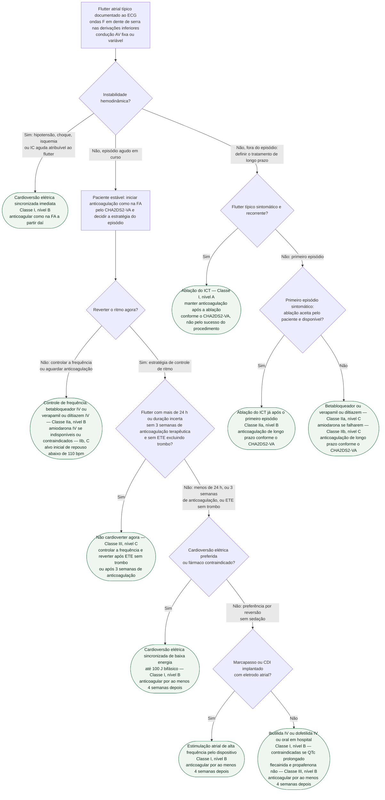

# Fluxograma: Flutter atrial típico — anticoagulação, controle agudo e ablação do istmo cavotricuspídeo

O flutter atrial típico é uma macrorreentrada em torno do anel tricúspide que depende obrigatoriamente do istmo cavotricuspídeo (ICT). Isso o torna, ao mesmo tempo, a arritmia atrial mais difícil de controlar com fármaco e a mais fácil de curar com cateter: a diretriz ESC 2019 de TSV registra que o controle de frequência é "particularmente difícil" no flutter — a própria combinação de bloqueadores do nó AV pode falhar —, enquanto a ablação do ICT com bloqueio bidirecional confirmado deixa recorrência abaixo de 10%. A diretriz ESC 2024 de FA fecha o outro lado da decisão: o flutter recebe a mesma prevenção tromboembólica da FA (Classe I, nível B), antes, durante e depois de qualquer tentativa de reversão. O fluxograma de TSV de QRS estreito já publicado ([ver fluxograma-taquicardia-supraventricular-qrs-estreito-esc-2019](/biblioteca/fluxograma-taquicardia-supraventricular-qrs-estreito-esc-2019)) cobre a taquicardia regular indiferenciada; este é o ramo dedicado ao flutter já reconhecido no ECG.

## Árvore de decisão

## Instável: cardioversão sincronizada sem esperar fármaco

A cardioversão elétrica sincronizada é Classe I, nível B, no flutter com instabilidade hemodinâmica (ESC 2019). A diretriz destaca que a cardioversão elétrica do flutter é mais eficaz e exige menos energia do que a da FA — o que vale também para o paciente estável em que o clínico prefere o choque à droga. A anticoagulação não é dispensada pela urgência: a ESC 2024 exige anticoagulação por pelo menos 4 semanas após qualquer cardioversão, em todos os pacientes, com manutenção de longo prazo quando há fator de risco tromboembólico, independentemente de o ritmo sinusal ter sido restaurado (Classe I, nível B).

## Estável: anticoagular como na FA antes de decidir o resto

A ESC 2019 recomendava anticoagulação como na FA para o flutter com FA concomitante (Classe I, nível B) e apenas "considerar" no flutter isolado, sem limiar estabelecido (Classe IIa, nível C). A ESC 2024 resolveu a ambiguidade: anticoagulação oral é recomendada no flutter atrial com risco tromboembólico elevado (Classe I, nível B), e a seção 9.14 manda espelhar na íntegra a etapa A do AF-CARE — anticoagulação periprocedimento e de longo prazo. O escore é o CHA2DS2-VA, sem o ponto por sexo feminino ([ver fluxograma-fibrilacao-atrial-af-care-esc-2024](/biblioteca/fluxograma-fibrilacao-atrial-af-care-esc-2024)):

| Componente | Pontos |
|---|---:|
| Insuficiência cardíaca congestiva | 1 |
| Hipertensão | 1 |
| Idade de 75 anos ou mais | 2 |
| Diabetes mellitus | 1 |
| AVC, AIT ou tromboembolismo arterial prévio | 2 |
| Doença vascular | 1 |
| Idade de 65 a 74 anos | 1 |

| Escore CHA2DS2-VA | Recomendação ESC 2024 | Classe, nível |
|---|---|---|
| 2 ou mais | Indicador de risco elevado: iniciar anticoagulante oral | I, C |
| 1 | Deve ser considerado indicador de risco elevado: considerar anticoagulante | IIa, C |
| 0 | Sem indicação pelo escore; ainda assim, 4 semanas após qualquer cardioversão | — |

A ESC 2019 reconhece que faltam ensaios randomizados dedicados ao flutter e que o valor do escore nessa arritmia não foi estabelecido de forma independente da FA — a recomendação é por extrapolação e pela coexistência frequente das duas arritmias.

## Controle de frequência: por que costuma falhar

O flutter tem frequência atrial regular e condução AV em razão fixa, com pouca margem para o nó AV filtrar mais. A ESC 2019 coloca o controle de frequência como primeiro passo no paciente muito sintomático, mas registra que a meta é "particularmente difícil" e que até a combinação de digoxina, betabloqueador e antagonista de cálcio pode falhar, tornando a cardioversão necessária. A ESC 2024 repete: "o controle de frequência pode ser difícil de alcançar no flutter, apesar de terapia combinada".

| Fármaco IV no episódio agudo | ESC 2019, flutter | Ressalva registrada na diretriz |
|---|---|---|
| Betabloqueador, verapamil ou diltiazem | IIa, B | Verapamil e diltiazem contraindicados em hipotensão ou ICFEr; betabloqueador contraindicado em IC descompensada |
| Amiodarona | IIb, C | Se os anteriores não estão disponíveis ou são indesejáveis; pouco eficaz para reverter, útil para controlar a frequência |

Para o longo prazo, a ESC 2024 lista betabloqueador, diltiazem, verapamil ou digoxina como primeira escolha com FEVE acima de 40% (Classe I, nível B), betabloqueador e/ou digoxina com FEVE de 40% ou menos (Classe I, nível B), e alvo inicial leniente de repouso abaixo de 110 bpm (Classe IIa, nível B).

A adenosina não é tratamento: a ESC 2019 admite seu uso apenas para desmascarar as ondas F quando o diagnóstico é duvidoso na condução 2:1, com material de reanimação disponível, porque pode causar rebote de condução 1:1 e precipitar FA.

## Reversão no estável: elétrica, farmacológica ou por estimulação

O ramo D3 aplica ao flutter a estratégia de segurança da ESC 2024, cuja tabela nomeia explicitamente "FA e flutter atrial" na exigência de 3 semanas de anticoagulação terapêutica antes de cardioversão programada (Classe I, nível B), com ETE para excluir trombo quando as 3 semanas não foram cumpridas (Classe I, nível B). A árvore adota o corte conservador de 24 h da diretriz atual; isso evita transportar para a prática o limiar antigo de 48 h diante de duração incerta. A via eletiva está detalhada em [fluxograma-cardioversao-eletiva-anticoagulacao-periprocedimento](/biblioteca/fluxograma-cardioversao-eletiva-anticoagulacao-periprocedimento).

| Método de reversão (ESC 2019, flutter estável) | Classe, nível | Observação |
|---|---|---|
| Cardioversão elétrica sincronizada de baixa energia, até 100 J bifásico | I, B | Mais eficaz e com menos energia que na FA; pode ser a primeira escolha |
| Ibutilida IV, ou dofetilida IV ou oral em hospital | I, B | Contraindicadas com QTc prolongado; ibutilida prolonga o QT com risco de torsades |
| Estimulação atrial de alta frequência por marcapasso ou CDI implantado | I, B | Pode converter passando por FA, o que às vezes facilita o controle da frequência |
| Estimulação atrial invasiva ou não invasiva, incluindo esofágica | IIb, B | Uso majoritariamente pediátrico; pré-tratamento com procainamida pode facilitar |
| Amiodarona IV | IIb, C | Se os anteriores não estão disponíveis ou são indesejáveis |
| Propafenona ou flecainida | III, B | Não recomendadas: lentificam o flutter e favorecem condução 1:1 |

A diretriz não traz dose de ibutilida ou dofetilida nessa seção; o fluxograma, portanto, não prescreve dose. O uso depende de disponibilidade local, bula vigente e protocolo institucional, com monitorização do QT durante e após a administração. Se houver torsades, a conduta imediata está em [fluxograma-torsades-de-pointes-e-qt-longo-adquirido](/biblioteca/fluxograma-torsades-de-pointes-e-qt-longo-adquirido).

## Longo prazo: ablação do ICT é primeira linha, não resgate

A ESC 2019 recomenda ablação por cateter para episódios sintomáticos recorrentes de flutter dependente do ICT (Classe I, nível A) e considera a ablação já após o primeiro episódio sintomático (Classe IIa, nível B); ela é também recomendada no flutter persistente ou quando há disfunção ventricular por taquicardiomiopatia (Classe I, nível B). Fármacos ficam para quem não quer ou não pode ser ablacionado: betabloqueador, verapamil ou diltiazem (Classe IIa, nível C) e amiodarona se falharem (Classe IIb, nível C); "ablate and pace" deve ser considerado quando tudo falha e persiste flutter sintomático com resposta ventricular rápida (Classe IIa, nível C). A base randomizada é o LADIP, já detalhado no acervo: recorrência de 3,8% com ablação contra 29,5% com amiodarona no primeiro episódio sintomático ([ver ablacao-do-istmo-cavotricuspideo-no-flutter-atrial-tipico-primeira-linha-sucesso-e-recorrencia](/biblioteca/ablacao-do-istmo-cavotricuspideo-no-flutter-atrial-tipico-primeira-linha-sucesso-e-recorrencia)).

Dois números da ESC 2019 pertencem à conversa com o paciente: mortalidade de 0,2 a 0,34% e AVC de 0,19 a 0,5% em séries recentes de ablação de flutter. Quando o flutter típico surge durante tratamento da FA com classe IC ou amiodarona, a ablação do ICT é uma escolha razoável para permitir que o antiarrítmico continue.

## Depois da ablação: a anticoagulação segue o escore, não o procedimento

A ESC 2024 registra que 50 a 70% dos pacientes manifestam FA no seguimento de longo prazo após ablação de flutter em estudos observacionais; na coorte de Enriquez já publicada no acervo, foram 35,8% em mediana de 24,2 meses, com bloqueio interatrial avançado como preditor mais forte ([ver flutter-atrial-tipico-diagnostico-ablacao-e-fibrilacao-atrial-de-novo](/biblioteca/flutter-atrial-tipico-diagnostico-ablacao-e-fibrilacao-atrial-de-novo)). Por isso as condutas C7 e C8 mantêm a anticoagulação conforme o CHA2DS2-VA: a ablação cura o circuito do ICT, não a doença atrial que gera FA, e a diretriz pede reavaliação dinâmica de todo paciente com flutter dentro do AF-CARE.

## Limitações e o que confirmar

- O corte de 24 h é uma escolha conservadora alinhada à estratégia atual de cardioversão; duração incerta segue o ramo de anticoagulação/ETE.
- Doses de ibutilida e dofetilida não são reproduzidas; consultar bula e protocolo institucional.
- A árvore cobre apenas o flutter típico dependente do ICT. Flutter atípico, pós-cirurgia ou pós-ablação de FA tem controle de frequência ainda mais difícil e ablação restrita a centros experientes (Classe I, nível B na ESC 2019) — ver [flutter-atrial-atipico-pos-cirurgia-cardiaca-mecanismo-mapeamento-e-ablacao](/biblioteca/flutter-atrial-atipico-pos-cirurgia-cardiaca-mecanismo-mapeamento-e-ablacao).
- A diretriz de 2019 admite que a evidência de anticoagulação no flutter isolado é extrapolada da FA e que o limiar de início pode ser mais alto que na FA; a de 2024 unificou a recomendação sem novo ensaio dedicado.
- Não há aqui dose de betabloqueador, verapamil, diltiazem ou amiodarona IV: as tabelas de dose são as de FA e não foram lidas nesta sessão.

## Tudo com Tudo

- [Fluxograma: Taquicardia Supraventricular de QRS Estreito Regular (ESC 2019)](/biblioteca/fluxograma-taquicardia-supraventricular-qrs-estreito-esc-2019)
- [Flutter Atrial Típico: Diagnóstico, Ablação e Fibrilação Atrial de Novo](/biblioteca/flutter-atrial-tipico-diagnostico-ablacao-e-fibrilacao-atrial-de-novo)
- [Ablação do Istmo Cavotricuspídeo no Flutter Atrial Típico: Por que é Primeira Linha, não Resgate](/biblioteca/ablacao-do-istmo-cavotricuspideo-no-flutter-atrial-tipico-primeira-linha-sucesso-e-recorrencia)
- [Fluxograma: Fibrilação Atrial — trajetória AF-CARE (ESC 2024)](/biblioteca/fluxograma-fibrilacao-atrial-af-care-esc-2024)
- [Fluxograma: cardioversão eletiva na FA — via de anticoagulação e janela pós-procedimento (ESC 2024)](/biblioteca/fluxograma-cardioversao-eletiva-anticoagulacao-periprocedimento)
- [Fluxograma: Torsades de Pointes e QT Longo Adquirido — Conduta Imediata](/biblioteca/fluxograma-torsades-de-pointes-e-qt-longo-adquirido)
- [Flutter Atrial Atípico Pós-Cirurgia Cardíaca: Mecanismo, Mapeamento e Resultado da Ablação](/biblioteca/flutter-atrial-atipico-pos-cirurgia-cardiaca-mecanismo-mapeamento-e-ablacao)
