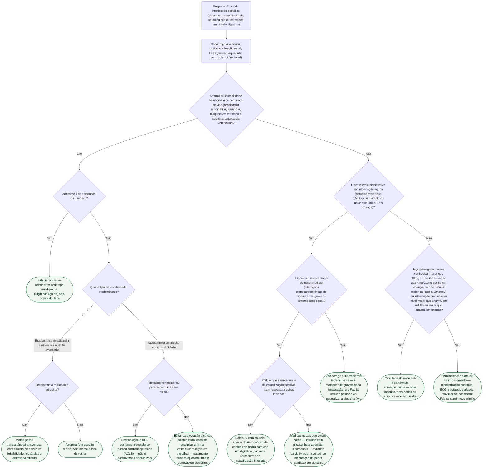

# Intoxicação digitálica

Protocolo de conduta imediata para suspeita de intoxicação digitálica (gatilho: náusea, alteração visual, bradiarritmia ou qualquer arritmia em paciente sob digoxina). Cobre da suspeita clínica e da dosagem sérica até a indicação do anticorpo antidigoxina Fab (Digibind/DigiFab), o manejo da hipercalemia associada e a conduta quando o Fab não está disponível de imediato.

## Árvore de decisão

Em todo ramo com indicação confirmada de Fab, a administração do anticorpo pela fórmula correspondente é a conduta definitiva; o que muda entre os ramos é a medida de suporte enquanto ele é obtido ou age. Mantenha em paralelo, em qualquer ramo: ECG contínuo, suspensão da digoxina, potássio sérico seriado e correção de outros distúrbios eletrolíticos (magnésio, função renal) — sem repetir isso a cada nó da árvore.

**Fórmulas de dose do Fab** (StatPearls, Digoxin Immune Fab):
- Dose ingerida conhecida: nº de frascos = (dose ingerida em mg × 0,8) ÷ 0,5mg de digoxina ligada por frasco
- Concentração sérica conhecida: nº de frascos = concentração sérica (ng/mL) × peso (kg) ÷ 100
- Dose empírica, nível desconhecido: 10 frascos em adulto; 5 frascos em criança <20kg

O evitar cálcio IV na hipercalemia associada à intoxicação digitálica reflete a preocupação teórica com o "coração de pedra" (potencialização do efeito inotrópico do digitálico levando a estado não-contrátil irreversível); é a orientação padrão quando há alternativa, mas não é absoluta — diante de hipercalemia com risco de vida iminente e sem resposta a outras medidas, o cálcio IV não deve ser retido.
