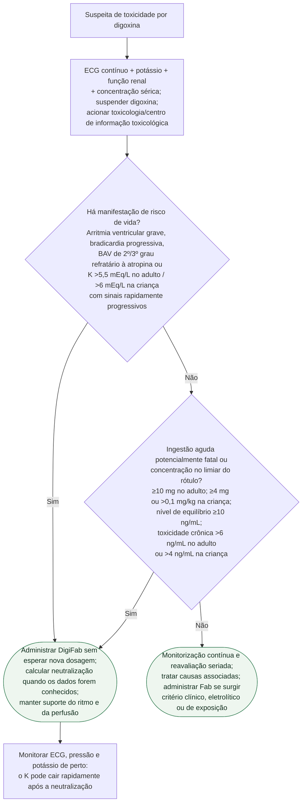

# Intoxicação digitálica com risco de vida

Suspeitar diante de náusea/vômitos, alteração visual, confusão, bradicardia,
bloqueio atrioventricular ou arritmia ventricular em pessoa exposta a digoxina.
Suspender o fármaco, obter ECG contínuo, potássio, função renal e concentração
sérica, sem esperar o resultado para tratar manifestação de risco de vida.

## Árvore de decisão

## Como calcular os frascos de DigiFab

Cada frasco contém 40 mg de Fab e neutraliza aproximadamente **0,5 mg de
digoxina**. Arredondar o resultado para o frasco inteiro seguinte.

- **Quantidade corporal conhecida:** frascos = carga corporal de digoxina (mg)
  ÷ 0,5. Para comprimidos de digoxina, o rótulo estima carga corporal como
  quantidade ingerida × 0,8; cápsulas e digitoxina têm biodisponibilidade
  diferente e não devem receber automaticamente o fator 0,8.
- **Toxicidade crônica com concentração sérica conhecida:** frascos =
  concentração (ng/mL) × peso (kg) ÷ 100.
- **Ingestão aguda de quantidade desconhecida, sem nível disponível:**
  **20 frascos**. O rótulo permite iniciar 10 e administrar os 10 restantes se
  necessário para reduzir risco de reação febril; em criança <20 kg, monitorar
  sobrecarga de volume.
- **Toxicidade crônica sem concentração sérica:** **6 frascos** em adultos e
  crianças ≥20 kg; **1 frasco** em lactentes e crianças <20 kg.

Na emergência com risco de vida, a estimativa imperfeita não deve atrasar o
antídoto. Falta de resposta ao Fab deve levar à reconsideração do diagnóstico,
da dose neutralizante e de causas concomitantes.

## Hiperpotassemia e suporte do ritmo

Hiperpotassemia na intoxicação aguda é marcador de gravidade e indica Fab nos
limiares do rótulo. Medidas temporizadoras e estabilização de membrana devem ser
individualizadas com toxicologia e não podem atrasar o antídoto. Após o Fab, o
potássio pode entrar rapidamente na célula e produzir hipopotassemia; acompanhar
de perto nas primeiras horas e repor com cautela quando necessário.

Enquanto o Fab é obtido, executar suporte avançado compatível com o ritmo e a
perfusão. Desfibrilação continua indicada em FV/TV sem pulso. Atropina, pacing,
antiarrítmico ou cardioversão no paciente com pulso dependem do fenótipo e de
orientação toxicológica; nenhum deles substitui a neutralização. Hemodiálise,
hemofiltração, hemoperfusão e plasmaférese **não são recomendadas** para remover
digoxina/digitoxina na toxicidade grave (AHA 2025, Classe 3: sem benefício,
B-NR).

## Tudo com Tudo

- [Diretriz AHA 2025 de intoxicações cardiotóxicas graves](/biblioteca/diretriz-aha-2025-intoxicacoes-cardiotoxicas-graves)
- [Monografia do anticorpo antidigoxina Fab](/biblioteca/anticorpo-antidigoxina-fab-ovino-digifab)
- [Intoxicação digitálica: manejo agudo e Fab](/biblioteca/intoxicacao-digitalica-manejo-agudo-e-anticorpo-antidigoxina-fab)
- [Fluxograma de bradicardia sintomática no adulto](/biblioteca/fluxograma-bradicardia-sintomatica-manejo-agudo)
- [Fluxograma de parada cardiorrespiratória no adulto](/biblioteca/fluxograma-parada-cardiorrespiratoria-ritmo-inicial)
