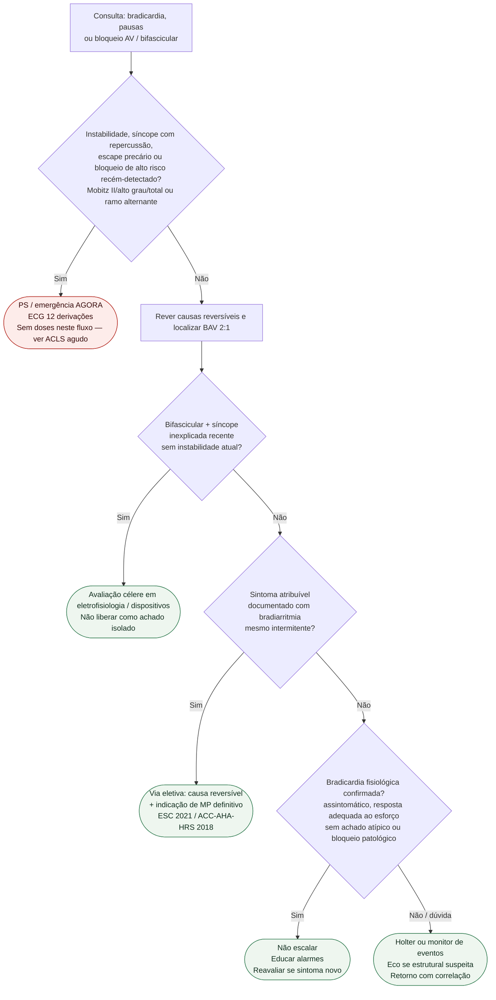

# Fluxograma: sinalizadores ambulatoriais de bradicardia e bloqueio AV

Prosa: [`sinalizadores-ambulatoriais-de-bradicardia-e-bloqueio-av-quando-escalar`](/biblioteca/sinalizadores-ambulatoriais-de-bradicardia-e-bloqueio-av-quando-escalar) e [`bloqueio-bifascicular-no-consultorio-sinais-vermelhos-quando-escalar`](/biblioteca/bloqueio-bifascicular-no-consultorio-sinais-vermelhos-quando-escalar). Agudo instável: [`fluxograma-bradicardia-sintomatica-manejo-agudo`](/biblioteca/fluxograma-bradicardia-sintomatica-manejo-agudo). Indicação definitiva: [`fluxograma-bradiarritmia-indicacao-de-marcapasso-esc-2021`](/biblioteca/fluxograma-bradiarritmia-indicacao-de-marcapasso-esc-2021).

## Árvore de decisão

## Notas

- **D1** = triagem de segurança (instabilidade ou bloqueio de alto risco).
- **D2** = bifascicular + síncope muda o peso — ver protocolo irmão e estudo de progressão.
- **C3** = correlação sintoma-traçado antes de “MP por FC baixa”.
- Não decide atropina, estimulação temporária nem programação de dispositivo já implantado.
