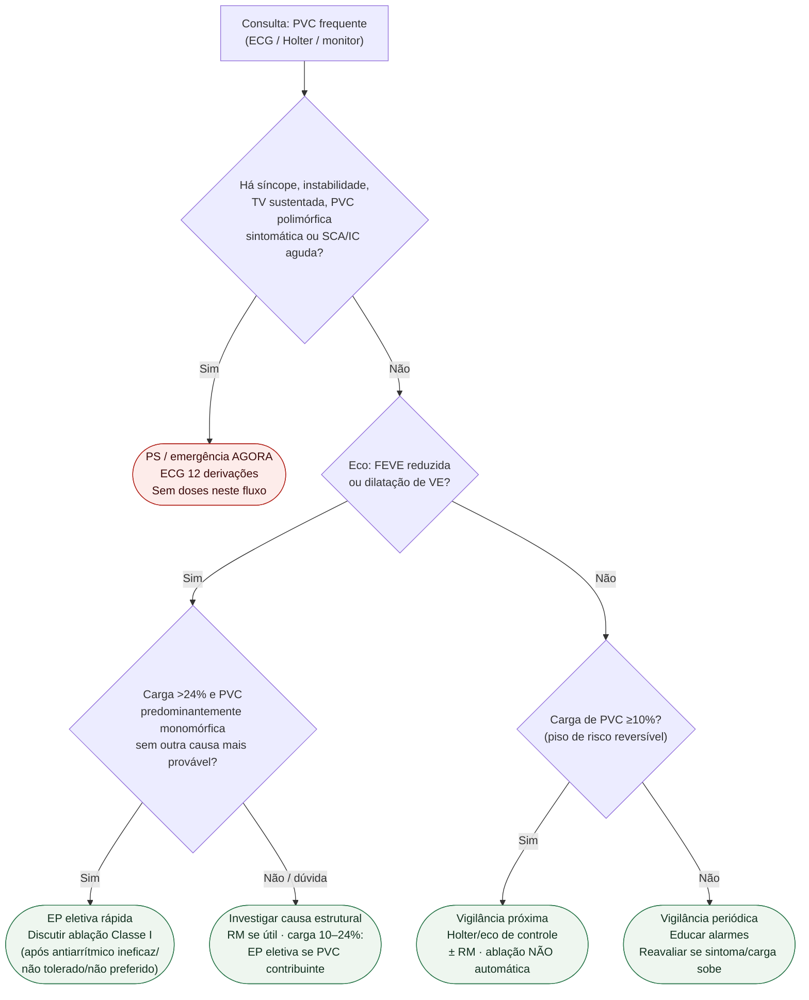

# Fluxograma: sinalizadores ambulatoriais de PVC frequente

Prosa: [`pvc-frequente-no-consultorio-sinais-vermelhos-quando-ir-ao-ps`](pvc-frequente-no-consultorio-sinais-vermelhos-quando-ir-ao-ps.md) e [`sinalizadores-ambulatoriais-de-carga-de-pvc-quando-escalar-ablacao`](sinalizadores-ambulatoriais-de-carga-de-pvc-quando-escalar-ablacao.md). Indicação Classe I/IIa detalhada: [`fluxograma-extrassistole-ventricular-frequente-cardiomiopatia-induzida-e-indicacao-de-ablacao`](fluxograma-extrassistole-ventricular-frequente-cardiomiopatia-induzida-e-indicacao-de-ablacao.md). Evidência de corte: [`extrassistole-ventricular-frequente-e-cardiomiopatia-induzida-carga-que-preve-disfuncao`](extrassistole-ventricular-frequente-e-cardiomiopatia-induzida-carga-que-preve-disfuncao.md).

## Árvore de decisão

## Notas

- **D1** = gate de segurança (ESC 2022) — não confundir com indicação eletiva de ablação.
- **D3** = corte Baman >24% + morfologia monomórfica + exclusão de alternativa (HRS 2019).
- **C4** = carga ≥10% sem disfunção atual ≠ ablação automática; é vigilância mais próxima.
- Não decide anticoagulação de FA (#827/#852/#883) nem doses antiarrítmicas.
