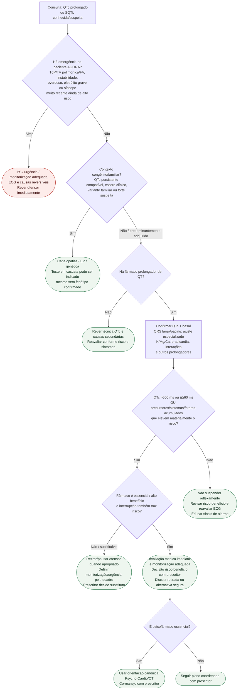

# Fluxograma: sinalizadores ambulatoriais de QT longo

Prosa: [sinalizadores-ambulatoriais-de-qt-longo-congenito-e-adquirido-quando-escalar](/biblioteca/sinalizadores-ambulatoriais-de-qt-longo-congenito-e-adquirido-quando-escalar) e [qt-longo-ambulatorial-quando-suspender-farmacos-prolongadores-de-qt](/biblioteca/qt-longo-ambulatorial-quando-suspender-farmacos-prolongadores-de-qt).

Canalopatias: [canalopatias-sindrome-do-qt-longo-e-sindrome-de-brugada-diagnostico-e-manejo](/biblioteca/canalopatias-sindrome-do-qt-longo-e-sindrome-de-brugada-diagnostico-e-manejo).

Psicofármacos: [fluxograma-escolha-de-antidepressivo-e-antipsicotico-no-cardiopata-risco-de-qt](/biblioteca/fluxograma-escolha-de-antidepressivo-e-antipsicotico-no-cardiopata-risco-de-qt).

## Árvore de decisão

## Notas

- Evento agudo **em familiar** não transforma paciente assintomático estável em emergência; aumenta prioridade para avaliação genética/canalopatias.
- Síncope remota já esclarecida é diferente de síncope muito recente ainda de alto risco.
- QTc >500 ms ou Δ≥60 ms são marcadores de ação/risk review; não significam “suspender tudo” sem considerar benefício e contexto.
- Genética pode ser indicada por variante familiar conhecida ou rastreamento em cascata mesmo com QTc normal.
- O ramo psicofármaco exige co-manejo com o prescritor; risco elétrico alto não permite aguardar consulta eletiva.
