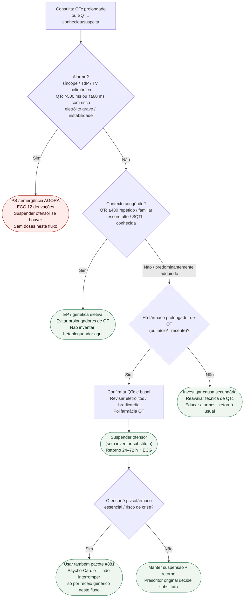

# Fluxograma: sinalizadores ambulatoriais de QT longo

Prosa: [`sinalizadores-ambulatoriais-de-qt-longo-congenito-e-adquirido-quando-escalar`](sinalizadores-ambulatoriais-de-qt-longo-congenito-e-adquirido-quando-escalar.md) e [`qt-longo-ambulatorial-quando-suspender-farmacos-prolongadores-de-qt`](qt-longo-ambulatorial-quando-suspender-farmacos-prolongadores-de-qt.md). Canalopatias (diagnóstico/manejo): [`canalopatias-sindrome-do-qt-longo-e-sindrome-de-brugada-diagnostico-e-manejo`](canalopatias-sindrome-do-qt-longo-e-sindrome-de-brugada-diagnostico-e-manejo.md). Psicofármaco: **#881**.

## Árvore de decisão

## Notas

- **D1** = gate de segurança (Drew 2010 + sintoma/TdP).
- **D2** = braço congênito (ESC 2022 / Priori 2013) → EP/genética, não “ Holter daqui a um ano”.
- **D3/C3** = braço adquirido → **suspender ofensor** sem regime inventado.
- **D4** = ponte explícita anti-colisão com **#881**.
- Não decide doses, CDI, mexiletina nem classes de betabloqueador.
