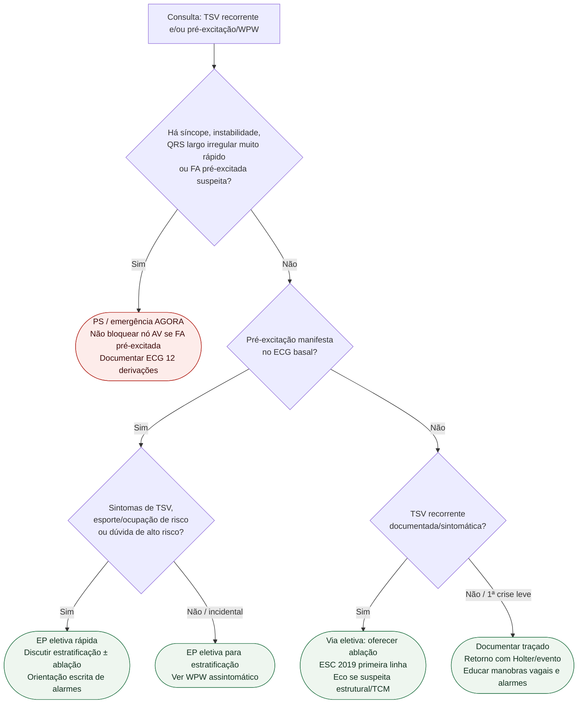

# Fluxograma: sinalizadores ambulatoriais de SVT e pré-excitação

Prosa: [`sinalizadores-ambulatoriais-de-svt-recorrente-quando-escalar`](sinalizadores-ambulatoriais-de-svt-recorrente-quando-escalar.md) e [`pre-excitacao-wpw-no-consultorio-sinais-vermelhos-quando-ir-ao-ps`](pre-excitacao-wpw-no-consultorio-sinais-vermelhos-quando-ir-ao-ps.md). Agudo QRS estreito: [`fluxograma-taquicardia-supraventricular-qrs-estreito-esc-2019`](fluxograma-taquicardia-supraventricular-qrs-estreito-esc-2019.md).

## Árvore de decisão

## Notas

- **D1** = gate de segurança (ESC 2019 / ACC/AHA/HRS 2015).
- **D2** = pré-excitação muda o algoritmo — não tratar como TSV “comum”.
- **C4** = ablação como discussão de primeira linha na TSV sintomática recorrente (ESC 2019), sem doses neste fluxograma.
- Não decide protocolo IV de emergência nem anticoagulação de FA (#827/#852).
