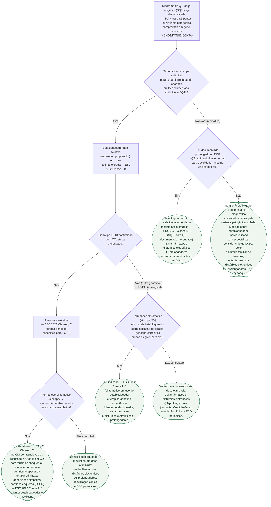

# Fluxograma: Síndrome do QT Longo Congênita — Estratificação de Risco e Decisão Terapêutica (ESC 2022)

Este fluxograma parte de um diagnóstico **já estabelecido** de síndrome do QT
longo congênita (SQTL) — por escore de Schwartz de alta probabilidade
(≥3,5 pontos) ou por variante patogênica comprovada em gene causador (KCNQ1,
KCNH2, SCN5A, entre outros), critério que por si só já é suficiente para o
diagnóstico independentemente da pontuação clínica. O corpus já cobre o
diagnóstico da SQTL (escore de Schwartz) e a conduta imediata na SQTL
ADQUIRIDA/torsades; esta árvore cobre o degrau seguinte, específico da forma
CONGÊNITA: qual terapia iniciar, quando associar terapia genótipo-específica e
quando escalar para dispositivo, conforme a presença de sintomas e a resposta
ao tratamento em curso, segundo a diretriz ESC 2022 de arritmias ventriculares
e prevenção de morte súbita.

## Árvore de decisão

## Leitura da árvore

**Sintomático primeiro.** O primeiro ramo separa quem já teve síncope
arrítmica, parada cardiorrespiratória abortada ou TV documentada atribuível à
SQTL de quem nunca foi sintomático. Em ambos os ramos, o betabloqueador não
seletivo (nadolol ou propranolol) em dose máxima tolerada é a base do
tratamento sempre que há QT documentado prolongado — a diretriz ESC 2022 não
restringe essa recomendação de Classe I, B a pacientes sintomáticos.

**Mexiletina é genótipo-específica, não universal.** A associação de
mexiletina ao betabloqueador (Classe I, C) é restrita a pacientes com
genótipo LQT3 confirmado e QTc ainda prolongado — é a principal mudança da
diretriz ESC 2022 em relação à versão de 2015, quando a recomendação era
Classe IIb e combinada a flecainida ou ranolazina.

**CDI e LCSD entram quando a terapia farmacológica não controla os
sintomas.** O CDI (Classe I, C) é indicado quando o paciente permanece
sintomático apesar de betabloqueador e da terapia genótipo-específica
aplicável. A denervação simpática cardíaca esquerda (LCSD, Classe I, C) tem
dois gatilhos específicos e não substitui automaticamente o CDI: entra quando
o CDI é contraindicado ou recusado, ou quando o paciente já está com CDI
implantado e sofre múltiplos choques ou síncope por arritmia ventricular
apesar da terapia otimizada.

**O que este fluxograma não resolve.** A indicação isolada de CDI como
prevenção secundária pura (sobrevivente de parada cardíaca, sem checar
resposta prévia a betabloqueador) e a orientação formal sobre restrição de
esporte/exercício na SQTL não tiveram classe/nível de recomendação
confirmados nas fontes de acesso aberto consultadas nesta sessão — ficam como
decisão individualizada com o especialista, sem atribuir aqui uma
classificação não verificada. O manejo da SQTL ADQUIRIDA (fármacos,
distúrbios eletrolíticos) e da torsades de pointes em curso está em
`fluxograma-torsades-de-pointes-e-qt-longo-adquirido.md`; o diagnóstico pelo
escore de Schwartz está em
`canalopatias-sindrome-do-qt-longo-e-sindrome-de-brugada-diagnostico-e-manejo.md`.
