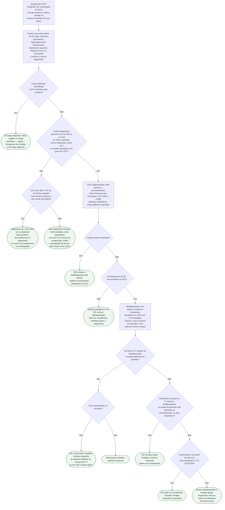

# Fluxograma: Síndrome do QT longo congênito — diagnóstico e manejo (ESC 2022)

A síndrome do QT longo congênita (LQTS) é a canalopatia em que a primeira decisão errada custa mais: rotular como "QT longo" um prolongamento adquirido leva a betabloqueador e teste genético desnecessários, e deixar de reconhecer a forma congênita em um jovem com síncope deixa sem proteção quem pode morrer no próximo episódio. A diretriz ESC 2022 fixou três portas de entrada para o diagnóstico — QTc ≥480 ms em ECGs repetidos, escore diagnóstico >3 ou variante patogênica —, uma quarta porta condicional (QTc 460-479 ms com síncope arrítmica) e um manejo em degraus: betabloqueador não seletivo para todo QT prolongado documentado, CDI após parada cardíaca abortada, e CDI ou denervação simpática cardíaca esquerda quando o paciente segue sintomático apesar do betabloqueador e da terapia específica de genótipo. Este fluxograma cobre o adulto e o adolescente fora da gestação; a forma adquirida está em fluxograma-torsades-de-pointes-e-qt-longo-adquirido, e o puerpério em fluxograma-sindrome-do-qt-longo-e-risco-arritmico-no-puerperio.

## Árvore de decisão

## Antes de tudo: excluir a forma adquirida

O prolongamento do QT que aparece com um antiarrítmico, um antiemético, um antipsicótico, uma hipocalemia ou uma bradicardia importante não é LQTS congênita, e a própria diretriz condiciona o critério de QTc 460-479 ms à "ausência de causas secundárias para o prolongamento do QT". Se a causa adquirida é identificada e o QTc normaliza após corrigi-la, o caminho é o de fluxograma-torsades-de-pointes-e-qt-longo-adquirido, e o paciente sai desta árvore. A ressalva clínica é que as duas condições coexistem com frequência — o fármaco pró-QT costuma ser o que desmascara um portador —, e por isso o ECG deve ser repetido depois da correção, não apenas no momento do evento.

## As portas de entrada do diagnóstico

| Critério | Recomendação ESC 2022 |
|---|---|
| QTc ≥480 ms em ECGs de 12 derivações repetidos, com ou sem sintomas | Classe I, nível C |
| Escore diagnóstico de LQTS >3 | Classe I, nível C |
| Variante patogênica em gene de LQTS, independentemente da duração do QT | Classe I, nível C |
| QTc ≥460 e <480 ms em ECGs repetidos, com síncope arrítmica e sem causa secundária | "Deve ser considerado" — Classe IIa, nível C |
| Teste genético e aconselhamento genético em LQTS clinicamente diagnosticada | Classe I, nível C |
| Teste diagnóstico rotineiro com provocação por epinefrina | Não recomendado — Classe III, nível C |

O escore diagnóstico modificado da diretriz (tabela abaixo) soma três blocos — ECG, história clínica e história familiar — mais o achado genético; dentro de cada bloco conta-se apenas o item de maior pontuação (torsades e alternância de T não se somam, nem síncope com e sem estresse). O ponto que muda a prática em relação ao escore clássico de 1993 é que a variante patogênica sozinha vale 3,5 pontos e, portanto, fecha o diagnóstico mesmo com QTc normal. A versão modificada da ESC 2022 também retirou o item "surdez congênita" (0,5 ponto no escore de Schwartz 2011, ainda listado no GeneReviews); a surdez segue como pista clínica da síndrome de Jervell e Lange-Nielsen, mas não pontua nesta tabela.

| Achado | Pontos |
|---|---:|
| QTc ≥480 ms | 3,5 |
| QTc 460-479 ms | 2 |
| QTc 450-459 ms, no sexo masculino | 1 |
| QTc ≥480 ms no 4º minuto de recuperação do teste ergométrico | 1 |
| Torsades de pointes | 2 |
| Alternância de onda T | 1 |
| Onda T entalhada em 3 derivações | 1 |
| Frequência cardíaca baixa para a idade | 0,5 |
| Síncope com estresse | 2 |
| Síncope sem estresse | 1 |
| Familiar com LQTS definida | 1 |
| Morte súbita inexplicada antes dos 30 anos em familiar de 1º grau | 0,5 — VERIFICAÇÃO HUMANA NECESSÁRIA (o texto extraído do slide oficial da ESC sugere 1 ponto; o escore de Schwartz original, o GeneReviews e três reproduções de acesso aberto da Tabela 10 da ESC 2022 — PMC11119491, PMC10856791, PMC12594730 — trazem 0,5) |
| Variante patogênica em gene de LQTS | 3,5 |

Interpretação, conforme GeneReviews: ≤1 ponto, probabilidade baixa; 1,5-3 pontos, intermediária; >3, diagnóstico clínico. Quem cai na faixa intermediária sem síncope arrítmica não recebe rótulo: repete ECG, faz teste ergométrico (o QTc no 4º minuto de recuperação é um item do escore) e recalcula.

## Medidas gerais e betabloqueador

Com o diagnóstico feito, três medidas valem para todos (Classe I, nível C): evitar fármacos que prolongam o QT, evitar e corrigir distúrbios eletrolíticos, e evitar os gatilhos próprios do genótipo — exercício e natação no LQT1, estímulo sonoro súbito no LQT2, sono e repouso no LQT3, conforme a correlação genótipo-fenótipo detalhada em sindrome-do-qt-longo-congenita-na-crianca-escore-de-schwartz-genotipos-e-estratificacao-de-risco.

O betabloqueador, idealmente não seletivo — nadolol ou propranolol —, é recomendado em todo paciente com LQTS e prolongamento documentado do QT, sintomático ou não (Classe I, nível B). No portador de variante patogênica com QTc normal, o betabloqueador "deve ser considerado" (Classe IIa, nível B). A mexiletina é indicada no LQT3 com QT prolongado (Classe I, nível C), promovida de IIb na diretriz de 2015 para I em 2022. A diretriz também recomenda calcular o risco arrítmico antes de iniciar a terapia, com base no genótipo e na duração do QTc (Classe IIa, nível C). Este documento não apresenta doses de nadolol ou propranolol, que não constam das fontes lidas.

## CDI e denervação simpática

| Situação | Conduta ESC 2022 |
|---|---|
| Parada cardíaca | CDI somado ao betabloqueador — Classe I, nível B |
| Sintomático apesar de betabloqueador e terapia específica do genótipo | CDI — Classe I, nível C |
| CDI contraindicado ou recusado; ou choques múltiplos ou síncope por TV com CDI já em uso de betabloqueador e terapia do genótipo | Denervação simpática cardíaca esquerda — Classe I, nível C |
| LQTS sintomática em que betabloqueador e terapia do genótipo não são tolerados ou são contraindicados na dose terapêutica | CDI ou denervação simpática esquerda devem ser considerados — Classe IIa, nível C |
| Assintomático com perfil de alto risco pela calculadora 1-2-3-LQTS-Risk | CDI pode ser considerado, somado à terapia do genótipo — Classe IIb, nível B |
| Estudo eletrofisiológico invasivo | Não recomendado — Classe III, nível C |

A lógica é a de degraus: o CDI só entra como primeira conduta depois de parada cardíaca abortada; no restante dos pacientes, o betabloqueador na dose terapêutica precisa ter falhado, ou não ser tolerável, antes de o dispositivo ou a denervação entrarem. A denervação simpática esquerda ocupa duas posições distintas — substituto do CDI quando este é contraindicado ou recusado, e adjuvante quando o CDI já implantado dispara repetidamente.

## Genotipagem e família

O teste genético não é opcional: além de fechar o diagnóstico com 3,5 pontos e de definir a terapia específica (mexiletina no LQT3) e o gatilho a evitar, ele permite o rastreio em cascata dos familiares de primeiro grau, que precisam de ECG e, quando a variante do caso índice é conhecida, do teste dirigido. A conversa com a família — culpa parental, decisão de testar menores — está em comunicar-diagnostico-de-canalopatia-hereditaria-teste-em-cascata-culpa-parental-e-teste-em-menores. O portador identificado no rastreio com QTc normal entra nesta árvore pelo ramo de variante patogênica sem prolongamento documentado.

## Limitações e o que confirmar

- O valor do item "morte súbita inexplicada antes dos 30 anos em familiar de 1º grau" está marcado como VERIFICAÇÃO HUMANA NECESSÁRIA: o texto extraído do slide oficial da ESC 2022 registra 1 ponto, enquanto o escore original, o GeneReviews e três reproduções de acesso aberto da Tabela 10 da diretriz (PMC11119491, PMC10856791, PMC12594730) trazem 0,5. Conferir na Tabela 10 do texto integral da diretriz.
- Os cortes numéricos da calculadora 1-2-3-LQTS-Risk (faixas de QTc por genótipo que definem "alto risco") não foram lidos nesta sessão e não são reproduzidos — VERIFICAÇÃO HUMANA NECESSÁRIA antes de usar o ramo D8 como regra numérica.
- A instrução de produção citava betabloqueador "recomendado nos assintomáticos com QTc >470 ms". Esse corte não existe na ESC 2022 lida: a recomendação Classe I é para todo prolongamento documentado do QT, sem limiar próprio para assintomáticos; o corte de 470 ms não foi incorporado.
- O texto integral do European Heart Journal não foi acessado (a página da Oxford Academic devolveu apenas sumário e seções iniciais); as classes e níveis vêm do slide set oficial da ESC e de duas revisões de acesso aberto que os reproduzem literalmente.
- Doses de nadolol, propranolol e mexiletina não são apresentadas por não constarem das fontes lidas; a restrição esportiva por genótipo fica para canalopatias-qt-longo-cpvt-esporte-retorno.

## Tudo com Tudo

- [Fluxograma: Torsades de Pointes e QT Longo Adquirido — Conduta Imediata](/biblioteca/fluxograma-torsades-de-pointes-e-qt-longo-adquirido)
- [Canalopatias: Síndrome do QT Longo, Síndrome de Brugada e TVPC — Diagnóstico e Manejo](/biblioteca/canalopatias-sindrome-do-qt-longo-e-sindrome-de-brugada-diagnostico-e-manejo)
- [Síndrome do QT Longo Congênita na Criança: Escore de Schwartz, Genótipos e Estratificação de Risco](/biblioteca/sindrome-do-qt-longo-congenita-na-crianca-escore-de-schwartz-genotipos-e-estratificacao-de-risco)
- [Fluxograma: síndrome do QT longo no puerpério](/biblioteca/fluxograma-sindrome-do-qt-longo-e-risco-arritmico-no-puerperio)
- [Comunicar o Diagnóstico de Canalopatia ou Cardiomiopatia Hereditária: Culpa Parental e a Decisão de Testar Menores](/biblioteca/comunicar-diagnostico-de-canalopatia-hereditaria-teste-em-cascata-culpa-parental-e-teste-em-menores)
- [Canalopatias no atleta: QT longo, CPVT, exercício e retorno ao esporte](/biblioteca/canalopatias-qt-longo-cpvt-esporte-retorno)
