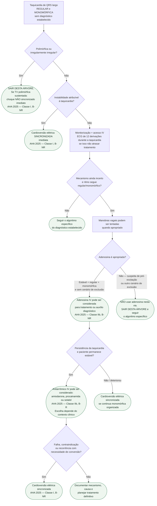

# Fluxograma: Taquicardia de QRS largo regular/monomórfica sem diagnóstico estabelecido

## Regra de segurança antes de entrar na árvore

Uma taquicardia de QRS largo sem mecanismo definido deve ser manejada de forma conservadora, **presumindo origem ventricular até que uma alternativa esteja suficientemente estabelecida**. O erro mais perigoso é aplicar tratamento de taquicardia supraventricular a uma TV ou a uma fibrilação atrial pré-excitada.

Esta página foi estreitada de propósito: a árvore abaixo vale para **taquicardia de QRS largo regular e monomórfica**. O rótulo antigo era amplo demais e podia induzir a aplicar cardioversão sincronizada a uma TV polimórfica.

**TV polimórfica sustentada não entra nesta árvore.** A AHA 2025 recomenda **choque não sincronizado imediato — Classe I, nível de evidência B-NR**. A razão é operacional: a morfologia variável impede sincronização confiável e a arritmia pode rapidamente degenerar em fibrilação ventricular.

Também saia desta árvore se o ritmo for **irregularmente irregular** ou houver forte suspeita de fibrilação atrial pré-excitada. Esses cenários exigem algoritmo próprio; bloqueadores do nó AV podem ser perigosos na pré-excitação.

## Árvore de decisão

## O que mudou com a AHA 2025

A atualização mais importante é a separação explícita entre **QRS largo monomórfico** e **TV polimórfica**:

- **TV polimórfica sustentada:** choque não sincronizado imediato — Classe I, B-NR. Outras intervenções não devem atrasar a desfibrilação.
- **QRS largo hemodinamicamente instável e organizado/monomórfico:** cardioversão sincronizada — Classe I, B-NR.
- **QRS largo estável, regular e monomórfico, mecanismo incerto:** adenosina IV **pode ser considerada** para tratamento ou auxílio diagnóstico — Classe IIb, B-NR.
- **QRS largo instável, irregularmente irregular ou polimórfico:** adenosina **não deve ser administrada** — Classe III: dano, C-LD.
- **Verapamil e diltiazem em QRS largo:** **não devem ser administrados** — Classe III: dano, B-NR.
- **Amiodarona, procainamida ou sotalol IV:** podem ser considerados no tratamento da taquicardia de QRS largo — Classe IIb, B-R.

Isso não transforma todo QRS largo em um único diagnóstico. A categoria inclui TV, TSV com aberrância, condução por via acessória e ritmo estimulado; hipercalemia e bloqueio de canal de sódio também podem produzir apresentações semelhantes.

## Adenosina: restrição mais importante do que a possibilidade de uso

A adenosina não deve ser tratada como “teste diagnóstico” genérico de qualquer taquicardia de QRS largo. Na AHA 2025 ela só é uma opção quando o paciente está **hemodinamicamente estável** e o ritmo é **regular e monomórfico**.

A ESC 2019 acrescenta uma cautela útil: quando a pré-excitação no ECG basal sugere possibilidade de taquicardia pré-excitada, a adenosina deve ser evitada. Em especial, **fibrilação atrial pré-excitada** é outro problema: agentes que bloqueiam predominantemente o nó AV podem favorecer condução rápida pela via acessória e precipitar fibrilação ventricular.

## Verapamil e diltiazem: não usar em QRS largo de mecanismo incerto

A AHA 2025 classifica verapamil e diltiazem como **Classe III: dano, B-NR** na taquicardia de QRS largo. Em uma TV, o efeito vasodilatador e inotrópico negativo pode provocar deterioração hemodinâmica grave sem terminar a arritmia.

A exceção conceitual — por exemplo, uma TV fascicular conhecida e corretamente diagnosticada — pertence ao manejo de um diagnóstico específico e **não** à árvore da taquicardia de QRS largo sem diagnóstico estabelecido.

## Procainamida versus amiodarona: evidência útil, mas pequena

O PROCAMIO foi um ensaio multicêntrico, randomizado e aberto em taquicardia sustentada de QRS largo bem tolerada. Foram randomizados 74 pacientes e 62 entraram na análise principal. Eventos cardíacos adversos maiores em 40 minutos ocorreram em 3/33 pacientes com procainamida e 12/29 com amiodarona; a terminação da taquicardia em 40 minutos ocorreu em 22/33 versus 11/29, respectivamente.

Esse ensaio sustenta a preferência da ESC 2019 por procainamida em determinados pacientes estáveis, mas **não justifica declarar superioridade universal**: a amostra é pequena, o estudo foi aberto e a aplicabilidade depende de função ventricular, pressão arterial, contraindicações, disponibilidade local e experiência da equipe. A AHA 2025 agrupa amiodarona, procainamida e sotalol como opções que **podem ser consideradas** (IIb, B-R), sem estabelecer uma sequência universal entre elas.

## Quando a TV monomórfica já está diagnosticada

A árvore acima existe para o cenário em que o mecanismo ainda é incerto. Quando uma **TV monomórfica sustentada** já está estabelecida, a diretriz ESC 2022 recomenda tratamento conforme sintomas e etiologia. Instabilidade hemodinâmica requer cardioversão sincronizada imediata; se a sincronização não for possível, utiliza-se choque não sincronizado. Em paciente tolerado, ECG de 12 derivações durante a arritmia é valioso e cardioversão elétrica/terapia antiarrítmica são escolhidas conforme contexto, etiologia e risco do procedimento.

## Causas e conexões que precisam correr em paralelo

Não espere a reversão do ritmo para pensar em etiologia. Em paralelo à estabilização, procure causas que mudam recorrência e prognóstico: **isquemia aguda, hipocalemia, hipomagnesemia, hipercalemia, toxicidade por bloqueadores de canal de sódio, intoxicação digitálica, descompensação de insuficiência cardíaca, via acessória e cardiopatia estrutural**.

No grafo clínico do CorVIA, este nó deve permanecer conectado a:

- taquicardia ventricular monomórfica e arritmias ventriculares/morte súbita;
- TV polimórfica, torsades de pointes e QT longo adquirido;
- fibrilação atrial pré-excitada/Wolff-Parkinson-White;
- distúrbios de potássio e magnésio;
- intoxicações por fármacos e bloqueio de canal de sódio;
- síndrome coronariana aguda/isquemia e insuficiência cardíaca;
- ECG de 12 derivações e investigação de cardiopatia estrutural.

## Limites da evidência

As recomendações elétricas de emergência são fortes, mas grande parte da evidência farmacológica para taquicardias de QRS largo não vem de grandes ensaios orientados a mortalidade. A AHA 2025 classifica os antiarrítmicos IV como **IIb, B-R** e a adenosina no QRS largo estável regular/monomórfico como **IIb, B-NR**. O PROCAMIO é randomizado, porém pequeno.

Para TV polimórfica, a própria AHA 2025 registra ausência de ensaios randomizados sobre tratamento farmacológico agudo; os dados são majoritariamente relatos e séries de casos. Por isso, fármacos para prevenir recorrência **não podem atrasar o choque** quando a TV polimórfica é sustentada.

## Segurança operacional

**VERIFICAÇÃO HUMANA NECESSÁRIA:** esta página deliberadamente não codifica energia de cardioversão/desfibrilação, velocidade de infusão nem doses de antiarrítmicos. Antes de transformar qualquer dose, energia ou sequência farmacológica em protocolo operacional do CorVIA, confirmar contra o algoritmo institucional vigente, o dispositivo disponível, a formulação local e a diretriz-fonte completa.

### Governança da revisão

A versão anterior deste arquivo registrava revisão humana em 30/07/2026. Como esta atualização modifica pontos clínicos relevantes à luz da AHA 2025, o `review_status` foi corretamente retornado para **pendente_revisao**. Nenhuma revisão humana é atribuída a esta nova versão.
