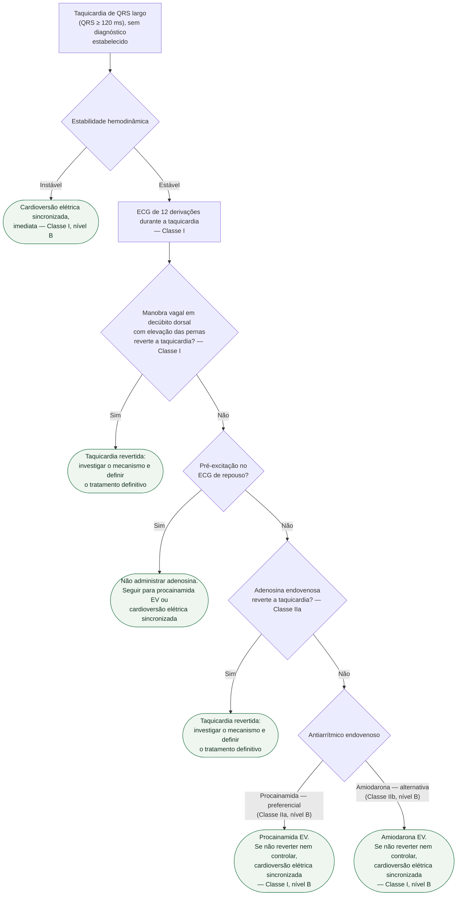

# Fluxograma: Taquicardia de QRS largo sem diagnóstico estabelecido (ESC 2019)

Toda taquicardia de QRS largo é **taquicardia ventricular até prova em
contrário**. A regra não é retórica: ela decide a conduta antes de o diagnóstico
existir, e é o que impede o erro mais grave desse cenário — tratar como
supraventricular com aberrância uma TV que vai deteriorar com o fármaco errado.

O algoritmo abaixo é o da diretriz de 2019, escrito exatamente para o momento em
que **ainda não há diagnóstico**. Quando a TV já está estabelecida, a lógica muda
e está descrita na última seção.

## Árvore de decisão

## Verapamil é contraindicação formal

**Verapamil não é recomendado na taquicardia de QRS largo de etiologia
desconhecida — Classe III, nível B.** O motivo é concreto: em paciente com TV
até então estável, o verapamil pode provocar **deterioração hemodinâmica grave**.
Ele só tem lugar quando o diagnóstico de taquicardia supraventricular está
completa e seguramente estabelecido.

É o item mais importante desta página, e o que mais aparece invertido na
prática: a taquicardia "regular, bem tolerada, paciente jovem" é justamente a que
tenta o médico a tratar como supraventricular.

## Por que a adenosina depende do ECG de repouso

A adenosina deve ser considerada quando as manobras vagais falham **e não há
pré-excitação no ECG de repouso** (Classe IIa). Ela ajuda de duas formas: revela
o mecanismo pela resposta, e pode interromper uma TV adenosina-sensível.

A ressalva não é burocrática — **na presença de pré-excitação, a adenosina deve
ser evitada**, porque uma taquicardia pré-excitada pode acelerar a condução pela
via acessória.

## Procainamida antes de amiodarona

A hierarquia entre os dois antiarrítmicos vem do PROCAMIO, ensaio randomizado que
comparou procainamida e amiodarona intravenosas na taquicardia de QRS largo
tolerada: **a procainamida teve menos eventos adversos e maior taxa de terminação
precoce**. Daí a assimetria das classes — procainamida IIa, amiodarona IIb.

No Brasil, a disponibilidade da procainamida endovenosa é limitada, e o
antiarrítmico efetivamente escolhido acaba sendo outro. Isso não muda a
recomendação da diretriz; muda o que se pode fazer com ela, e vale registrar a
diferença em vez de silenciar sobre ela.

## Quando a TV já está diagnosticada, a lógica muda

O algoritmo acima vale para a **ausência de diagnóstico**. Quando se trata de
taquicardia ventricular monomórfica sustentada já estabelecida, a diretriz
europeia de 2022 de arritmias ventriculares desloca a cardioversão elétrica para
o **início** do atendimento, e não para depois da falha dos fármacos, mesmo com
o paciente hemodinamicamente tolerado — desde que o risco anestésico/de sedação
seja baixo. O raciocínio: a cardioversão resolve mais rápido e com menos
exposição do que a sequência farmacológica.

Na atualização oficial [AHA 2025 de suporte avançado adulto](https://cpr.heart.org/en/resuscitation-science/cpr-and-ecc-guidelines/adult-advanced-life-support), cardioversão sincronizada também é recomendada quando a taquicardia de QRS largo estável não responde à manobra vagal ou à terapia farmacológica, ou quando estas são contraindicadas (**Classe 1, B-NR**). Amiodarona, procainamida ou sotalol EV podem ser considerados no estável (**2b, B-R**). Isso não transforma uma sequência farmacológica em obrigação nem autoriza atrasar cardioversão quando há deterioração.

## O que a árvore não mostra

**Critérios eletrocardiográficos de TV** — dissociação atrioventricular, batimentos
de captura e de fusão, concordância precordial, morfologia do QRS — não são ramos
da árvore porque não mudam a conduta imediata: na dúvida, trata-se como TV. Eles
importam para o diagnóstico definitivo e para o tratamento a longo prazo.

**Torsades de pointes e TV polimórfica** têm via própria. Se a TV polimórfica está sustentada, a AHA 2025 recomenda **choque não sincronizado imediato** (**Classe 1, B-NR**); correção eletrolítica e prevenção de recorrência vêm depois. Adenosina não deve ser administrada em QRS largo instável, irregular ou polimórfico (**Classe 3: dano**). Taquicardia polimórfica não entra nesta árvore, que é a da taquicardia **regular monomórfica** de QRS largo.

**Causa reversível é investigação paralela**: isquemia aguda, distúrbio
eletrolítico, intoxicação por fármaco e descompensação de insuficiência cardíaca
mudam o tratamento de fundo, não o passo imediato.

## Tudo com Tudo
- [Fluxograma canônico de arritmia ventricular e morte súbita](fluxograma-arritmia-ventricular-e-morte-subita.md)
- [Fluxograma de torsades de pointes e QT longo adquirido](fluxograma-torsades-de-pointes-e-qt-longo-adquirido.md)
