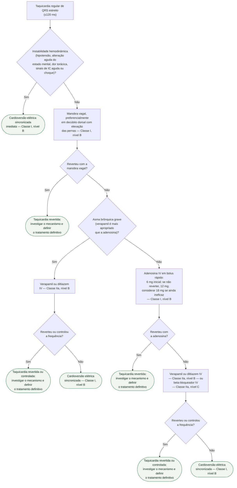
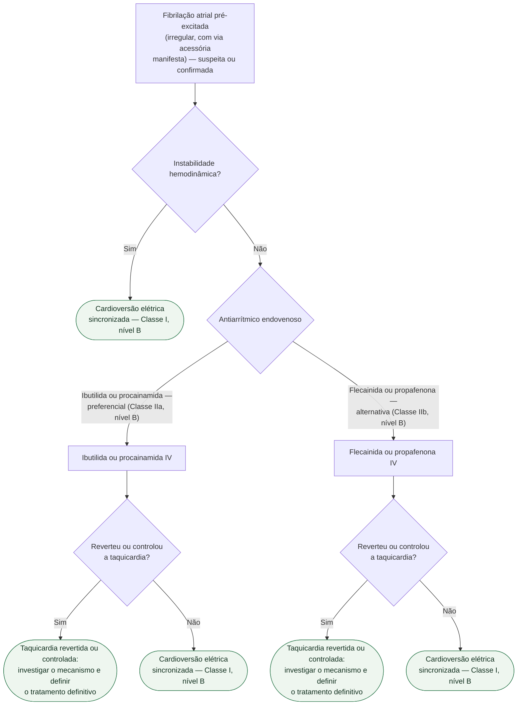

# Fluxograma: Taquicardia Supraventricular de QRS Estreito Regular (ESC 2019)

Este fluxograma cobre a conduta imediata na taquicardia regular de QRS estreito
(≤120 ms), da avaliação da estabilidade hemodinâmica até a reversão ou o
controle da arritmia. A base é o algoritmo de manejo agudo da diretriz ESC
2019 para TSV. A fibrilação atrial pré-excitada é um ritmo **irregular**, com
risco próprio de fibrilação ventricular, e por isso tem árvore separada mais
abaixo.

## Árvore de decisão: Taquicardia regular de QRS estreito

## Por que a asma grave entra antes da adenosina

A adenosina pode ser usada com cautela em pacientes asmáticos, mas na **asma
brônquica grave** o verapamil é a escolha mais apropriada — daí a bifurcação
antes da adenosina, e não uma contraindicação absoluta.

Verapamil e diltiazem, por sua vez, devem ser evitados em caso de
hipotensão, insuficiência cardíaca com fração de ejeção reduzida (<40%) ou
suspeita de taquicardia ventricular. Beta-bloqueadores endovenosos são
contraindicados na insuficiência cardíaca descompensada. Essas ressalvas
valem em qualquer ponto da árvore em que esses fármacos apareçam.

## Por que a adenosina tem faixa de dose, não dose fixa

O esquema é incremental: 6 mg em bolus rápido; se a taquicardia não reverter,
12 mg; um paciente ainda não revertido pode receber 18 mg, conforme
tolerabilidade individual. A meia-vida plasmática é curtíssima (segundos), o
que torna segura a repetição da dose já a partir de 1 minuto da anterior.

## Por que a fibrilação atrial pré-excitada tem árvore própria

Quando o ECG basal mostra pré-excitação (padrão de Wolff-Parkinson-White) mas
a taquicardia **atual** é regular e de QRS estreito — ou seja, uma taquicardia
por reentrada atrioventricular ortodrômica —, a adenosina continua sendo
conduta Classe I: a árvore acima permanece válida.

O que muda tudo é a irregularidade do ritmo. Na fibrilação atrial
pré-excitada, o impulso pode conduzir preferencialmente pela via acessória,
que tem período refratário mais curto que o do nó AV. Por isso, **qualquer
bloqueador do nó AV — adenosina, verapamil, diltiazem, beta-bloqueador ou
digoxina — deve ser evitado**, porque pode acelerar a condução pela via
acessória e precipitar fibrilação ventricular. É esse cenário que a árvore
abaixo cobre.

## Árvore de decisão: Fibrilação atrial pré-excitada (suspeita de via acessória / WPW)

Amiodarona endovenosa **não é recomendada** na fibrilação atrial
pré-excitada — a condução pela via acessória pode ser maior do que se
pensava, com relatos de precipitação de fibrilação ventricular.

## O que a árvore não mostra

O diagnóstico diferencial entre AVNRT, taquicardia por reentrada
atrioventricular ortodrômica e taquicardia atrial não muda a conduta
imediata — todas seguem a mesma primeira árvore. Ele importa para a decisão
de tratamento definitivo (ablação por cateter, na maioria dos casos), não
para o atendimento agudo.
