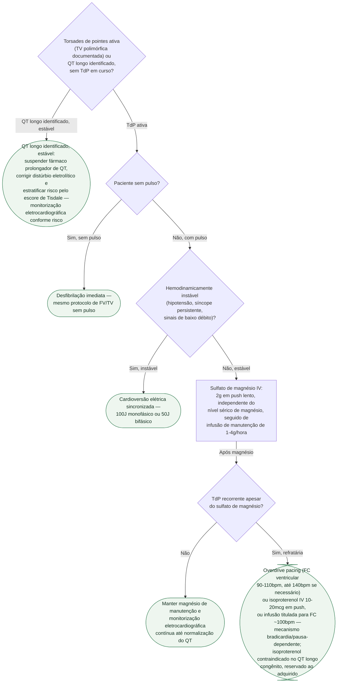

# Fluxograma: Torsades de Pointes e QT Longo Adquirido — Conduta Imediata

Torsades de pointes (TdP) é a taquicardia ventricular polimórfica associada ao
QT longo **adquirido** — por fármaco, distúrbio eletrolítico ou combinação dos
dois. A conduta imediata separa dois cenários que não se misturam: TdP **em
curso**, que exige estabilização elétrica conforme pulso/estabilidade e
sulfato de magnésio sem esperar a dosagem sérica, e QT longo **identificado
antes do evento**, em que a conduta é prevenir a torsades, não tratá-la. O
escore de risco e o detalhamento fisiopatológico estão no documento de
origem; aqui o foco é a sequência de decisão à beira do leito.

## Árvore de decisão

## O que se repete em todo ramo, e por isso não está no diagrama

**Suspender o fármaco prolongador de QT e corrigir o distúrbio eletrolítico de
base** é a primeira ação em qualquer ramo desta árvore — feita de imediato, em
paralelo à estabilização elétrica ou ao início do magnésio, nunca como medida
tardia ou acessória.

**Potássio alvo 4,5–5,0mEq/L** durante o tratamento da torsades — faixa
alta-normal, acima da normalidade habitual (3,5–4,5mEq/L), especificamente
para reduzir a dispersão de repolarização.

**Não usar antiarrítmicos de classe Ia ou III** (ex.: procainamida,
amiodarona, sotalol) no manejo agudo do torsades — esses fármacos prolongam
ainda mais o QT e podem perpetuar a arritmia.

**Reavaliação eletrocardiográfica contínua** (telemetria/monitor) em qualquer
ramo, até a normalização do QT.

## Escore de Tisdale — risco de prolongamento do QTc em paciente internado

Usado na via de **prevenção** (QT longo identificado, sem TdP ativa) para
decidir quem precisa de monitorização eletrocardiográfica mais próxima antes
que a torsades ocorra — não para tratar o evento já instalado.

| Variável | Pontos |
|---|---|
| Idade ≥68 anos | 1 |
| Sexo feminino | 1 |
| Diurético de alça | 1 |
| Potássio sérico ≤3,5mEq/L | 2 |
| QTc na admissão ≥450ms | 2 |
| IAM agudo | 2 |
| Sepse | 3 |
| Insuficiência cardíaca | 3 |
| Um fármaco prolongador de QTc | 3 |
| ≥2 fármacos prolongadores de QTc | 3 |
| **Pontuação máxima** | 21 |

**Estratificação de risco** (grupo de validação): baixo risco ≤6 pontos
(incidência 15%); risco moderado 7-10 pontos (incidência 37%); alto risco ≥11
pontos (incidência 73%).

## Isoproterenol é contraindicação formal no QT longo congênito

O isoproterenol (via de refratariedade ao magnésio) é **reservado ao QT longo
adquirido**. Na síndrome do QT longo **congênito** ele é contraindicado —
pode paradoxalmente prolongar ainda mais o QT nesse cenário, em vez de
encurtá-lo como no adquirido.
