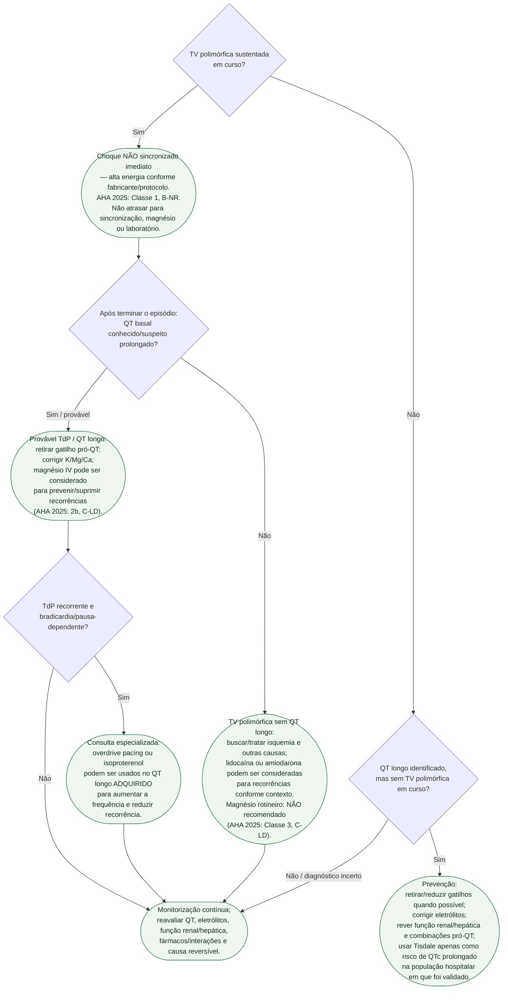

# Fluxograma: Torsades de Pointes e QT Longo Adquirido — Conduta Imediata

> **STATUS DE CURADORIA:** `revisado`. Revisão documental independente concluída. Doses, energia e metas eletrolíticas exigem validação no protocolo institucional antes de serem convertidas em ordens clínicas.

A decisão inicial é mais simples e mais segura do que na versão anterior: **TV polimórfica sustentada é arritmia eletricamente instável e requer choque não sincronizado imediato**. A presença de pulso não transforma a terapia elétrica em cardioversão sincronizada. Depois de interromper a arritmia, o QT basal e o contexto etiológico orientam a prevenção de recorrência.

## Árvore de decisão

## Regras de segurança incorporadas ao fluxo

### 1. Não sincronizar TV polimórfica sustentada

AHA 2025: os complexos variam de morfologia e **não permitem sincronização confiável**. O tratamento é choque não sincronizado imediato, mesmo quando há pulso. A versão anterior deste fluxograma continha o ramo “com pulso + instável → cardioversão sincronizada”; ele foi removido.

### 2. Não usar “magnésio para toda TV polimórfica”

- **QT longo/TdP recorrente:** magnésio pode ser considerado (**2b, C-LD**).
- **QT normal:** magnésio rotineiro não é recomendado (**Classe 3: sem benefício, C-LD**).

A distinção importa porque TV polimórfica sem QT longo é frequentemente isquêmica e exige tratamento etiológico diferente.

### 3. Corrigir eletrólitos, mas não apresentar meta antiga como certeza moderna

Hipocalemia, hipomagnesemia e hipocalcemia reduzem a reserva de repolarização e devem ser corrigidas. A faixa de K⁺ **4,5-5,0 mmol/L** aparece em recomendações/consensos mais antigos com evidência baixa; a AHA 2025 não a transforma em meta universal para toda TdP.

> **VALIDAÇÃO INSTITUCIONAL NECESSÁRIA:** metas numéricas de K/Mg, dose/velocidade de MgSO4 e energia específica do choque devem ser validadas contra o protocolo local antes de virar ordem operacional.

### 4. Pacing/isoproterenol são estratégia de recorrência, não substituto do choque

Em TdP adquirida recorrente associada a bradicardia/pausas, AHA 2025 recomenda consulta especializada para **overdrive pacing ou isoproterenol**; ESC 2022 também reconhece essas estratégias. Elas não devem atrasar o choque de TV polimórfica sustentada.

Não extrapolar isoproterenol para síndrome de QT longo congênito sem avaliação especializada.

## Escore de Tisdale — encaixe correto

O Tisdale foi criado para predizer **prolongamento de QTc em paciente hospitalizado**, não para decidir choque, dose de magnésio ou probabilidade direta de TdP. No estudo original, QTc prolongado foi definido como >500 ms ou aumento >60 ms do basal.

| Variável | Pontos |
|---|---:|
| Idade ≥68 anos | 1 |
| Sexo feminino | 1 |
| Diurético de alça | 1 |
| Potássio sérico ≤3,5 mEq/L | 2 |
| QTc na admissão ≥450 ms | 2 |
| IAM agudo | 2 |
| Sepse | 3 |
| Insuficiência cardíaca | 3 |
| Um fármaco prolongador de QTc | 3 |
| ≥2 fármacos prolongadores de QTc | **6 no total** (3 do primeiro + 3 adicionais) |
| **Pontuação máxima** | **21** |

Estratos originais: baixo 0-6, moderado 7-10, alto 11-21. O escore não deve ser automaticamente generalizado para ambulatório, pediatria ou para estimar risco absoluto de TdP.

## Conexões prioritárias

- `torsades-de-pointes-e-qt-longo-adquirido-escore-de-tisdale-e-manejo-agudo`
- `sulfato-de-magnesio-em-cardiologia-torsades-de-pointes-e-adjuvante-no-controle-de-frequencia-da-fa`
- fármacos pró-QT (sotalol, ibutilida, metadona, antipsicóticos, antieméticos e outros)
- hipocalemia/hipomagnesemia/hipocalcemia
- isquemia miocárdica/ACS quando TV polimórfica ocorre sem QT longo
- intoxicação digitálica quando houver TV bidirecional/polimórfica por mecanismo tóxico

## Pendências para os próximos lotes

1. Auditar o verbete de sulfato de magnésio para alinhar a frase “primeira linha farmacológica” à prioridade do choque na TV polimórfica sustentada.
2. Criar módulo de hipomagnesemia e sua relação com hipocalemia refratária, diuréticos, digoxina e risco arrítmico.
3. Procurar outras ocorrências no corpus de “TV polimórfica → cardioversão sincronizada” e de “magnésio para qualquer TV polimórfica”.
4. Normalizar exames canônicos de potássio e magnésio em lote seguro, sem edição cega do manifesto monolítico.
