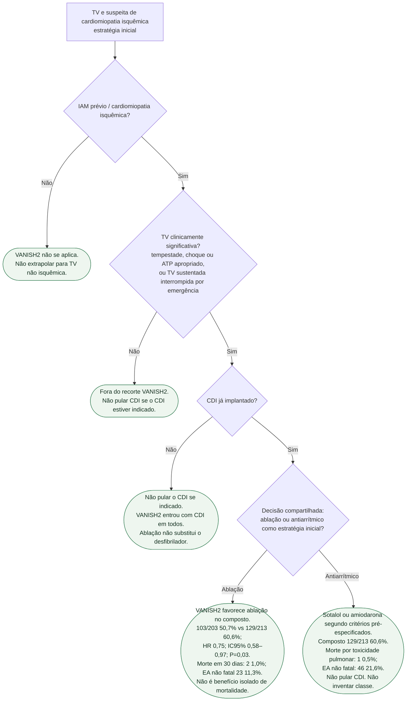

# Fluxograma: TV isquêmica — estratégia inicial após VANISH2

Pergunta desta árvore: **neste paciente com cardiomiopatia isquêmica e TV clinicamente significativa, o VANISH2 informa a estratégia inicial — ablação versus antiarrítmico — sem pular o CDI?**  O ensaio ganhou no **composto**, não em mortalidade isolada. Não inventar Classe I nem Classe III. 

Confirmação em série: cardiomiopatia isquêmica **e** TV clinicamente significativa **e** contexto de CDI. Só então decisão compartilhada. VANISH2 favorece ablação no composto. Risco peri-procedimento: morte em 30 dias **1,0%**. Braço fármaco: morte por toxicidade pulmonar **0,5%**. Não pular CDI se indicado.

## Árvore de decisão

## Como ler cada folha

**C1 — sem cardiomiopatia isquêmica.** VANISH2 randomizou infarto prévio. TV não isquêmica **não** herda o HR 0,75.

**C2 — TV que não é “clinicamente significativa” no ensaio.** Tempestade, choque ou ATP apropriado, ou TV sustentada interrompida por emergência. Extra-sístole e TV não sustentada isolada **não** abrem C4/C5. Tempestade **entra** em D2 como critério positivo. O CDI, se indicado por outra porta, **não** se omite.

**C3 — CDI ainda não implantado.** Todos os 416 tinham CDI. Ablação **não** substitui o desfibrilador. Avaliar a indicação e o momento do implante, sem atrasar estabilização ou ablação urgente por esta árvore. Folha terminal: sem seta de volta para D4. Não pular o dispositivo.

**C4 — ablação como estratégia inicial.** Composto **103/203 (50,7%)** vs **129/213 (60,6%)**; **HR 0,75**; IC95% **0,58–0,97**; **P = 0,03**; mediana **4,3 anos**. Morte em 30 dias: **2 (1,0%)**; EA não fatal: **23 (11,3%)**. O composto inclui morte — **não** traduzir HR 0,75 como mortalidade isolada. Sem Classe I inventada.

**C5 — antiarrítmico como estratégia inicial.** Sotalol ou amiodarona segundo critérios pré-especificados. Composto **129/213 (60,6%)**. Morte por toxicidade pulmonar: **1 (0,5%)**; EA não fatal: **46 (21,6%)**. Os dois braços têm dano nomeável. Não pular CDI.

## O que a árvore não mostra

**VANISH 2016** era ablação versus **escalada** de fármaco. Esta árvore é estratégia **inicial**.

**Instabilidade aguda** pede estabilização agora. Tempestade já revertida **foi** critério de inclusão do VANISH2; não é folha de exclusão.

**Mortalidade isolada.** O resultado primário do VANISH2 é composto.

**Classe de diretriz.** Esta árvore **não** atribui I, IIa, IIb ou III.

**Reabilitação, IC e coronária** valem nos dois ramos de D4 e ficaram fora do diagrama: não ramificam com VANISH2.

## Tudo com Tudo

- **Arritmias:** esta porta — árvore da estratégia inicial.
- **Dispositivos:** C3 existe para não pular o CDI.
- **Doença coronariana:** D1 é IAM prévio / cardiomiopatia isquêmica.
- **Insuficiência cardíaca:** a FE isquêmica não some porque a TV “ganhou” ablação no composto.
- **Comunicação clínica:** frequências naturais em `como-explicar-ablacao-de-tv-em-vez-de-so-amiodarona`.
- **Reabilitação cardíaca:** tempestade e choque atrasam a volta à função; C4 e C5 não dispensam o encaminhamento.

## Limite editorial

PMID **39555820**, NCT02830360. `flowchart TD`, um pai por nó, folhas em estádio, `classDef conduta` verde. Sem ciclo. Sem Classe I/III inventada. Primário = composto. Não pular CDI. 

## Seleção e leitura da segurança

O registro NCT02830360 especifica eventos nos seis meses anteriores sem antiarrítmico de classe I/III: TV monomórfica sustentada tratada, pelo menos um choque apropriado, três episódios em 24 horas, ou ATP em pelo menos três episódios com um sintomático ou cinco episódios independentemente de sintomas. Excluiu isquemia ativa/causa reversível, SCA recente, ablação prévia de TV e arritmia de apresentação polimórfica/FV. Instabilidade e tempestade ativa exigem estabilização imediata; o ensaio não define uma ordem obrigatória de implante antes de ablação urgente.

As taxas de segurança da ablação se referem aos 30 dias após o procedimento, enquanto as farmacológicas são eventos atribuídos ao antiarrítmico durante o acompanhamento. Não representam duas janelas temporais idênticas e não devem ser comparadas como se fossem.
