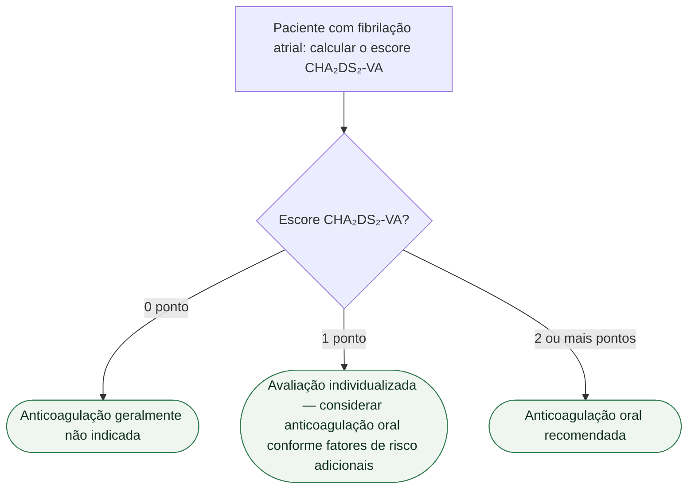

# Fluxograma: CHA₂DS₂-VA e a Decisão de Anticoagular na Fibrilação Atrial

Este fluxograma deriva dos documentos já publicados `cha2ds2-va.md` e `has-bled.md` (tema Calculadoras). O CHA₂DS₂-VA (diretriz ESC 2024, que substitui o CHA₂DS₂-VASc removendo o sexo feminino como fator isolado) decide a indicação de anticoagular; o HAS-BLED é complementar, nunca gatekeeper dessa decisão.

## As sete variáveis do CHA₂DS₂-VA (entrada de cálculo, fora da árvore)

| letra | variável | pontos |
|---|---|---|
| C | Insuficiência cardíaca congestiva / disfunção de VE | 1 |
| H | Hipertensão | 1 |
| A₂ | Idade ≥75 anos | 2 |
| D | Diabetes mellitus | 1 |
| S₂ | AVC/AIT/tromboembolismo prévio | 2 |
| V | Doença vascular (DAC, DAP, placa aórtica) | 1 |
| A | Idade 65–74 anos | 1 |

Escore máximo: 9 pontos.

## Árvore de decisão

## O papel do HAS-BLED — complementar, não excludente

O HAS-BLED (Pisters R et al., Chest. 2010;138(5):1093-1100, PMID 20299623) estima risco de sangramento maior em 1 ano em quem já usa ou vai usar anticoagulação oral. Escore ≥3 indica risco aumentado de sangramento — mas isso pede monitorização mais frequente e correção de fatores modificáveis (hipertensão não controlada, álcool, AINE, INR lábil), **nunca** suspensão ou não indicação da anticoagulação em quem tem indicação clara pelo CHA₂DS₂-VA.

A diretriz ESC 2024 de fibrilação atrial afirma explicitamente que a decisão de anticoagular não deve ser condicionada a escore de sangramento — por isso o HAS-BLED não aparece como ramo de decisão nesta árvore. Ele se encaixa na etapa de reavaliação periódica (E — Evaluation) do caminho AF-CARE da ESC 2024, calibrando a frequência de acompanhamento de quem já está anticoagulado, não decidindo se deve estar.

## Armadilhas clínicas (herdadas dos documentos de origem)

- Usar HAS-BLED alto como critério de exclusão da anticoagulação — inverte o propósito do escore.
- Aplicar o corte de anticoagulação sem considerar que o escore 1 exige avaliação individualizada, não uma regra automática de "sim" ou "não".
- Confundir CHA₂DS₂-VA (sem o ponto de sexo feminino, ESC 2024) com o CHA₂DS₂-VASc anterior — os dois têm escore máximo diferente (9 vs. 9, mas composição distinta) e não são intercambiáveis sem checar qual diretriz está em uso.
