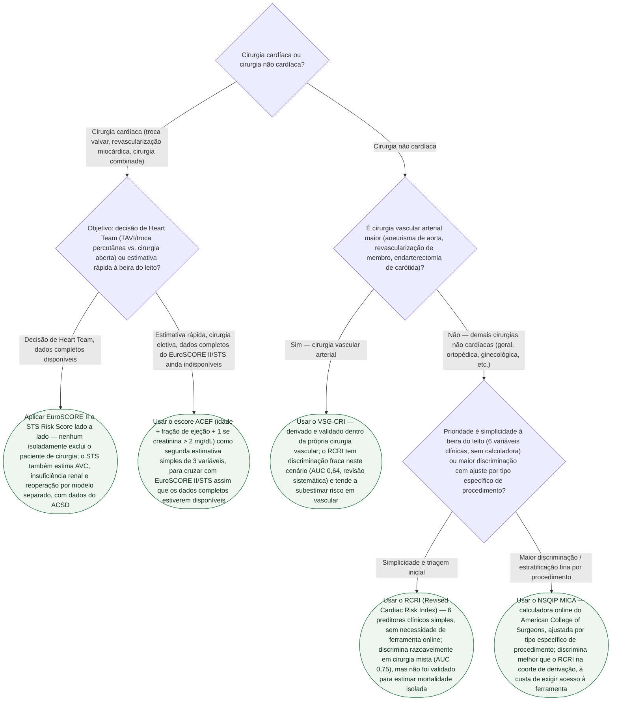

# Fluxograma: Qual Escore de Risco Cirúrgico Usar em Cada Cenário Perioperatório

A pasta Calculadoras acumulou seis documentos de risco cirúrgico — RCRI/NSQIP MICA, VSG-CRI, EuroSCORE II, STS Risk Score e ACEF —, cada um derivado e validado em uma população diferente, mas nenhum fluxograma amarrava a pergunta que antecede o cálculo: **diante deste paciente, qual desses escores é o certo a aplicar?** Este fluxograma responde a essa pergunta de triagem, sem repetir o cálculo interno de cada escore (que já está documentado em seu respectivo artigo nesta pasta).

## Árvore de decisão

## Por que a bifurcação inicial é cardíaca vs. não cardíaca, e não "qual escore é melhor"

Os seis escores desta pasta não competem pela mesma população — cada um foi derivado em um universo cirúrgico distinto, e usar o modelo errado para o cenário é o erro mais comum na prática, não a escolha entre modelos igualmente válidos:

- **EuroSCORE II** (Nashef SA et al., Eur J Cardiothorac Surg. 2012, PMID 22378855) e **STS Risk Score** (O'Brien SM et al., Ann Thorac Surg. 2018, PMID 29577924) foram desenvolvidos e validados **exclusivamente em cirurgia cardíaca** — o primeiro em 22.381 pacientes de 154 hospitais de 43 países, o segundo em centenas de milhares de procedimentos do banco americano ACSD. Não têm papel em cirurgia não cardíaca.
- **ACEF** (Ranucci M et al., Circulation. 2009, PMID 19506110) também é escore de **cirurgia cardíaca eletiva**, desenhado deliberadamente com apenas 3 variáveis para evitar o sobreajuste dos modelos maiores em populações de baixa mortalidade — não é substituto do EuroSCORE II/STS, é complemento rápido quando os dados completos ainda não estão disponíveis.
- **RCRI** (Lee TH et al., Circulation. 1999, PMID 10477528) foi derivado em **cirurgia não cardíaca eletiva mista**. A revisão sistemática de Ford, Beattie e Wijeysundera (Ann Intern Med. 2010, PMID 20048269; 24 estudos, 792.740 pacientes) mostrou AUC de 0,75 nessa população mista, mas **apenas 0,64 em cirurgia vascular** — pouco acima do acaso.
- **VSG-CRI** (Bertges DJ et al., J Vasc Surg. 2010, PMID 20570467; 10.081 pacientes do Vascular Study Group of New England) foi derivado especificamente para resolver essa fraqueza do RCRI em cirurgia vascular.
- **NSQIP MICA** (Gupta PK et al., Circulation. 2011, PMID 21730309; derivação em 211.410 e validação em 257.385 pacientes) cobre o mesmo universo do RCRI — cirurgia não cardíaca mista —, mas ajusta por tipo específico de procedimento, à custa de exigir a calculadora online em vez de soma manual de pontos.

## Armadilhas clínicas

- Usar EuroSCORE II, STS ou ACEF fora de cirurgia cardíaca — nenhum dos três tem validação para esse cenário.
- Aplicar o RCRI isoladamente em cirurgia vascular esperando a mesma discriminação da cirurgia mista — a própria revisão sistemática que valida o RCRI documenta a queda de AUC 0,75 para 0,64 nesse subgrupo.
- Comparar o percentual do EuroSCORE II diretamente com o do STS Risk Score, ou o do RCRI com o do NSQIP MICA, como se fossem a mesma métrica — são modelos com variáveis e populações de derivação diferentes, sem equivalência direta estabelecida entre eles.
- Usar qualquer um destes seis escores isoladamente para excluir um paciente de cirurgia — todos são insumo quantitativo à decisão compartilhada (Heart Team, avaliação pré-operatória), não substituto do julgamento clínico e da avaliação de fragilidade, que nenhum deles captura integralmente.
- Presumir que a escolha do escore certo elimina a necessidade de avaliação clínica completa — a árvore acima resolve "qual ferramenta calcular", não "o que fazer com o resultado", que depende do contexto clínico e da decisão compartilhada em cada cenário.
