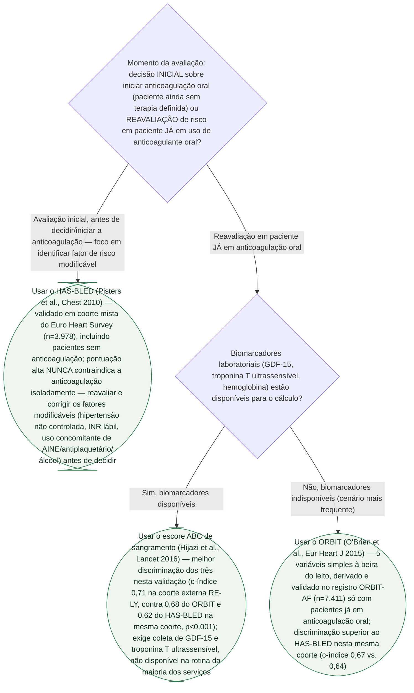

# Fluxograma: Qual Escore de Sangramento Usar na Fibrilação Atrial Anticoagulada — HAS-BLED, ORBIT ou ABC

A pasta Calculadoras já tem um documento dedicado a cada um dos três escores de sangramento validados para fibrilação atrial (HAS-BLED, ORBIT e ABC de sangramento), mas nenhum fluxograma respondia à pergunta que antecede o cálculo: **diante deste paciente, qual dos três é o escore certo a aplicar?** Os três escores não competem pela mesma pergunta clínica — foram derivados em populações e com propósitos diferentes, e usar o escore fora do contexto para o qual foi validado é o erro mais comum, não a escolha entre ferramentas equivalentes.

## Árvore de decisão

## Variáveis de cada escore (fora da árvore, para consulta)

**HAS-BLED (0-9 pontos, 1 ponto por item, exceto onde indicado):** Hipertensão não controlada (PAS >160 mmHg), função renal e/ou hepática alterada (1 ponto cada, até 2), AVC prévio, sangramento prévio ou predisposição, INR lábil, idade >65 anos, drogas (antiplaquetário/AINE) e/ou álcool (1 ponto cada, até 2).

**ORBIT (0-7 pontos):** idade ≥75 anos (1), hemoglobina/hematócrito reduzidos ou história de anemia (2), sangramento prévio (2), função renal insuficiente/TFGe <60 (1), uso concomitante de antiplaquetário (1). Categorias: baixo risco 0-2 (2,4 sangramentos/100 pacientes-ano), médio 3 (4,7/100 pacientes-ano), alto ≥4 (8,1/100 pacientes-ano).

**ABC de sangramento:** não é soma de pontos inteiros — é um modelo de risco contínuo calculado a partir de idade, GDF-15, troponina T ultrassensível, hemoglobina e história de sangramento prévio, exigindo calculadora/software (não há tabela de pontos manual).

## Por que a bifurcação inicial é "decisão inicial vs. reavaliação em uso", e não "qual escore discrimina melhor"

Os três escores foram derivados em populações diferentes, e a diferença de desenho importa mais que o c-índice isolado:

- **HAS-BLED** (Pisters R et al., Chest 2010, PMID 20299623) foi derivado numa coorte **mista** do Euro Heart Survey — pacientes com e sem anticoagulação. É o único dos três desenhado explicitamente para apontar **fatores de risco modificáveis** (hipertensão não controlada, INR lábil, uso concomitante de AINE/antiplaquetário/álcool), o que o torna a ferramenta natural no momento de decidir se e como iniciar a anticoagulação — nunca para excluir o paciente da terapia por pontuação alta isolada.
- **ORBIT** (O'Brien EC et al., Eur Heart J 2015, PMID 26424865) foi derivado e validado **só em pacientes já em anticoagulação oral** (registro ORBIT-AF, n=7.411) — é a ferramenta mais alinhada ao cenário de reavaliação de risco durante o seguimento, com 5 variáveis simples e discriminação superior ao HAS-BLED nessa mesma coorte (c-índice 0,67 vs. 0,64 — Tabela 4 do artigo original).
- **ABC de sangramento** (Hijazi Z et al., Lancet 2016, PMID 27056738) teve a melhor discriminação das três, tanto na derivação (ARISTOTLE, n=14.537) quanto na validação externa (RE-LY, n=8.468: c-índice ABC 0,71 vs. ORBIT 0,68 vs. HAS-BLED 0,62, p<0,001) — mas exige biomarcadores (GDF-15 e troponina T ultrassensível) que não fazem parte da rotina da maioria dos serviços, o que limita seu uso prático fora de centros com acesso a esses exames.

## Armadilhas clínicas

- Usar a pontuação alta de qualquer um dos três escores para **negar ou suspender a anticoagulação** — nenhum foi desenhado para essa finalidade; o risco de AVC isquêmico da FA não tratada costuma superar o risco hemorrágico, e a resposta correta a um escore alto é reavaliar/corrigir fatores modificáveis, não negar terapia.
- Comparar diretamente a pontuação do HAS-BLED (0-9) com a do ORBIT (0-7) como se fossem a mesma escala — são sistemas de pontos com variáveis e pesos diferentes, sem equivalência numérica direta.
- Calcular o ABC de sangramento sem os biomarcadores reais (GDF-15 e troponina T-hs) — ao contrário do HAS-BLED e do ORBIT, ele não tem versão simplificada por soma manual de pontos; sem os exames laboratoriais, não há como estimá-lo.
- Aplicar o ORBIT num paciente que ainda não iniciou anticoagulação — foi derivado e validado exclusivamente em pacientes já em terapia (ORBIT-AF), diferente do HAS-BLED, que também cobre a decisão inicial.
- Presumir que o escore mais recente ou de melhor c-índice (ABC) é sempre a melhor escolha — na ausência dos biomarcadores, uma estimativa validada e simples (ORBIT ou HAS-BLED, conforme o momento da avaliação) vale mais do que tentar calcular o ABC com dados incompletos ou estimados.
