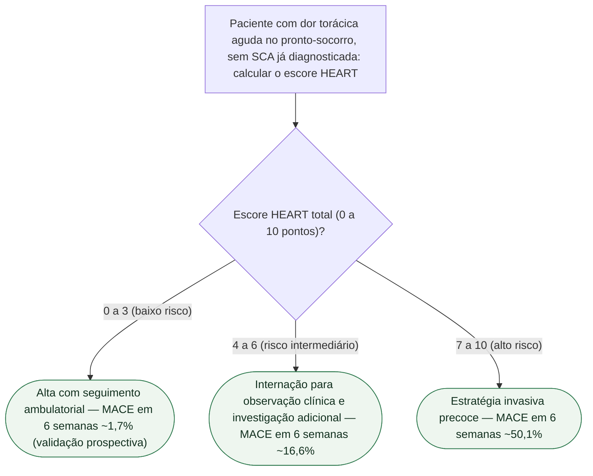

# Fluxograma: Escore HEART na Dor Torácica no Pronto-Socorro

Este fluxograma deriva do documento já publicado `escore-heart-dor-toracica-no-pronto-socorro.md` (tema Calculadoras). O HEART responde à pergunta que antecede TIMI e GRACE: entre os pacientes com dor torácica indiferenciada no pronto-socorro, quem pode ter alta e quem exige estratégia invasiva precoce.

## As cinco variáveis (entrada de cálculo, fora da árvore)

| letra | variável | pontos |
|---|---|---|
| H | História clínica | 0, 1 ou 2 |
| E | Eletrocardiograma | 0, 1 ou 2 |
| A | Idade | 0, 1 ou 2 |
| R | Fatores de risco | 0, 1 ou 2 |
| T | Troponina inicial | 0, 1 ou 2 |

Escore total: soma dos cinco itens, de 0 a 10 pontos. A atribuição detalhada de pontos item a item não consta nos resumos indexados das fontes consultadas — confira a tabela de pontuação completa na fonte primária antes de aplicar (mesma ressalva já registrada no documento de origem).

## Árvore de decisão

## Por que os cortes usados são os da validação de 2013, não os da derivação de 2008

A derivação original (Six AJ et al., 2008, PMID 18665203, 122 pacientes) propôs os cortes 0–3/4–6/≥7 com risco de desfecho de 2,5%/20,3%/72,7%. A validação prospectiva (Backus BE et al., 2013, PMID 23465250, 2.440 pacientes em dez hospitais holandeses) refinou esses números para a estratificação usada nesta árvore — 1,7%/16,6%/50,1% de MACE (eventos cardíacos adversos maiores) em 6 semanas — e é essa validação, não a derivação, que deve ser citada na prática, conforme já registrado no documento de origem.

A estatística c do HEART na validação (0,83) foi superior à do TIMI (0,75) e à do GRACE (0,70) nessa população de dor torácica indiferenciada, p<0,0001 nas duas comparações.

## Armadilhas clínicas (herdadas do documento de origem)

- Não aplicar os percentuais de risco de 2008 (2,5%/20,3%/72,7%) como se fossem os atuais — os corretos são os da validação de 2013.
- "Baixo risco" não é "risco zero": a validação mostrou 1,7% de MACE em 6 semanas mesmo na faixa 0–3.
- O HEART é para dor torácica indiferenciada, antes do diagnóstico de SCA — quem já tem SCA diagnosticada usa TIMI ou GRACE.
- Calcular o escore sem agir conforme o resultado esvazia o benefício, conforme mostrado pelo ensaio randomizado stepped-wedge (Poldervaart JM et al., Ann Intern Med. 2017;166(10):689-697, PMID 28437795), citado no documento de origem.
