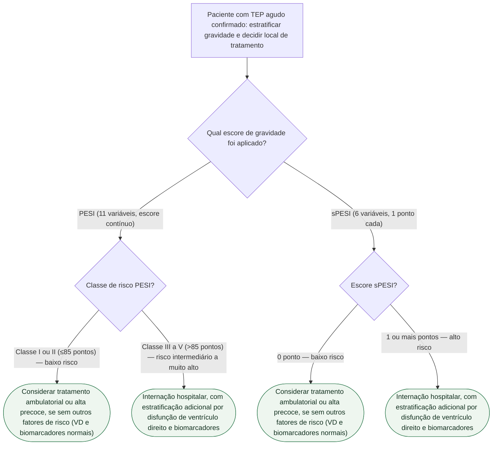

# Fluxograma: PESI e sPESI na Decisão de Internação vs. Tratamento Ambulatorial do TEP

Este fluxograma deriva do documento já publicado `pesi-e-spesi-escore-de-gravidade-do-tromboembolismo-pulmonar.md` (tema Calculadoras). PESI e sPESI estimam mortalidade em 30 dias no TEP agudo confirmado e orientam a decisão entre tratamento ambulatorial/alta precoce e internação hospitalar.

## Variáveis (entrada de cálculo, fora da árvore)

**PESI (11 variáveis, escore contínuo — a idade em anos entra como pontos):** sexo masculino (+10), câncer (+30), insuficiência cardíaca (+10), doença pulmonar crônica (+10), pulso ≥110/min (+20), PAS <100 mmHg (+30), frequência respiratória ≥30/min (+20), temperatura <36 °C (+20), estado mental alterado (+60), saturação de O₂ <90% (+20).

**Classes de risco do PESI e mortalidade em 30 dias:** I (≤65 pontos) 0–1,6% · II (66–85) 1,7–3,5% · III (86–105) 3,2–7,1% · IV (106–125) 4,0–11,4% · V (>125) 10,0–24,5%.

**sPESI (6 variáveis, 1 ponto cada):** idade >80 anos, câncer, doença cardiopulmonar crônica, frequência cardíaca ≥110 bpm, PAS <100 mmHg, saturação de O₂ <90%.

## Árvore de decisão

## Por que a árvore duplica a mesma conduta em dois ramos

PESI e sPESI são dois instrumentos independentes para a mesma pergunta clínica — qual escore foi calculado depende do fluxo de cada serviço. Como os dois convergem para a mesma orientação prática (documento de origem, seção "Aplicação prática"), a árvore duplica os nós de conduta (C1/C3 e C2/C4) em vez de fazer os dois ramos apontarem para o mesmo nó, conforme a regra de árvore estrita.

Na validação original do sPESI (Jiménez D et al., 2010, PMID 20696966), a coorte de baixo risco (36,2% dos pacientes) teve mortalidade em 30 dias de 1,1% (IC95% 0,7–1,5%), contra 8,9% (IC95% 8,1–9,8%) no grupo de alto risco — margem de segurança que sustenta considerar via ambulatorial nos pacientes de baixo risco.

## Armadilhas clínicas (herdadas do documento de origem)

- Usar PESI/sPESI para decidir trombólise — os dois escores estratificam mortalidade geral; a decisão de reperfusão em TEP de alto risco hemodinâmico é clínica (instabilidade), não pelo escore.
- Dispensar imagem de ventrículo direito e biomarcadores só porque o PESI/sPESI é baixo — a diretriz de TEP mantém essa recomendação mesmo com escore favorável.
- Confundir PESI (pontuação ponderada, 11 variáveis, 5 classes, soma inclui a idade em anos) com sPESI (1 ponto por variável, 6 variáveis, só 2 categorias).
- Usar frequência cardíaca abaixo de 110 bpm como corte do sPESI — o valor correto, herdado do PESI original, é ≥110 bpm.
