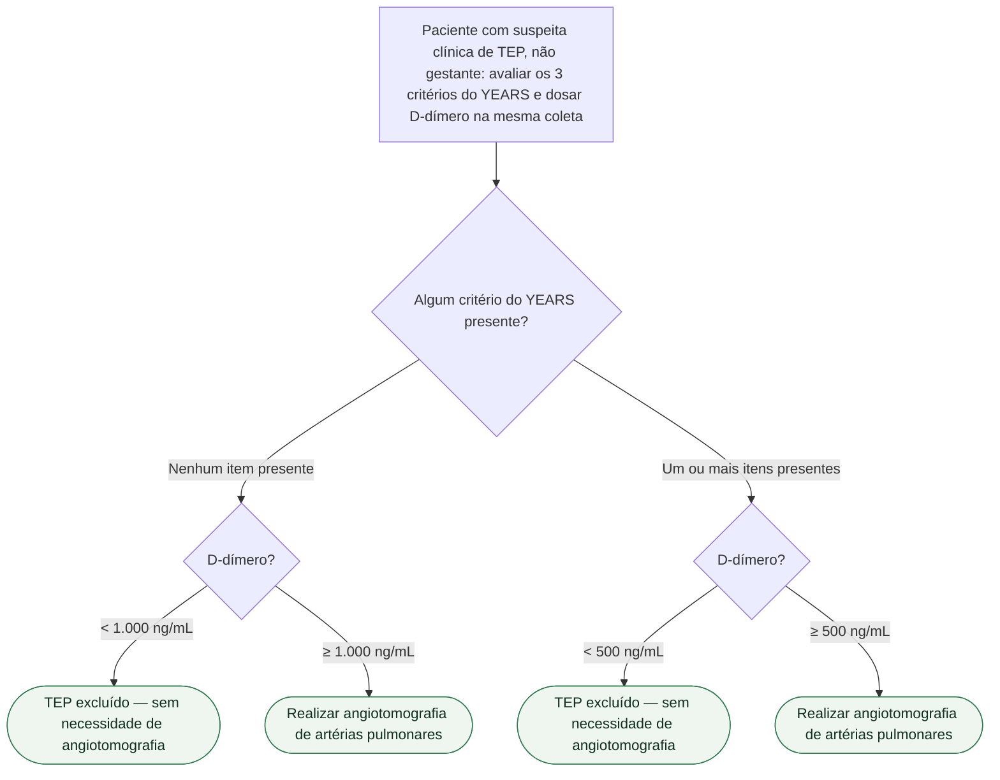

# Fluxograma: Algoritmo YEARS no Diagnóstico de TEP com D-dímero Adaptativo

Este fluxograma deriva do documento já publicado `algoritmo-years-diagnostico-de-tep-com-corte-de-d-dimero-adaptativo.md` (tema Calculadoras). Trata do algoritmo YEARS original (van der Hulle T et al., Lancet 2017, PMID 28549662), validado em população geral não gestante com suspeita clínica de TEP. **Não se aplica a gestantes** — para essa população existe o algoritmo YEARS adaptado (estudo Artemis), coberto em documento próprio do tema Gravidez.

## Os 3 critérios do YEARS (entrada de cálculo, fora da árvore)

1. Sinais clínicos de trombose venosa profunda (TVP)
2. Hemoptise
3. TEP é o diagnóstico mais provável (julgamento clínico do médico assistente)

Não há soma de pontos: o algoritmo apenas registra se zero, ou um ou mais desses itens estão presentes — essa contagem binária, junto com o D-dímero da mesma coleta, determina a conduta.

## Árvore de decisão

## O que o estudo de validação mostrou (números reais, PMID 28549662)

Estudo prospectivo, multicêntrico, em 12 hospitais holandeses, 3.465 pacientes consecutivos (out/2013 a jul/2015). Entre os 2.946 pacientes em que o TEP foi inicialmente excluído pelo algoritmo e que permaneceram sem anticoagulação, o seguimento de 3 meses identificou tromboembolismo venoso sintomático em 18 pacientes — 0,61% (IC95% 0,36–0,96%), incluindo 6 casos de TEP fatal. A angioTC não foi indicada em 1.651 (48%) dos 3.465 pacientes pelo YEARS, contra uma proporção estimada de 1.174 (34%) pela estratégia convencional baseada em Wells — redução absoluta de ~14 pontos percentuais no uso de angioTC.

## Por que o corte de D-dímero muda conforme os critérios

O mecanismo central do YEARS é permitir um corte de D-dímero mais alto (1.000 ng/mL) exatamente nos pacientes sem nenhum item de suspeita clínica reforçada — evitando angioTC em pacientes de baixíssima probabilidade cujo D-dímero está discretamente elevado (entre 500 e 999 ng/mL), faixa que em algoritmos de corte fixo obrigaria seguir para exame de imagem mesmo com probabilidade clínica baixa.

## Armadilhas clínicas e limitações (herdadas do documento de origem)

- Não aplicar este algoritmo em gestantes — usar o YEARS adaptado (Artemis), com corte próprio.
- A coorte de validação é holandesa; a generalização direta do desempenho numérico (falha de 0,61%) para outros sistemas de saúde não foi verificada nesta sessão — VERIFICAÇÃO HUMANA NECESSÁRIA se esse dado for necessário em outro contexto.
- O item "TEP é o diagnóstico mais provável" depende de julgamento clínico subjetivo, com variabilidade interobservador não quantificada no resumo consultado.
- D-dímero acima do corte aplicável, mesmo sem nenhum item do YEARS presente, ainda exige angioTC — o algoritmo reduz, mas não elimina, a necessidade de exame de imagem.
