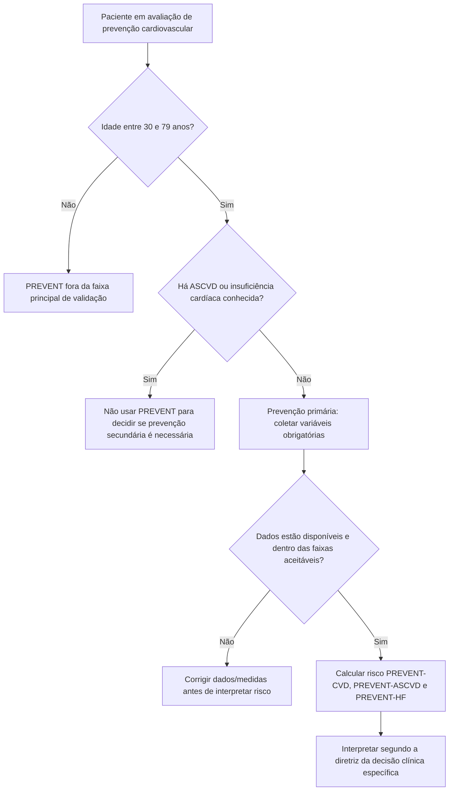
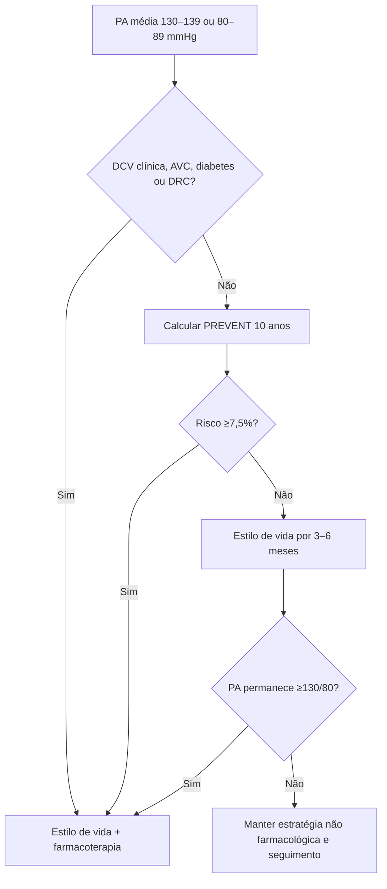

# PREVENT — como usar corretamente

As equações **PREVENT (Predicting Risk of cardiovascular disease EVENTs)** foram desenvolvidas pela American Heart Association para atualizar a estimativa de risco em prevenção primária, incorporando de forma explícita componentes cardiovasculares, renais e metabólicos.

Foram derivadas e validadas a partir de dados contemporâneos de milhões de adultos e hoje são incorporadas em diretrizes recentes de hipertensão e síndrome cardiovascular–renal–metabólica.

## O que o PREVENT estima

O sistema pode estimar risco em **10 anos** e **30 anos** para:

- **DCV total** — combinação de ASCVD e insuficiência cardíaca;
- **ASCVD**;
- **insuficiência cardíaca**.

Essa separação é clinicamente importante porque alguns pacientes podem ter risco aterosclerótico relativamente modesto, mas risco elevado de IC.

## População validada

Uso principal:

- adultos de **30 a 79 anos**;
- **sem doença cardiovascular conhecida**;
- prevenção primária;
- variáveis clínicas dentro das faixas aceitas pela equação.

Não usar como calculadora primária em:

- idade <30 anos;
- idade >79 anos;
- ASCVD já estabelecida;
- insuficiência cardíaca conhecida;
- situação clínica aguda;
- variáveis críticas ausentes ou fora da faixa validada sem reconhecer a limitação.

## Variáveis obrigatórias e opcionais

O PREVENT usa fatores cardiovasculares tradicionais e incorpora informações renais/metabólicas, incluindo eGFR e IMC. A AHA também permite personalização adicional com preditores opcionais como:

- relação albumina/creatinina urinária (UACR);
- HbA1c;
- índice de privação social (SDI), quando disponível no contexto para o qual foi desenvolvido.

A calculadora oficial deve ser usada com a definição exata de cada variável.

## Por que ele substitui ferramentas antigas em algumas diretrizes

As equações PREVENT:

- foram construídas com bases mais contemporâneas;
- incluem maior diversidade populacional;
- removem raça como variável biológica de cálculo;
- incorporam função renal e fatores metabólicos;
- estimam risco de IC além de ASCVD;
- incluem adultos a partir dos 30 anos.

Isso torna o modelo mais alinhado ao conceito CKM contemporâneo.

## Como o resultado muda decisões

### Hipertensão 2025

Na diretriz AHA/ACC de hipertensão de 2025, em pacientes com PA 130–139/80–89 mmHg sem DCV clínica, AVC, diabetes ou DRC:

- PREVENT em 10 anos **≥7,5%** favorece início de farmacoterapia junto com estilo de vida;
- PREVENT <7,5% favorece inicialmente estilo de vida; se após **3–6 meses** PA permanecer ≥130/80 mmHg, iniciar medicamento.

### CKM 2026

A diretriz CKM de 2026 integra PREVENT à definição de risco cardiovascular total, incluindo risco de IC, e utiliza risco absoluto para intensificar prevenção.

## Árvore de decisão — devo calcular PREVENT?

## Árvore — PREVENT na hipertensão estágio 1

## Por que a fórmula ainda NÃO deve ser implementada por cópia manual

A AHA disponibiliza código PREVENT sob **licença própria e mediante aceite dos termos**. Como há versão corrigida da publicação original e código oficial disponível sob condições específicas, implementar coeficientes manualmente no backend a partir de transcrições secundárias cria risco de erro e de descompasso com a versão oficial.

Até que o projeto obtenha e valide o código oficial segundo a licença da AHA:

**implementação local da fórmula PREVENT: VERIFICAÇÃO HUMANA NECESSÁRIA.**

A interface pode, entretanto, oferecer documentação, árvore de decisão e link para a calculadora oficial.

## Armadilhas

- Usar PREVENT em paciente que já tem ASCVD para decidir se precisa de prevenção secundária.
- Olhar apenas PREVENT-ASCVD e ignorar PREVENT-HF.
- Aplicar o corte de 7,5% a qualquer decisão clínica: esse limiar depende da diretriz/contexto.
- Usar risco de 30 anos como se fosse equivalente ao risco de 10 anos.
- Inserir valores aproximados de PA, colesterol ou função renal e tratar o resultado como preciso.
- Reproduzir coeficientes de uma calculadora de terceiros sem conferir a implementação oficial/correções.

## Regra prática

**PREVENT é uma plataforma de risco, não um único número.** Primeiro confirme que o paciente pertence à população validada; depois escolha o horizonte e o desfecho relevantes; por fim aplique o resultado à diretriz da decisão que você está tentando tomar.