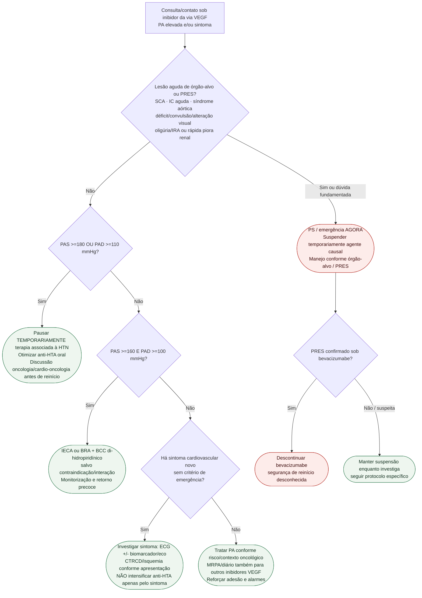

# Fluxograma ambulatorial: hipertensão por VEGF/TKI — destino

Prosa: [`sinalizadores-ambulatoriais-hipertensao-por-vegf-tki-quando-encaminhar`](sinalizadores-ambulatoriais-hipertensao-por-vegf-tki-quando-encaminhar.md). Checklist: [`hipertensao-por-vegf-tki-checklist-ambulatorial-de-alarme`](hipertensao-por-vegf-tki-checklist-ambulatorial-de-alarme.md). Crise/TKI: [`fluxograma-hipertensao-grave-e-crise-hipertensiva-induzida-por-tki`](fluxograma-hipertensao-grave-e-crise-hipertensiva-induzida-por-tki.md).

## Notas

- **D1**: lesão aguda/PRES define urgência; o número isolado da PA não.
- **D2**: pausa da terapia associada à hipertensão em **PAS >=180 OU PAD >=110 mmHg**.
- **D3**: recomendação ESC específica para **PAS >=160 E PAD >=100 mmHg** exige ambos os componentes.
- **D4**: sintoma cardiovascular tem investigação própria; não é sinônimo de necessidade de mais anti-hipertensivo.
- O fluxograma não define doses nem redução percentual da terapia oncológica.
