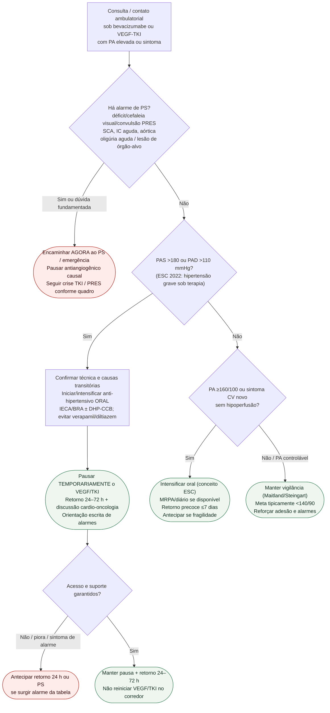

# Fluxograma ambulatorial: hipertensão por VEGF/TKI — destino

Prosa: [`sinalizadores-ambulatoriais-hipertensao-por-vegf-tki-quando-encaminhar`](sinalizadores-ambulatoriais-hipertensao-por-vegf-tki-quando-encaminhar.md). Checklist: [`hipertensao-por-vegf-tki-checklist-ambulatorial-de-alarme`](hipertensao-por-vegf-tki-checklist-ambulatorial-de-alarme.md). Crise/TKI já revisado: [`fluxograma-hipertensao-grave-e-crise-hipertensiva-induzida-por-tki`](fluxograma-hipertensao-grave-e-crise-hipertensiva-induzida-por-tki.md).

## Árvore de decisão

## Notas

- **D1** = gate de segurança (lesão aguda / PRES — Steingart 2012; ESC 2022).
- **D2** = limiar operacional de **pausa** da terapia oncológica associada à hipertensão (ESC 2022).
- **D3** = elevação significativa controlável no ambulatório com retorno precoce (Maitland 2010).
- Não decide doses de anti-hipertensivo IV/oral nem redução percentual da dose oncológica.
