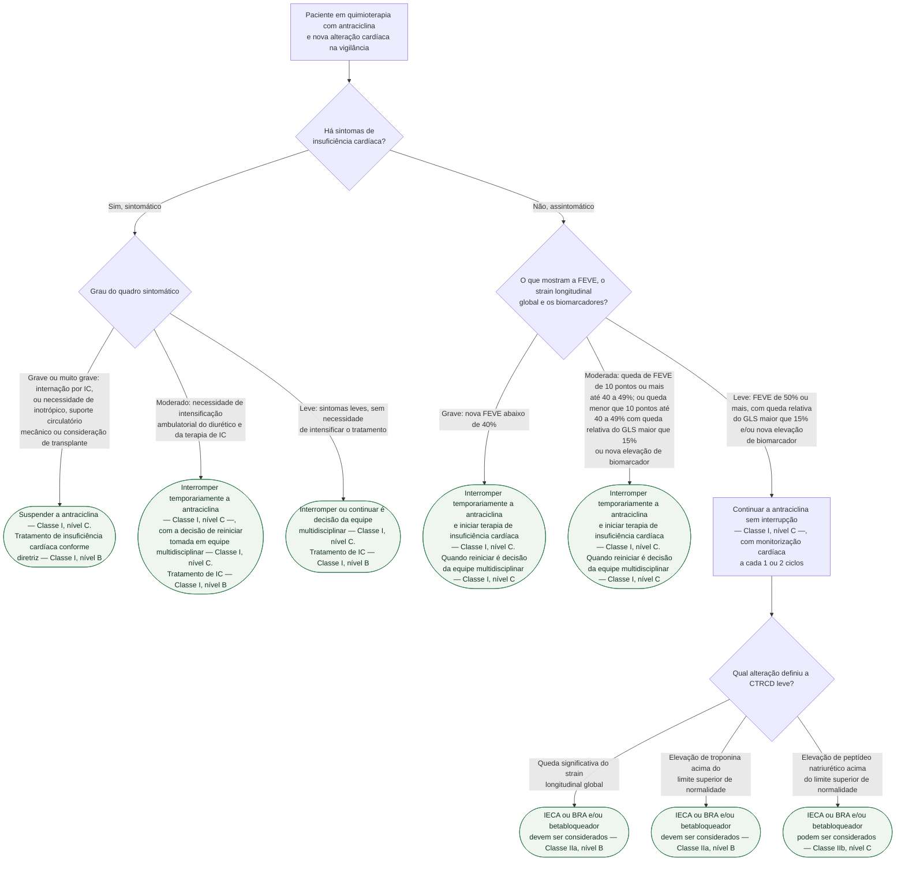
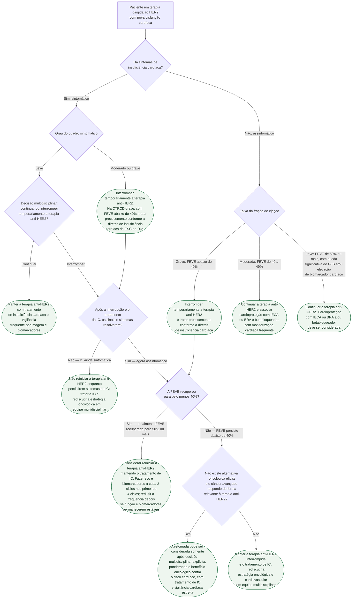

# Fluxograma: Disfunção cardíaca relacionada ao tratamento oncológico — antraciclina e terapia anti-HER2 (ESC 2022)

A diretriz ESC 2022 fez duas coisas que mudam a conduta à beira do leito. Primeiro,
**graduou** a disfunção cardíaca relacionada ao tratamento do câncer — a CTRCD —
em leve, moderada, grave e muito grave, em vez de tratá-la como categoria única.
Segundo, ligou cada grau a uma conduta específica sobre **continuar, interromper
temporariamente ou suspender** a quimioterapia.

E aqui está a razão de existirem duas árvores separadas neste documento: **as
condutas não são as mesmas para antraciclina e para terapia dirigida ao HER2**.
Um paciente assintomático com fração de ejeção de 40 a 49% deve ter a antraciclina
**interrompida**; o mesmo paciente, em terapia anti-HER2, deve **continuar** o
tratamento oncológico com cardioproteção associada e monitorização frequente. A
diferença não é descuido de redação — reflete que a cardiotoxicidade da antraciclina
é tipicamente cumulativa e menos reversível, enquanto a da terapia anti-HER2 costuma
ser reversível.

## Como a CTRCD é graduada (Tabela 3 da diretriz)

**CTRCD sintomática**, isto é, com insuficiência cardíaca manifesta:

| Grau | Definição |
|---|---|
| Muito grave | insuficiência cardíaca exigindo suporte inotrópico, suporte circulatório mecânico ou consideração de transplante |
| Grave | internação por insuficiência cardíaca |
| Moderada | necessidade de intensificação ambulatorial do diurético e da terapia de insuficiência cardíaca |
| Leve | sintomas leves, sem necessidade de intensificar o tratamento |

**CTRCD assintomática**:

| Grau | Definição |
|---|---|
| Grave | nova redução da FEVE para menos de 40% |
| Moderada | nova redução da FEVE de 10 pontos percentuais ou mais, chegando a 40–49%; **ou** redução de menos de 10 pontos até 40–49% **associada a** queda relativa nova do GLS maior que 15% **ou** nova elevação de biomarcador cardíaco |
| Leve | FEVE de 50% ou mais **com** queda relativa nova do GLS maior que 15% **e/ou** nova elevação de biomarcador cardíaco |

**Queda significativa do GLS, nesta diretriz, é redução relativa maior que 15%**
em relação ao valor basal. A Diretriz Brasileira de Cardio-oncologia de 2020 usa
o corte de redução **igual ou maior que 15%** — a diferença está na borda, e vale
saber de qual documento veio o número que se está aplicando.

## Árvore de decisão: CTRCD durante quimioterapia com antraciclina

## Árvore de decisão: CTRCD durante terapia dirigida ao HER2

**Sobre a segunda árvore:** as condutas da terapia anti-HER2 estão reproduzidas
com o verbo da própria diretriz — "é recomendado", "deve ser considerado" —, e
não com rótulo de classe. A fonte primária organiza essas decisões na Tabela de
Recomendação 25 e na Figura 26. Como as colunas gráficas de classe e nível não
foram transcritas neste documento, foram preservados os verbos oficiais em vez de
inferir uma graduação. A árvore inclui também o caminho de reinício após recuperação.
A exceção estreita por câncer avançado responsivo sem alternativa eficaz aplica-se
somente depois da resolução dos sintomas, se a FEVE persistir abaixo de 40%, e exige
decisão multidisciplinar. Sintomas de IC persistentes bloqueiam o reinício nesta árvore.

## Reiniciar antraciclina depois de uma CTRCD

Quando o paciente com CTRCD **moderada ou grave**, sintomática ou não, ainda
precisa de mais antraciclina, a diretriz oferece duas estratégias de redução de
risco, ambas **Classe IIb, nível C**:

- **antraciclina lipossomal**;
- **dexrazoxano** antes de cada ciclo seguinte.

O dexrazoxano tem aprovação formal restrita: adultos com câncer de mama avançado
ou metastático que já receberam dose cumulativa mínima de antraciclina — 300 mg/m²
de doxorrubicina ou equivalente pela agência norte-americana, 350 mg/m² pela
agência europeia. Os dois números existem, são de agências diferentes, e não é
erro de transcrição.

**Monitorização cardíaca a cada 1 ou 2 ciclos é recomendada** em duas situações:
no paciente que reinicia antraciclina após um episódio de CTRCD, e no que segue
com CTRCD leve mantendo a quimioterapia.

## O que as árvores não mostram

**A discussão em equipe multidisciplinar não é formalidade.** Ela aparece como
recomendação Classe I em quatro pontos diferentes da tabela — decidir sobre
interrupção na CTRCD leve sintomática, decidir quando reiniciar após CTRCD
moderada sintomática, e o mesmo para CTRCD moderada e grave assintomáticas.
Retirei da árvore o que valia para todos os ramos.

**Exercício aeróbico é recomendado** para o paciente com câncer que desenvolve
CTRCD. O benefício do exercício antes e durante a quimioterapia com antraciclina
está demonstrado.

**A estratificação de risco basal, antes do primeiro ciclo, é outra árvore** — e
já tem documento próprio nesta biblioteca, com os escores HFA-ICOS. Este
fluxograma começa depois: no paciente que já está em tratamento e cuja vigilância
detectou alteração.

**Sobreviventes de câncer têm recomendação separada.** Avaliação anual de risco
cardiovascular com ECG e peptídeo natriurético é Classe I, nível B em quem recebeu
fármaco potencialmente cardiotóxico ou radioterapia, e a reestratificação de risco
aos 5 anos de tratamento, Classe I, nível C. No sobrevivente que desenvolve CTRCD
moderada assintomática tardiamente, IECA ou BRA e/ou betabloqueador são
recomendados — Classe I, nível C; na CTRCD leve assintomática, podem ser
considerados — Classe IIb, nível C.

**Miocardite por inibidor de checkpoint imunológico não está aqui.** Tem
definição própria na mesma diretriz, com critérios diagnósticos maiores e menores
e diagnóstico histopatológico por biópsia endomiocárdica, e já é tratada em
documento separado desta biblioteca.
