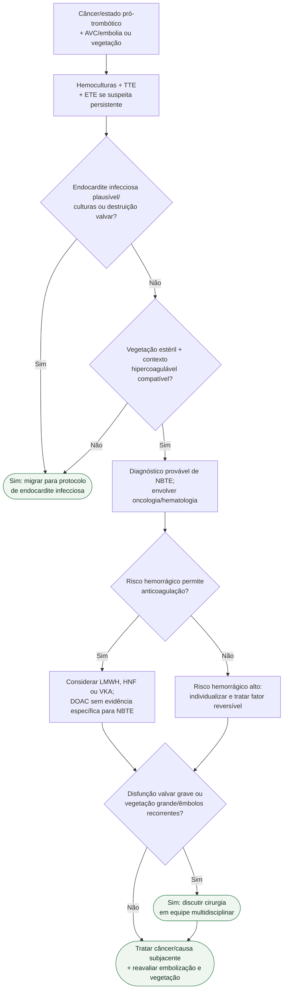

# NBTE associada ao câncer

## Regra prática

**Vegetação sem bactéria não significa vegetação sem risco:** NBTE é altamente embólica e exige tratar simultaneamente a hipercoagulabilidade e a causa oncológica.