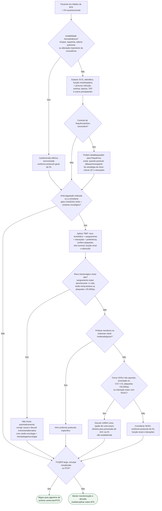

# FA aguda durante inibidor de BTK

## Regra prática

FA em paciente em BTK exige três perguntas simultâneas: **está instável? precisa controle de ritmo/frequência? pode anticoagular com segurança?** O CHA2DS2-VASc pode subestimar o risco trombótico no câncer; por outro lado, plaquetopenia, tumor gastrointestinal/geniturinário, absorção e interações impedem automatizar a escolha do anticoagulante. FA atribuída a fator transitório deve ter a necessidade de anticoagulação reavaliada após três meses. FA ou risco de FA, isoladamente, não contraindicam o tratamento antineoplásico: manutenção, pausa ou troca do BTK dependem de decisão multidisciplinar.
