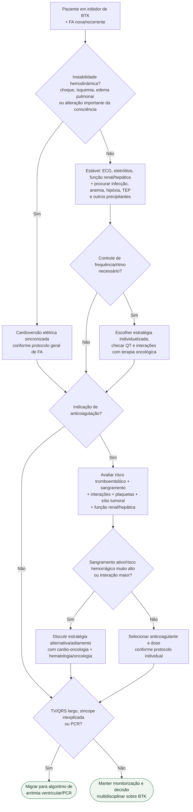

# FA aguda durante inibidor de BTK

## Regra prática

FA em paciente em BTK exige três perguntas simultâneas: **está instável? precisa controle de ritmo/frequência? pode anticoagular com segurança?** O câncer, a plaquetopenia e as interações impedem automatizar a terceira resposta.