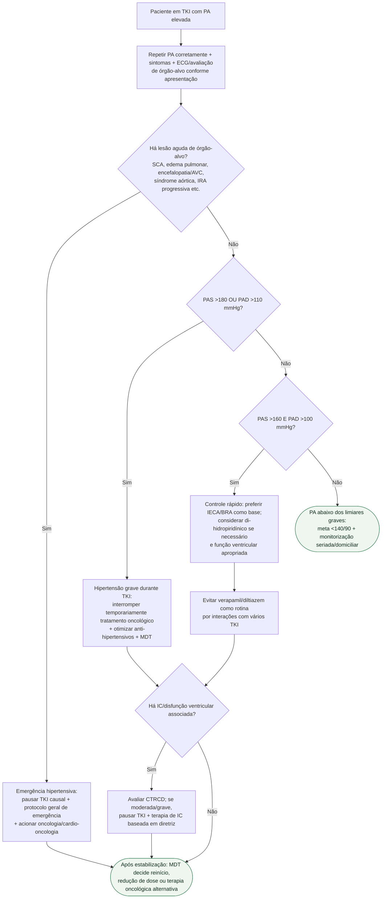

# Hipertensão durante TKI

## Regra prática

O **valor da PA define quando pausar o TKI; a lesão aguda de órgão-alvo define a emergência hipertensiva**. Em ambos os cenários graves, a reintrodução do antineoplásico é decisão conjunta após estabilização.