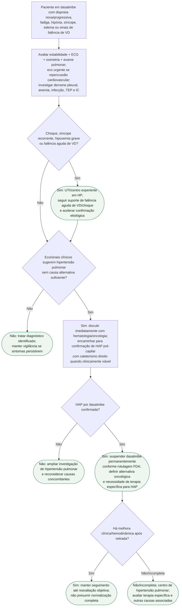

# HAP por dasatinibe com descompensação

## Ponto-chave

**Dispneia em quem usa dasatinibe não é sinônimo de derrame pleural.** Se HAP for confirmada, a rotulagem do SPRYCEL determina suspensão permanente do fármaco. O seguimento continua necessário porque reversibilidade completa não é garantida.
